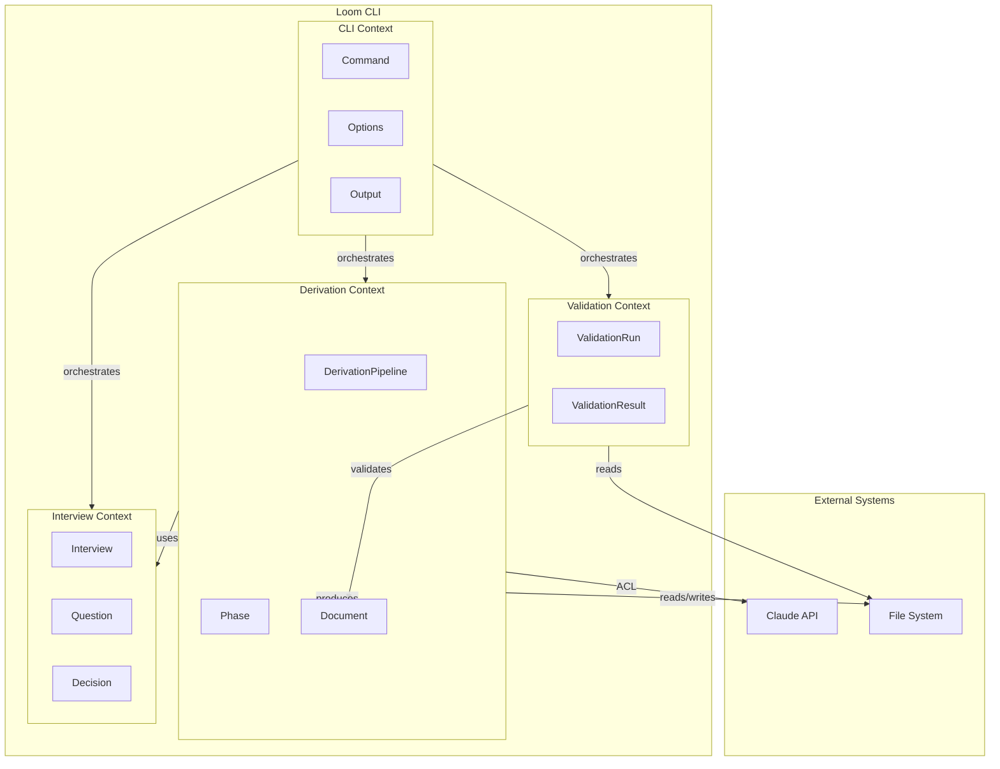

# Loom CLI Bounded Context Map

## Overview

This document defines the bounded contexts for loom-cli and their relationships. It maps the domain boundaries and integration patterns between contexts.

**Traceability:** Derived from [l0-domain-vocabulary.md](l0-domain-vocabulary.md) and [l0-loom-cli.md](l0-loom-cli.md).

---

## Context Map Diagram



---

## Bounded Contexts

### BC-DRV: Derivation Context

**Purpose:** Core domain for AI-powered document derivation.

**Responsibilities:**
- Orchestrate multi-level derivation pipeline (L0 → L1 → L2 → L3)
- Manage phase execution and state transitions
- Handle checkpoints for resume capability
- Produce structured markdown documents

**Key Entities:**
- DerivationPipeline (E-DRV-001)
- Phase (E-DRV-002)
- Document (E-DOC-001)

**Ubiquitous Language:**
| Term | Meaning in this context |
|------|------------------------|
| Derivation | AI-assisted generation of lower-level docs from higher-level |
| Phase | A single step in the pipeline (analyze, derive-l1, etc.) |
| Cascade | Full pipeline execution in one command |
| Checkpoint | Saved state for resume after interruption |

**Integrations:**
- Upstream: Interview Context (decisions inform derivation)
- Downstream: Validation Context (validates produced documents)
- External: Claude API (AI generation), File System (read/write)

---

### BC-INT: Interview Context

**Purpose:** Handle ambiguity resolution through structured Q&A.

**Responsibilities:**
- Present questions identified during analysis
- Record answers with source attribution
- Manage interview state and progress
- Support batch and grouped answer modes

**Key Entities:**
- Interview (E-INT-001)
- Question (E-INT-002)
- Decision (E-INT-003)

**Ubiquitous Language:**
| Term | Meaning in this context |
|------|------------------------|
| Interview | A Q&A session to resolve ambiguities |
| Question | An ambiguity requiring clarification |
| Decision | A recorded answer with source |
| Source | Origin of answer: user, ai, existing |

**Integrations:**
- Upstream: Analysis phase (provides questions)
- Downstream: Derivation Context (decisions used in generation)

---

### BC-VAL: Validation Context

**Purpose:** Ensure document consistency and completeness.

**Responsibilities:**
- Apply validation rules (V001-V010)
- Report violations with actionable details
- Support level-specific validation
- Produce JSON output for CI/CD

**Key Entities:**
- ValidationRun (E-VAL-001)
- ValidationResult (E-VAL-002)

**Ubiquitous Language:**
| Term | Meaning in this context |
|------|------------------------|
| Validation | Checking documents against rules |
| Rule | A specific check (V001, V002, etc.) |
| Violation | A failed rule with details |
| Traceability | Bidirectional reference checking |

**Integrations:**
- Upstream: Derivation Context (documents to validate)
- Related: Sync-Links (fixes V004 violations)

---

### BC-CLI: CLI Context

**Purpose:** Command-line interface orchestration and user interaction.

**Responsibilities:**
- Parse command-line arguments
- Route to appropriate context handlers
- Manage input/output streams
- Provide help and version information
- Handle exit codes

**Key Concepts:**
- Command (analyze, interview, derive, etc.)
- Options (--input-file, --output-dir, etc.)
- Exit Codes (0, 1, 100)

**Ubiquitous Language:**
| Term | Meaning in this context |
|------|------------------------|
| Command | A CLI operation (verb) |
| Option | A flag or parameter |
| Interactive | Mode requiring user confirmation |
| Dry-run | Preview without modification |

**Integrations:**
- Orchestrates: Derivation, Interview, Validation contexts
- External: File System, stdout/stderr

---

## Context Relationships

### Relationship Types

| Pattern | Description |
|---------|-------------|
| **Upstream/Downstream** | One context provides data that another consumes |
| **Conformist** | Downstream conforms to upstream's model |
| **ACL (Anti-Corruption Layer)** | Translates external model to internal |
| **Shared Kernel** | Shared types between contexts |

### Relationship Matrix

| From | To | Pattern | Description |
|------|-----|---------|-------------|
| CLI | Derivation | Orchestrator | CLI invokes derivation pipeline |
| CLI | Interview | Orchestrator | CLI invokes interview flow |
| CLI | Validation | Orchestrator | CLI invokes validation |
| Interview | Derivation | Upstream | Decisions inform derivation |
| Derivation | Validation | Upstream | Documents are validated |
| Derivation | Claude API | ACL | Translates API responses to domain |
| All | File System | Shared | Common I/O operations |

---

## Shared Kernel

The following types are shared across contexts:

### DerivationLevel

Used by: Derivation, Validation, CLI

```
enum DerivationLevel { L0, L1, L2, L3 }
```

### Document Identifiers

Used by: All contexts

```
Pattern: {PREFIX}-{CONTEXT}-{NUMBER}
Examples: AC-ORD-001, BR-CUST-002, TC-AC-ORD-001-P01
```

### Frontmatter

Used by: Derivation, Validation

```
value object Frontmatter {
  title: string
  generated: datetime
  status: draft | review | approved
  level: DerivationLevel
}
```

---

## Anti-Corruption Layers

### Claude API ACL

**Location:** Derivation Context

**Purpose:** Translate Claude API JSON responses to domain documents.

**Responsibilities:**
- Parse structured JSON from Claude
- Map to internal type definitions
- Handle response validation
- Retry on transient failures

**Input:** Raw JSON from Claude API
**Output:** Typed domain objects (TechSpec, InterfaceContract, etc.)

---

## Context Evolution

### Current State

All contexts are implemented within a single Go binary (loom-cli). Contexts are logical separations, not physical deployments.

### Future Considerations

If scaling requires:
- **Derivation Context** could become a separate service with queue-based processing
- **Validation Context** could be extracted for CI/CD pipeline integration
- **Interview Context** could support web UI for collaborative sessions

---

## Related Documents

| Level | Document | Description |
|-------|----------|-------------|
| L0 | [l0-domain-vocabulary.md](l0-domain-vocabulary.md) | Domain Vocabulary |
| L0 | [l0-loom-cli.md](l0-loom-cli.md) | User Stories |
| L0 | [l0-nfr.md](l0-nfr.md) | Non-Functional Requirements |
| L1 | [l1-domain-model.md](l1-domain-model.md) | Domain Model |
| L1 | This document | Bounded Context Map |
| L1 | [l1-business-rules.md](l1-business-rules.md) | Business Rules |
| L1 | [l1-acceptance-criteria.md](l1-acceptance-criteria.md) | Acceptance Criteria |
| L2 | [l2-cli-interface.md](l2-cli-interface.md) | CLI Interface Contract |
