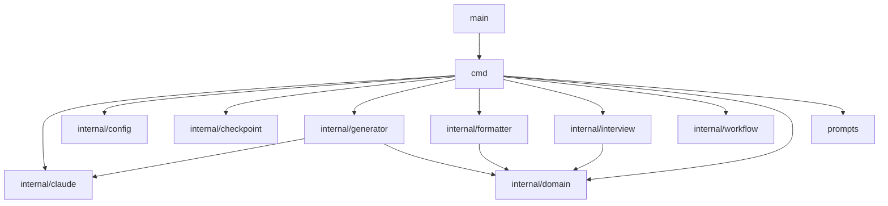

# Loom CLI Package Structure

## Overview

This document specifies the Go package structure for loom-cli implementation.

**Traceability:** Implements [bounded-context-map.md](../l1/bounded-context-map.md) infrastructure layer.

---

## Directory Structure

```
loom-cli/
├── main.go                      # Entry point
├── go.mod                       # Module definition
├── cmd/                         # Command implementations
│   ├── root.go                  # Main router, CLI entry
│   ├── analyze.go               # IC-ANL-001: analyze command
│   ├── interview.go             # IC-INT-001: interview command
│   ├── derive_new.go            # IC-DRV-001: derive command (L1)
│   ├── derive_l2.go             # IC-DRV-002: derive-l2 command
│   ├── derive_l2_convert.go     # L2 conversion utilities
│   ├── derive_l3.go             # IC-DRV-003: derive-l3 command
│   ├── validate.go              # IC-VAL-001: validate command
│   ├── cascade.go               # IC-CAS-001: cascade command
│   ├── sync_links.go            # IC-SYN-001: sync-links command
│   └── interactive.go           # Interactive mode utilities
├── internal/                    # Private packages
│   ├── checkpoint/              # Resume functionality
│   ├── config/                  # Configuration management
│   ├── claude/                  # Claude API client (ACL)
│   ├── generator/               # Document generators
│   ├── formatter/               # Output formatters
│   ├── interview/               # Interview logic
│   ├── workflow/                # Workflow utilities
│   └── domain/                  # Domain types
├── prompts/                     # Embedded prompt templates
│   ├── prompts.go               # Go embed directives
│   └── *.md                     # Prompt files
├── checklists/                  # Embedded checklists
└── test/                        # Test fixtures
```

---

## Package Specifications

### PKG-001: main

**File:** `main.go`

**Responsibility:** Application entry point

```go
package main

import "loom-cli/cmd"

func main() {
    cmd.Execute()
}
```

---

### PKG-002: cmd

**Path:** `cmd/`

**Responsibility:** CLI command implementations

**Files:**

| File | Command | Interface Contract |
|------|---------|-------------------|
| root.go | - | Router, dispatches to commands |
| analyze.go | analyze | IC-ANL-001 |
| interview.go | interview | IC-INT-001 |
| derive_new.go | derive | IC-DRV-001 |
| derive_l2.go | derive-l2 | IC-DRV-002 |
| derive_l3.go | derive-l3 | IC-DRV-003 |
| validate.go | validate | IC-VAL-001 |
| cascade.go | cascade | IC-CAS-001 |
| sync_links.go | sync-links | IC-SYN-001 |
| interactive.go | - | Shared interactive utilities |

**Pattern:** Each command file contains:
- `run{Command}()` - Main execution function
- Argument parsing via `os.Args`
- Error handling with formatted output

---

### PKG-003: internal/checkpoint

**Path:** `internal/checkpoint/`

**Responsibility:** Resume/checkpoint functionality for long-running operations

**Files:**
- `checkpoint.go` - Save/load checkpoint state

**Key Types:**
```go
type Checkpoint struct {
    Phase      string    `json:"phase"`
    Timestamp  time.Time `json:"timestamp"`
    Data       any       `json:"data"`
}

func Save(path string, cp *Checkpoint) error
func Load(path string) (*Checkpoint, error)
```

---

### PKG-004: internal/config

**Path:** `internal/config/`

**Responsibility:** Configuration management

**Files:**
- `config.go` - Config loading and defaults

**Key Types:**
```go
type Config struct {
    AnthropicAPIKey string
    Model           string
    MaxTokens       int
    Temperature     float64
}

func Load() (*Config, error)
func LoadFromEnv() *Config
```

**Environment Variables:**
- `ANTHROPIC_API_KEY` - Required for Claude API
- `LOOM_MODEL` - Model override (default: claude-sonnet-4-20250514)
- `LOOM_MAX_TOKENS` - Token limit override

---

### PKG-005: internal/claude

**Path:** `internal/claude/`

**Responsibility:** Claude API client (Anti-Corruption Layer)

**Files:**
- `client.go` - API client implementation
- `retry.go` - Retry logic with exponential backoff

**Key Types:**
```go
type Client struct {
    apiKey    string
    model     string
    maxTokens int
}

type Message struct {
    Role    string `json:"role"`
    Content string `json:"content"`
}

type Response struct {
    Content    string
    StopReason string
    Usage      Usage
}

func NewClient(config *config.Config) *Client
func (c *Client) Complete(prompt string) (*Response, error)
func (c *Client) CompleteWithContext(prompt string, context string) (*Response, error)
```

**Retry Strategy:**
- Max retries: 3
- Base delay: 1s
- Backoff multiplier: 2x
- Retryable errors: 429 (rate limit), 5xx (server errors)

---

### PKG-006: internal/generator

**Path:** `internal/generator/`

**Responsibility:** Document generation orchestration

**Files:**
- `testcases.go` - Test case generation logic
- `parallel.go` - Parallel processing utilities

**Key Functions:**
```go
// testcases.go
func GenerateTestCases(acs []AC, client *claude.Client) ([]TestCase, error)
func ChunkACs(acs []AC, chunkSize int) [][]AC

// parallel.go
func ProcessInParallel[T, R any](items []T, fn func(T) (R, error), workers int) ([]R, error)
```

---

### PKG-007: internal/formatter

**Path:** `internal/formatter/`

**Responsibility:** JSON to Markdown formatting

**Files:**

| File | Purpose | Output |
|------|---------|--------|
| types.go | Shared types | - |
| anchor.go | Anchor/link formatting | Cross-references |
| frontmatter.go | YAML frontmatter | Document headers |
| techspecs.go | Tech spec formatting | tech-specs.md |
| sequences.go | Sequence diagram formatting | sequence-design.md |
| datamodel.go | Data model formatting | initial-data-model.md |
| testcases.go | Test case formatting | test-cases.md |
| contracts.go | Interface contract formatting | interface-contracts.md |
| aggregates.go | Aggregate formatting | aggregate-design.md |

**Common Pattern:**
```go
func Format{Type}(data *{Type}Data) string {
    var buf strings.Builder
    // Write YAML frontmatter
    // Write sections with proper markdown
    // Add traceability links
    return buf.String()
}
```

---

### PKG-008: internal/interview

**Path:** `internal/interview/`

**Responsibility:** Interview question grouping and processing

**Files:**
- `grouping.go` - Question grouping logic

**Key Types:**
```go
type QuestionGroup struct {
    Category  string
    Questions []Question
}

func GroupQuestions(ambiguities []Ambiguity) []QuestionGroup
func ProcessAnswers(answers map[string]string) []Decision
```

---

### PKG-009: internal/workflow

**Path:** `internal/workflow/`

**Responsibility:** Interactive workflow utilities

**Files:**
- `approval.go` - Document approval flow
- `progress.go` - Progress display

**Key Functions:**
```go
// approval.go
func RequestApproval(doc string, prompt string) (bool, error)
func ShowDiff(before, after string) error

// progress.go
type Progress struct {
    Total   int
    Current int
    Phase   string
}

func (p *Progress) Update(current int, message string)
func (p *Progress) Complete()
```

---

### PKG-010: internal/domain

**Path:** `internal/domain/`

**Responsibility:** Shared domain types

**Files:**
- `types.go` - Core domain types

**Key Types:**
```go
// Analysis output
type AnalysisResult struct {
    Entities      []Entity      `json:"entities"`
    Operations    []Operation   `json:"operations"`
    Relationships []Relationship `json:"relationships"`
    Aggregates    []Aggregate   `json:"aggregates"`
    BusinessRules []string      `json:"business_rules"`
}

// Interview types
type Ambiguity struct {
    ID          string   `json:"id"`
    Concept     string   `json:"concept"`
    Question    string   `json:"question"`
    Options     []string `json:"options"`
    Category    string   `json:"category"`
}

type Decision struct {
    ID       string `json:"id"`
    Question string `json:"question"`
    Answer   string `json:"answer"`
    Rationale string `json:"rationale"`
}

// Validation types
type ValidationResult struct {
    RuleID  string `json:"rule_id"`
    Passed  bool   `json:"passed"`
    Message string `json:"message"`
}
```

---

### PKG-011: prompts

**Path:** `prompts/`

**Responsibility:** Embedded prompt templates

**Files:**
- `prompts.go` - Go embed directives and accessors
- `*.md` - Prompt template files (21 files)

**Implementation:**
```go
package prompts

import "embed"

//go:embed *.md
var promptFS embed.FS

var (
    DomainDiscovery       string
    EntityAnalysis        string
    // ... all prompt variables
)

func init() {
    // Load all prompts from embedded FS
    DomainDiscovery = mustRead("domain-discovery.md")
    EntityAnalysis = mustRead("entity-analysis.md")
    // ...
}

func mustRead(name string) string {
    data, err := promptFS.ReadFile(name)
    if err != nil {
        panic(err)
    }
    return string(data)
}

// BuildPrompt injects context into prompt template
func BuildPrompt(template string, context string) string {
    return strings.Replace(template, "</context>", context+"\n</context>", 1)
}
```

---

## Package Dependencies



---

## Build Configuration

**Module:** `loom-cli`

**Go Version:** 1.21+

**Build Command:**
```bash
go build -o loom-cli .
```

**Dependencies:**
- Standard library only (no external dependencies)

---

## Related Documents

| Level | Document | Description |
|-------|----------|-------------|
| L1 | [bounded-context-map.md](../l1/bounded-context-map.md) | Context boundaries |
| L2 | [interface-contracts.md](interface-contracts.md) | CLI interface contracts |
| L2 | [tech-specs.md](tech-specs.md) | Technical specifications |
| L2 | [prompt-catalog.md](prompt-catalog.md) | Prompt specifications |
| L2 | This document | Package structure |
