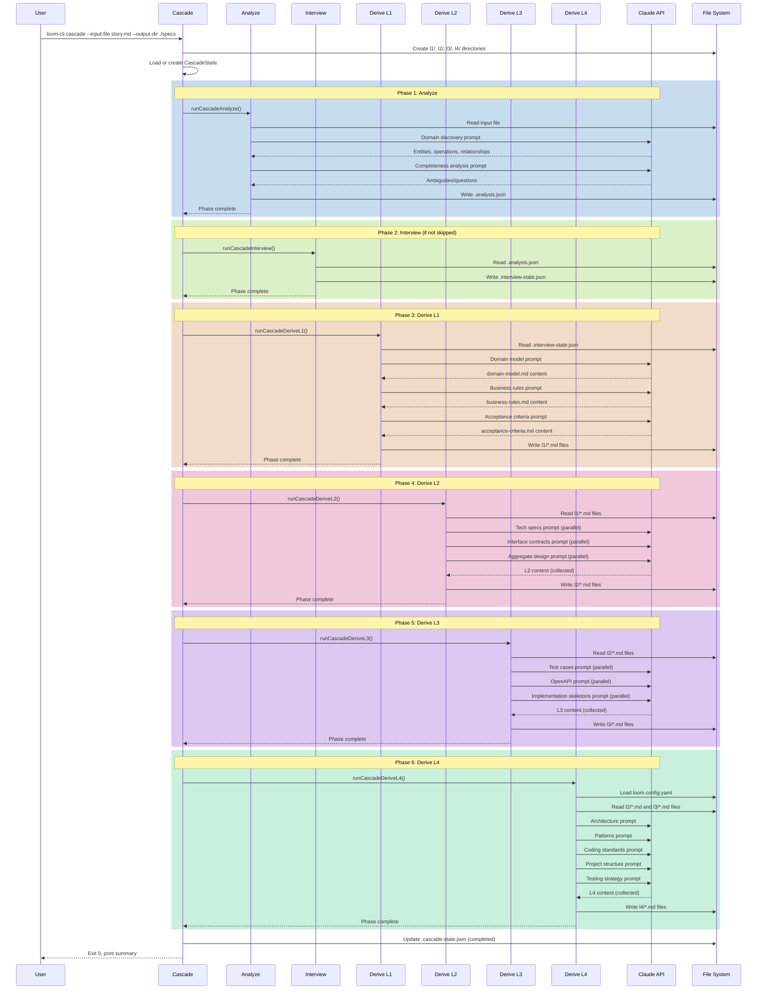
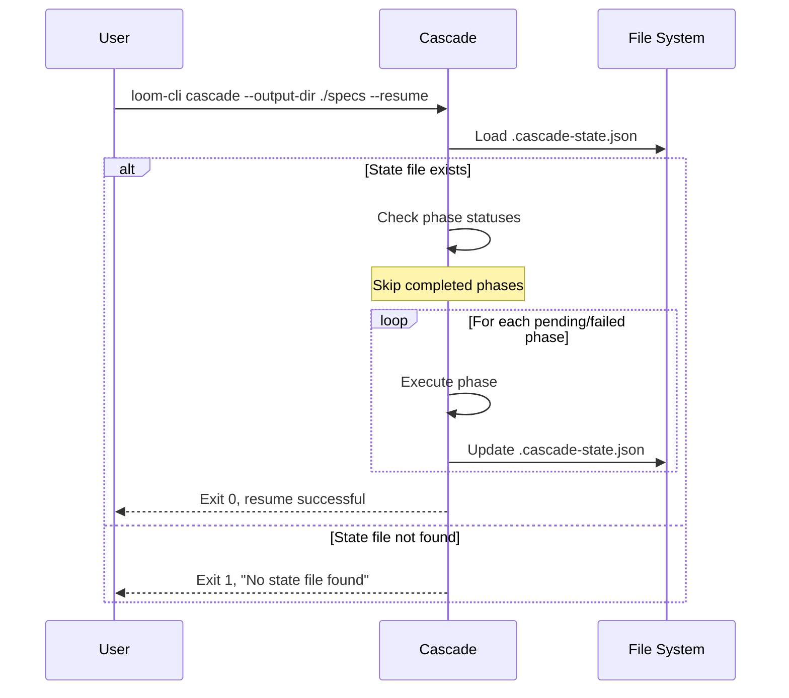
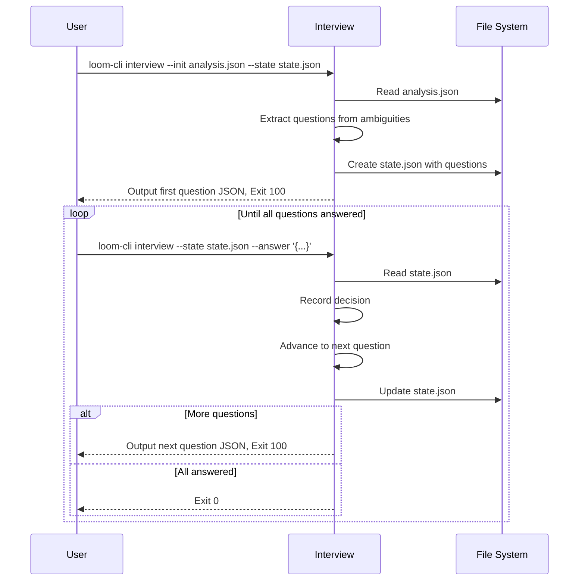
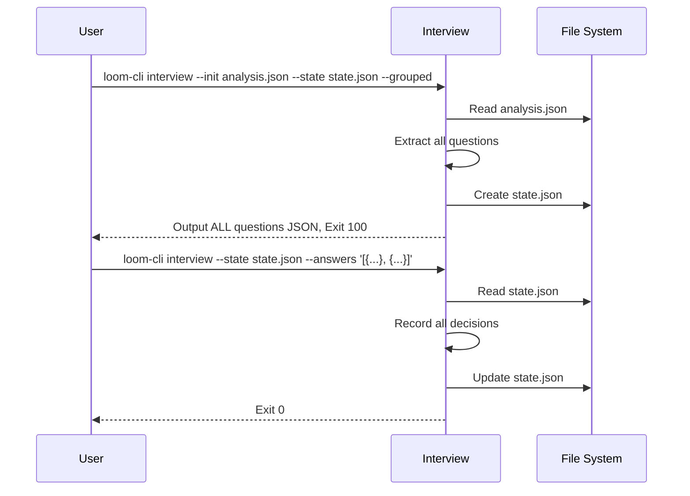
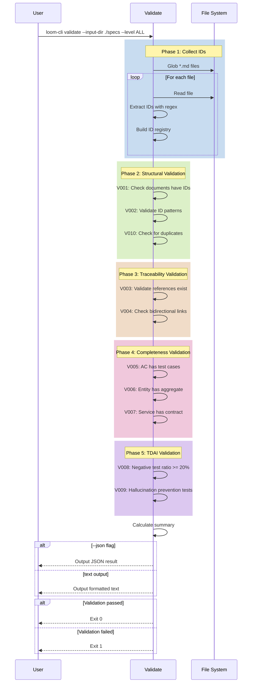
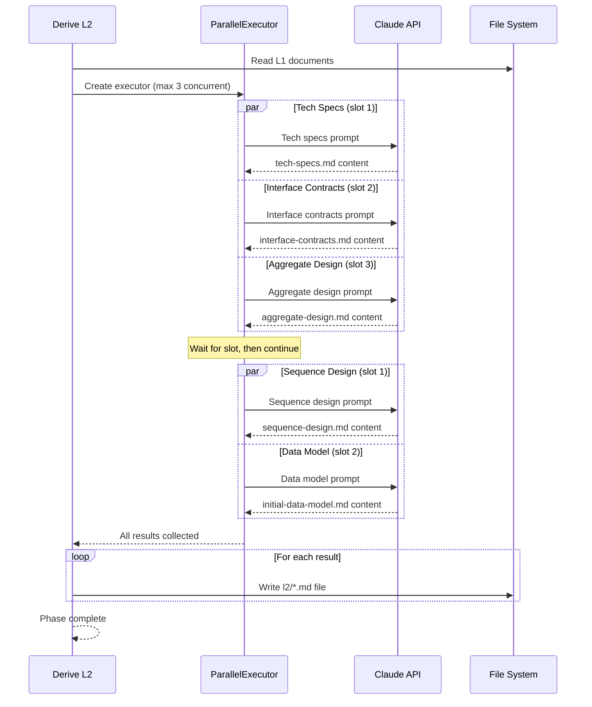
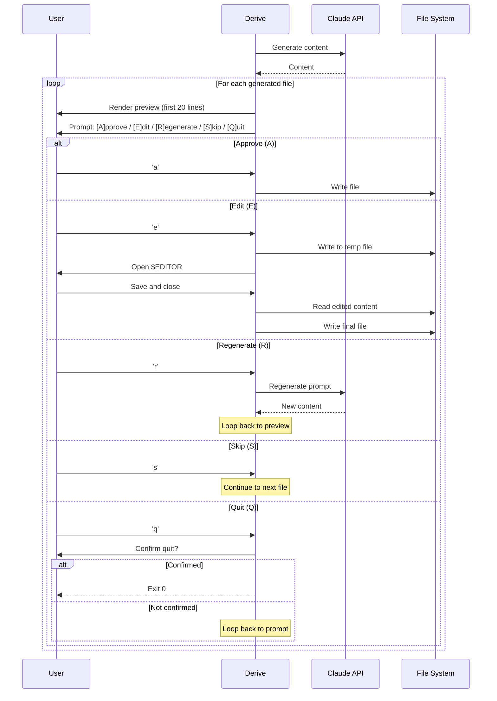
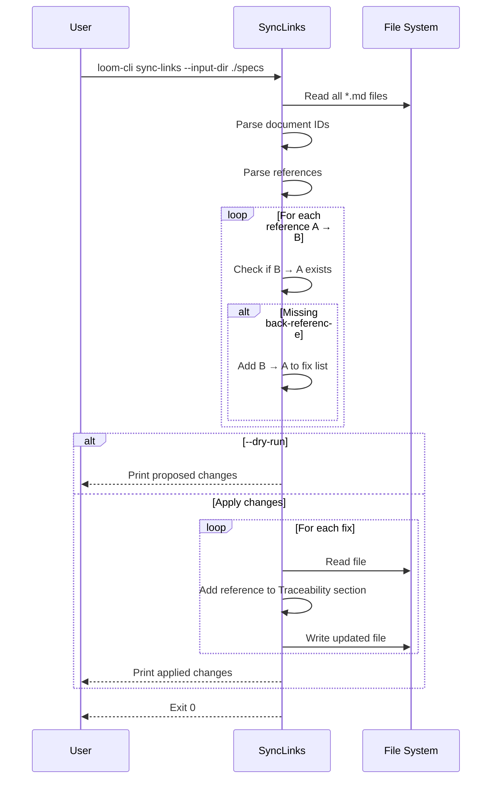
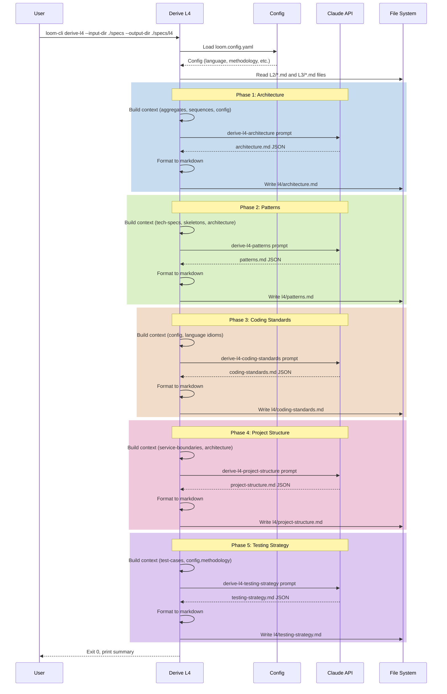
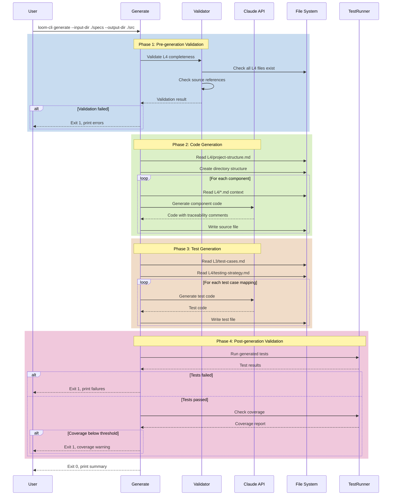

# Loom CLI Sequence Design

## Overview

This document defines the sequence designs for loom-cli operations, showing the flow of control between components.

**Traceability:** Derived from [acceptance-criteria.md](../l1/acceptance-criteria.md) and [business-rules.md](../l1/business-rules.md).

---

## SEQ-CAS-001: Full Cascade Derivation

**Traces to:** AC-CAS-001, US-008

**Actors:**
- User (CLI caller)
- Cascade Command
- Phase Executors
- Claude API
- File System

---

## SEQ-CAS-002: Cascade Resume

**Traces to:** AC-CAS-004, BR-DRV-003

---

## SEQ-INT-001: Interview Flow

**Traces to:** AC-INT-001 through AC-INT-004, BR-INT-001

---

## SEQ-INT-002: Grouped Interview Mode

**Traces to:** AC-INT-005, BR-INT-001 (override)

---

## SEQ-VAL-001: Document Validation

**Traces to:** AC-VAL-001, BR-VAL-001

---

## SEQ-DRV-001: L2 Parallel Derivation

**Traces to:** AC-L2-002, BR-DRV-002

---

## SEQ-INT-003: Interactive Approval Flow

**Traces to:** AC-L2-004, BR-DRV-004, DEC-031

---

## SEQ-SYN-001: Sync Links

**Traces to:** AC-SYN-001, BR-DOC-003

---

## SEQ-L4-001: L4 Derivation

**Traces to:** IC-DRV-004, US-010

**Actors:**
- Derive L4 Command
- Claude API
- File System
- Config Loader

---

## SEQ-GEN-001: Code Generation

**Traces to:** IC-GEN-001, US-011

**Actors:**
- Generate Command
- Claude API
- File System
- Validator
- Test Runner

---

## Related Documents

| Level | Document | Description |
|-------|----------|-------------|
| L0 | [domain-vocabulary.md](../l0/domain-vocabulary.md) | Domain Vocabulary |
| L0 | [loom-cli.md](../l0/loom-cli.md) | User Stories |
| L0 | [nfr.md](../l0/nfr.md) | Non-Functional Requirements |
| L0 | [decisions.md](../l0/decisions.md) | Design Decisions (L0→L1) |
| L1 | [domain-model.md](../l1/domain-model.md) | Domain Model |
| L1 | [decisions.md](../l1/decisions.md) | Design Decisions (L1→L2) |
| L2 | [decisions.md](decisions.md) | Design Decisions (L2→L3) |
| L2 | [prompt-catalog.md](prompt-catalog.md) | Prompt Catalog |
| L1 | [bounded-context-map.md](../l1/bounded-context-map.md) | Bounded Context Map |
| L1 | [business-rules.md](../l1/business-rules.md) | Business Rules |
| L1 | [acceptance-criteria.md](../l1/acceptance-criteria.md) | Acceptance Criteria (source) |
| L2 | [tech-specs.md](tech-specs.md) | Technical Specifications |
| L2 | [interface-contracts.md](interface-contracts.md) | CLI Interface Contract |
| L2 | [aggregate-design.md](aggregate-design.md) | Aggregate Design |
| L2 | This document | Sequence Design |
| L2 | [initial-data-model.md](initial-data-model.md) | Data Model |
