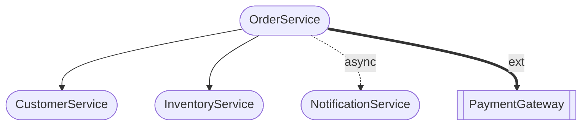

# Loom CLI L3 Dependency Graph Specification

## Overview

This document specifies the dependency graph document structure generated by derive-l3.

**Traceability:** Derived from [service-boundaries.md](service-boundaries.md).

---

## Dependency Graph Structure

### DEP-GRP-001: GraphComponent Entity

**File:** `cmd/derive_l3.go`

```go
type GraphComponent struct {
    ID          string `json:"id"`
    Type        string `json:"type"`
    Description string `json:"description"`
}
```

**ID Pattern:** `DEP-{DOMAIN}-{NNN}`

Where:
- `{DOMAIN}` - Domain code extracted from component name
- `{NNN}` - Sequence number

**Example:** `DEP-ORDR-001` (OrderService component)

**Related DEC:** DEC-022 (L3 document ID prefixes)

---

### DEP-GRP-002: GraphDependency Entity

```go
type GraphDependency struct {
    From        string `json:"from"`
    To          string `json:"to"`
    Type        string `json:"type"`
    Description string `json:"description"`
}
```

---

## Component Types

| Type | Description | Mermaid Shape |
|------|-------------|---------------|
| `service` | Internal microservice | `([name])` (rounded) |
| `domain_service` | Core domain service | `[name]` (square) |
| `external` | External system | `[[name]]` (double square) |

---

## Dependency Types

| Type | Description | Mermaid Arrow |
|------|-------------|---------------|
| `sync` | Synchronous call | `-->` |
| `async` | Asynchronous message | `-.->|async|` |
| `external` | External integration | `==>|ext|` |

---

## Output Format

### OUT-001: dependency-graph.md

**File:** `{output-dir}/dependency-graph.md`

**Structure:**
```markdown
---
title: Dependency Graph
generated: 2024-01-15T10:30:00Z
status: draft
level: L3
---

# Dependency Graph

---

## Visual Overview



## Components

### DEP-ORDR-001: OrderService

- **Type:** service
- **Description:** Manages order lifecycle

### DEP-CUST-001: CustomerService

- **Type:** service
- **Description:** Customer data management

### DEP-EXT-001: PaymentGateway

- **Type:** external
- **Description:** External payment processing

## Dependencies

| From | To | Type | Description |
|---|---|---|---|
| DEP-ORDR-001 | DEP-CUST-001 | sync | Validate customer |
| DEP-ORDR-001 | DEP-INVT-001 | sync | Check inventory |
| DEP-ORDR-001 | DEP-NOTF-001 | async | Send notifications |
| DEP-ORDR-001 | DEP-EXT-001 | external | Process payment |

```

---

## Generation Process

### SEQ-DEP-001: Dependency Graph Generation

**Input:** `service-boundaries.md` (L3, generated in prior phase)

**Prompt:** Uses `prompts.DeriveDependencyGraph`

**Process:**
1. Read service boundaries from L3-4 phase output
2. Build input summary of services and their dependencies
3. Generate components and dependencies via Claude
4. Build ID map for consistent referencing
5. Generate Mermaid diagram
6. Format as markdown

**Output:** `dependency-graph.md`

---

## Mermaid Diagram Generation

### Helper Functions

```go
// sanitizeID removes non-alphanumeric characters for Mermaid
func sanitizeID(id string) string

// extractDomainCode extracts short code from service name
// e.g., "ProductService" -> "PROD"
func extractDomainCode(name string) string
```

---

## Related Documents

| Level | Document | Description |
|-------|----------|-------------|
| L0 | [decisions.md](../l0/decisions.md) | Design Decisions (L0→L1) |
| L1 | [decisions.md](../l1/decisions.md) | Design Decisions (L1→L2) |
| L2 | [decisions.md](../l2/decisions.md) | Design Decisions (L2→L3) |
| L3 | [service-boundaries.md](service-boundaries.md) | Service Boundaries (source) |
| L3 | [event-message-design.md](event-message-design.md) | Event & Message Design |
| L3 | This document | Dependency Graph |
