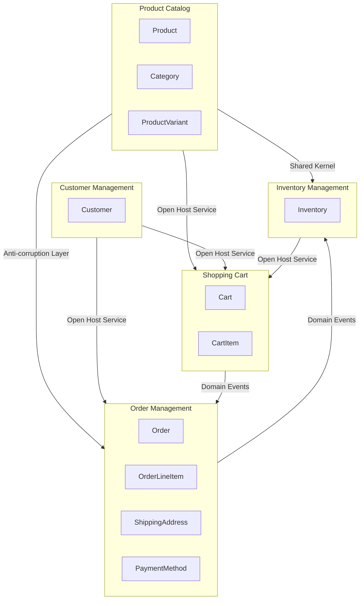

# Bounded Context Map

Generated: 2025-12-31T13:11:10+01:00

---

## Bounded Contexts

### BC-CUSTOMER – Customer Management {#bc-customer}

**Purpose:** Manages customer identity, registration, and authentication

**Core Entities:** [Customer]

**Aggregates:** [Customer]

**Capabilities:**
- Register new customers
- Manage customer profiles
- Authenticate customers

**Ubiquitous Language:**
- **Registration**: Process of creating a customer account with validated email
- **RegistrationStatus**: State indicating whether customer has completed registration
- **Customer**: A registered user who can browse and purchase products

---

### BC-CATALOG – Product Catalog {#bc-catalog}

**Purpose:** Manages product information, categorization, and variants for browsing

**Core Entities:** [Product Category ProductVariant]

**Aggregates:** [Product Category]

**Capabilities:**
- Create and manage products
- Organize products into categories
- Define product variants (size, color)
- Activate/deactivate products

**Ubiquitous Language:**
- **Product**: An item available for sale with name, description, and price
- **Category**: A hierarchical grouping of related products
- **ProductVariant**: A specific variation of a product (e.g., size/color combination)
- **SKU**: Stock Keeping Unit - unique identifier for a variant
- **Active Product**: A product visible and available for purchase

---

### BC-SHOPPING – Shopping Cart {#bc-shopping}

**Purpose:** Handles the shopping experience including cart management before checkout

**Core Entities:** [Cart CartItem]

**Aggregates:** [Cart]

**Capabilities:**
- Add items to cart
- Update item quantities
- Remove items from cart
- Calculate cart totals
- Clear cart on checkout

**Ubiquitous Language:**
- **Add to Cart**: Action of placing a product into the shopping cart
- **Cart**: A collection of items a customer intends to purchase
- **CartItem**: A product with quantity in the shopping cart
- **Subtotal**: Sum of all item prices in the cart

---

### BC-ORDER – Order Management {#bc-order}

**Purpose:** Handles order lifecycle from placement through fulfillment and delivery

**Core Entities:** [Order OrderLineItem ShippingAddress PaymentMethod]

**Aggregates:** [Order]

**Capabilities:**
- Create orders from cart
- Process order confirmation
- Track order status transitions
- Handle order cancellation
- Calculate totals with shipping

**Ubiquitous Language:**
- **Order**: A confirmed purchase transaction with line items and delivery details
- **OrderLineItem**: Immutable snapshot of a product at time of purchase
- **OrderStatus**: Current state in the order lifecycle (PENDING, CONFIRMED, SHIPPED, DELIVERED, CANCELLED)
- **Fulfillment**: Process of confirming, shipping, and delivering an order
- **Free Shipping**: Shipping at no cost when subtotal exceeds $50

---

### BC-INVENTORY – Inventory Management {#bc-inventory}

**Purpose:** Tracks stock levels, reservations, and product availability

**Core Entities:** [Inventory]

**Aggregates:** [Inventory]

**Capabilities:**
- Track quantity on hand
- Reserve stock for pending orders
- Release reserved stock on cancellation
- Deduct stock on fulfillment
- Restock products
- Check product availability

**Ubiquitous Language:**
- **Out of Stock**: When available quantity reaches zero
- **Inventory**: Stock record tracking quantity for a specific product
- **Quantity on Hand**: Total physical stock available
- **Reserved Quantity**: Stock held for pending orders
- **Available Quantity**: Stock that can be purchased (on hand minus reserved)

---

## Context Relationships

| Upstream | Downstream | Type | Pattern |
|----------|------------|------|----------|
| BC-CATALOG | BC-SHOPPING | customer_supplier | Open Host Service |
| BC-CATALOG | BC-ORDER | customer_supplier | Anti-corruption Layer |
| BC-CUSTOMER | BC-SHOPPING | customer_supplier | Open Host Service |
| BC-CUSTOMER | BC-ORDER | customer_supplier | Open Host Service |
| BC-SHOPPING | BC-ORDER | customer_supplier | Domain Events |
| BC-INVENTORY | BC-SHOPPING | customer_supplier | Open Host Service |
| BC-ORDER | BC-INVENTORY | customer_supplier | Domain Events |
| BC-CATALOG | BC-INVENTORY | shared_kernel | Shared Kernel |

## Context Map Diagram

## Summary

- Total Contexts: 5
- Total Relationships: 8
- Integration Patterns: [Open Host Service Domain Events Anti-corruption Layer Shared Kernel]
