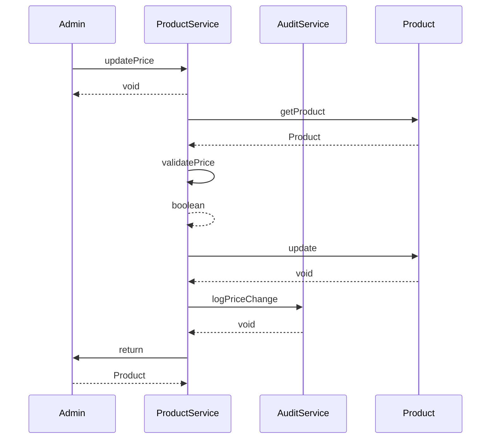

# Sequence Design

Generated: 2026-01-02T21:09:41+01:00

---

## SEQ-CART-001 – Add Item to Cart {#seq-cart-001}

Customer adds a product to their shopping cart with stock validation

### Trigger

**Type:** user_action

Customer clicks 'Add to Cart' button on product page

### Participants

- **Customer** (actor)
- **CartService** (service)
- **InventoryService** (service)
- **Cart** (aggregate)
- **Inventory** (aggregate)

### Sequence

1. **Customer** → CartService: addItem
   - Returns: void
2. **CartService** → InventoryService: isInStock
   - Returns: boolean
3. **CartService** → Cart: addItem
   - Emits: `ItemAddedToCart`
   - Returns: void
4. **CartService** → Customer: return
   - Returns: Cart

### Sequence Diagram

### Outcome

Item added to cart with updated total

**State Changes:**
- Cart.items += CartItem
- Cart.totalPrice = recalculated

### Exceptions

- **Product out of stock** (step 2): Return OUT_OF_STOCK error to customer
- **Quantity exceeds available stock** (step 2): Return QUANTITY_EXCEEDS_STOCK error with available quantity
- **Variant required but not selected** (step 1): Return VARIANT_REQUIRED error

---

## SEQ-CART-002 – Update Cart Item Quantity {#seq-cart-002}

Customer updates the quantity of an item already in their cart

### Trigger

**Type:** user_action

Customer changes quantity input on cart page

### Participants

- **Customer** (actor)
- **CartService** (service)
- **InventoryService** (service)
- **Cart** (aggregate)

### Sequence

1. **Customer** → CartService: updateQuantity
   - Returns: void
2. **CartService** → InventoryService: isInStock
   - Returns: boolean
3. **CartService** → Cart: updateQuantity
   - Emits: `CartQuantityUpdated`
   - Returns: void
4. **CartService** → Customer: return
   - Returns: Cart

### Sequence Diagram

### Outcome

Cart item quantity updated with recalculated total

**State Changes:**
- CartItem.quantity = newQuantity
- CartItem.subtotal = recalculated
- Cart.totalPrice = recalculated

### Exceptions

- **Quantity exceeds available stock** (step 2): Return QUANTITY_EXCEEDS_STOCK error, cap at available
- **Item not in cart** (step 3): Return ITEM_NOT_FOUND error

---

## SEQ-CART-003 – Remove Item from Cart {#seq-cart-003}

Customer removes an item from their shopping cart

### Trigger

**Type:** user_action

Customer clicks 'Remove' button on cart item

### Participants

- **Customer** (actor)
- **CartService** (service)
- **Cart** (aggregate)

### Sequence

1. **Customer** → CartService: removeItem
   - Returns: void
2. **CartService** → Cart: removeItem
   - Emits: `ItemRemovedFromCart`
   - Returns: void
3. **CartService** → Customer: return
   - Returns: Cart

### Sequence Diagram

### Outcome

Item removed from cart with recalculated total

**State Changes:**
- Cart.items -= CartItem
- Cart.totalPrice = recalculated

### Exceptions

- **Item not in cart** (step 2): Return ITEM_NOT_FOUND error or silently succeed

---

## SEQ-ORDER-001 – Place Order {#seq-order-001}

Customer places an order from their cart with payment processing and inventory reservation

### Trigger

**Type:** user_action

Customer clicks 'Place Order' button at checkout

### Participants

- **Customer** (actor)
- **OrderService** (service)
- **CartService** (service)
- **InventoryService** (service)
- **PaymentService** (service)
- **CustomerService** (service)
- **Order** (aggregate)
- **Cart** (aggregate)
- **Inventory** (aggregate)
- **PaymentGateway** (external)

### Sequence

1. **Customer** → OrderService: placeOrder
   - Returns: void
2. **OrderService** → CustomerService: validateCustomer
   - Returns: CustomerValidation
3. **OrderService** → CartService: getCart
   - Returns: Cart
4. **OrderService** → InventoryService: reserve
   - Emits: `InventoryReserved`
   - Returns: ReservationResult
5. **OrderService** → OrderService: calculateShipping
   - Returns: shippingCost
6. **OrderService** → PaymentService: authorizePayment
   - Returns: PaymentAuthorization
7. **PaymentService** → PaymentGateway: authorize
   - Returns: AuthorizationResult
8. **OrderService** → Order: create
   - Emits: `OrderPlaced`
   - Returns: Order
9. **OrderService** → CartService: clear
   - Emits: `CartCleared`
   - Returns: void
10. **OrderService** → Customer: return
   - Returns: OrderConfirmation

### Sequence Diagram

### Outcome

Order created, payment authorized, inventory reserved, cart cleared

**State Changes:**
- Order.status = PENDING
- Inventory.reservedQuantity += orderQuantities
- Cart.items = []
- Cart.totalPrice = 0

### Exceptions

- **Customer not registered** (step 2): Return REGISTRATION_REQUIRED error
- **Customer email not verified** (step 2): Return EMAIL_NOT_VERIFIED error
- **Cart is empty** (step 3): Return EMPTY_CART error
- **Insufficient stock for one or more items** (step 4): Return INSUFFICIENT_STOCK error with affected items
- **Payment authorization failed** (step 7): Return PAYMENT_FAILED error
- **International shipping address** (step 5): Return INTERNATIONAL_SHIPPING_NOT_AVAILABLE error

---

## SEQ-ORDER-002 – Confirm Order {#seq-order-002}

System or admin confirms a pending order after payment capture

### Trigger

**Type:** system_event

Payment capture confirmed by payment gateway webhook

### Participants

- **PaymentGateway** (external)
- **OrderService** (service)
- **Order** (aggregate)
- **AuditService** (service)

### Sequence

1. **PaymentGateway** → OrderService: paymentCaptured
   - Returns: void
2. **OrderService** → Order: getOrder
   - Returns: Order
3. **OrderService** → Order: confirm
   - Emits: `OrderConfirmed`
   - Returns: void
4. **OrderService** → AuditService: logStatusChange
   - Returns: void

### Sequence Diagram

### Outcome

Order status updated to CONFIRMED

**State Changes:**
- Order.status = CONFIRMED

### Exceptions

- **Order not in PENDING status** (step 3): Return INVALID_STATUS_TRANSITION error
- **Order not found** (step 2): Log error, alert admin for manual review

---

## SEQ-ORDER-003 – Ship Order {#seq-order-003}

Fulfillment marks order as shipped with tracking information

### Trigger

**Type:** user_action

Fulfillment staff marks order as shipped in admin system

### Participants

- **FulfillmentStaff** (actor)
- **OrderService** (service)
- **InventoryService** (service)
- **NotificationService** (service)
- **Order** (aggregate)
- **Inventory** (aggregate)

### Sequence

1. **FulfillmentStaff** → OrderService: shipOrder
   - Returns: void
2. **OrderService** → Order: getOrder
   - Returns: Order
3. **OrderService** → InventoryService: deduct
   - Emits: `InventoryDeducted`
   - Returns: void
4. **OrderService** → Order: ship
   - Emits: `OrderShipped`
   - Returns: void
5. **OrderService** → NotificationService: sendShippingNotification
   - Returns: void

### Sequence Diagram

### Outcome

Order shipped, inventory deducted from reserved, customer notified

**State Changes:**
- Order.status = SHIPPED
- Inventory.quantityOnHand -= orderQuantities
- Inventory.reservedQuantity -= orderQuantities

### Exceptions

- **Order not in CONFIRMED status** (step 4): Return INVALID_STATUS_TRANSITION error
- **Notification delivery failed** (step 5): Log for retry, order still shipped successfully

---

## SEQ-ORDER-004 – Deliver Order {#seq-order-004}

System marks order as delivered based on carrier confirmation

### Trigger

**Type:** system_event

Carrier webhook confirms delivery

### Participants

- **CarrierSystem** (external)
- **OrderService** (service)
- **NotificationService** (service)
- **Order** (aggregate)

### Sequence

1. **CarrierSystem** → OrderService: deliveryConfirmed
   - Returns: void
2. **OrderService** → Order: findByTracking
   - Returns: Order
3. **OrderService** → Order: deliver
   - Emits: `OrderDelivered`
   - Returns: void
4. **OrderService** → NotificationService: sendDeliveryNotification
   - Returns: void

### Sequence Diagram

### Outcome

Order status updated to DELIVERED, customer notified

**State Changes:**
- Order.status = DELIVERED

### Exceptions

- **Order not in SHIPPED status** (step 3): Log warning, may indicate duplicate webhook
- **Order not found for tracking number** (step 2): Log error for manual review

---

## SEQ-ORDER-005 – Cancel Order {#seq-order-005}

Customer cancels an order before shipment with inventory restoration and refund

### Trigger

**Type:** user_action

Customer clicks 'Cancel Order' button

### Participants

- **Customer** (actor)
- **OrderService** (service)
- **InventoryService** (service)
- **PaymentService** (service)
- **NotificationService** (service)
- **Order** (aggregate)
- **Inventory** (aggregate)
- **PaymentGateway** (external)

### Sequence

1. **Customer** → OrderService: cancelOrder
   - Returns: void
2. **OrderService** → Order: getOrder
   - Returns: Order
3. **OrderService** → OrderService: validateCancellation
   - Returns: boolean
4. **OrderService** → Order: cancel
   - Emits: `OrderCancelled`
   - Returns: void
5. **OrderService** → InventoryService: release
   - Emits: `InventoryReleased`
   - Returns: void
6. **OrderService** → PaymentService: initiateRefund
   - Returns: RefundResult
7. **PaymentService** → PaymentGateway: refund
   - Returns: RefundConfirmation
8. **OrderService** → NotificationService: sendCancellationNotification
   - Returns: void
9. **OrderService** → Customer: return
   - Returns: CancellationConfirmation

### Sequence Diagram

### Outcome

Order cancelled, inventory restored, refund initiated, customer notified

**State Changes:**
- Order.status = CANCELLED
- Inventory.reservedQuantity -= orderQuantities

### Exceptions

- **Order already shipped** (step 3): Return CANCELLATION_NOT_ALLOWED error
- **Refund failed** (step 7): Log for manual processing, order still cancelled

---

## SEQ-CUST-001 – Customer Registration {#seq-cust-001}

New user registers an account with email verification

### Trigger

**Type:** user_action

User submits registration form

### Participants

- **User** (actor)
- **CustomerService** (service)
- **NotificationService** (service)
- **Customer** (aggregate)
- **Cart** (aggregate)

### Sequence

1. **User** → CustomerService: register
   - Returns: void
2. **CustomerService** → CustomerService: validateEmail
   - Returns: boolean
3. **CustomerService** → CustomerService: validatePassword
   - Returns: boolean
4. **CustomerService** → Customer: register
   - Emits: `CustomerRegistered`
   - Returns: Customer
5. **CustomerService** → Cart: create
   - Returns: Cart
6. **CustomerService** → NotificationService: sendVerificationEmail
   - Returns: void
7. **CustomerService** → User: return
   - Returns: RegistrationResult

### Sequence Diagram

### Outcome

Customer account created, cart initialized, verification email sent

**State Changes:**
- Customer created with status REGISTERED
- Customer.emailVerified = false
- Cart created for customer

### Exceptions

- **Email already registered** (step 2): Return EMAIL_ALREADY_REGISTERED error
- **Password too weak** (step 3): Return WEAK_PASSWORD error with requirements
- **Verification email failed to send** (step 6): Log for retry, account still created

---

## SEQ-INV-001 – Restock Inventory {#seq-inv-001}

Admin restocks product inventory with audit logging

### Trigger

**Type:** user_action

Admin enters restock quantity in inventory management

### Participants

- **Admin** (actor)
- **InventoryService** (service)
- **AuditService** (service)
- **Inventory** (aggregate)

### Sequence

1. **Admin** → InventoryService: restock
   - Returns: void
2. **InventoryService** → Inventory: getInventory
   - Returns: Inventory
3. **InventoryService** → Inventory: restock
   - Emits: `InventoryRestocked`
   - Returns: void
4. **InventoryService** → AuditService: logInventoryChange
   - Returns: void
5. **InventoryService** → Admin: return
   - Returns: Inventory

### Sequence Diagram

### Outcome

Inventory quantity increased, audit trail recorded

**State Changes:**
- Inventory.quantityOnHand += restockQuantity

### Exceptions

- **Invalid quantity (negative or zero)** (step 3): Return validation error
- **Product not found** (step 2): Return PRODUCT_NOT_FOUND error

---

## SEQ-PROD-001 – Create Product {#seq-prod-001}

Admin creates a new product with inventory initialization

### Trigger

**Type:** user_action

Admin submits new product form

### Participants

- **Admin** (actor)
- **ProductService** (service)
- **InventoryService** (service)
- **Product** (aggregate)
- **Inventory** (aggregate)

### Sequence

1. **Admin** → ProductService: createProduct
   - Returns: void
2. **ProductService** → ProductService: validateProduct
   - Returns: boolean
3. **ProductService** → Product: create
   - Emits: `ProductCreated`
   - Returns: Product
4. **ProductService** → InventoryService: initializeInventory
   - Returns: Inventory
5. **ProductService** → Admin: return
   - Returns: Product

### Sequence Diagram

### Outcome

Product created with inventory initialized

**State Changes:**
- Product created with isActive = true
- Inventory created with quantityOnHand = initialStock

### Exceptions

- **Price below minimum** (step 2): Return INVALID_PRICE error
- **Name too short or too long** (step 2): Return INVALID_PRODUCT_NAME error
- **Description too long** (step 2): Return DESCRIPTION_TOO_LONG error
- **Category not found** (step 3): Return CATEGORY_NOT_FOUND error

---

## SEQ-PROD-002 – Update Product Price {#seq-prod-002}

Admin updates product price with audit tracking

### Trigger

**Type:** user_action

Admin changes price in product management

### Participants

- **Admin** (actor)
- **ProductService** (service)
- **AuditService** (service)
- **Product** (aggregate)

### Sequence

1. **Admin** → ProductService: updatePrice
   - Returns: void
2. **ProductService** → Product: getProduct
   - Returns: Product
3. **ProductService** → ProductService: validatePrice
   - Returns: boolean
4. **ProductService** → Product: update
   - Emits: `ProductUpdated`
   - Returns: void
5. **ProductService** → AuditService: logPriceChange
   - Returns: void
6. **ProductService** → Admin: return
   - Returns: Product

### Sequence Diagram

### Outcome

Product price updated, cart prices will reflect change on next view

**State Changes:**
- Product.price = newPrice

### Exceptions

- **Price below minimum** (step 3): Return INVALID_PRICE error
- **Product not found** (step 2): Return PRODUCT_NOT_FOUND error

---

## SEQ-NOTIF-001 – Order Shipped Notification {#seq-notif-001}

System sends shipping notification when order is shipped

### Trigger

**Type:** system_event

OrderShipped event emitted

### Participants

- **OrderService** (service)
- **NotificationHandler** (service)
- **CustomerService** (service)
- **EmailService** (service)

### Sequence

1. **OrderService** → NotificationHandler: emit
   - Emits: `OrderShipped`
   - Returns: void
2. **NotificationHandler** → CustomerService: getCustomerEmail
   - Returns: email
3. **NotificationHandler** → EmailService: sendShippingNotification
   - Returns: void
4. **NotificationHandler** → NotificationHandler: logNotificationSent
   - Returns: void

### Sequence Diagram

### Outcome

Customer receives shipping notification with tracking info

### Exceptions

- **Email delivery failed** (step 3): Retry 3 times with exponential backoff, then log for manual review
- **Customer email not found** (step 2): Log error, skip notification

---

## SEQ-INV-002 – Out of Stock Alert {#seq-inv-002}

System detects out of stock condition and alerts relevant parties

### Trigger

**Type:** system_event

Inventory available quantity reaches zero

### Participants

- **InventoryService** (service)
- **NotificationService** (service)
- **ProductService** (service)
- **Inventory** (aggregate)

### Sequence

1. **InventoryService** → Inventory: checkStock
   - Returns: availableQuantity
2. **InventoryService** → InventoryService: emit
   - Emits: `OutOfStock`
   - Returns: void
3. **InventoryService** → NotificationService: sendOutOfStockAlert
   - Returns: void

### Sequence Diagram

### Outcome

Out of stock condition detected and admin alerted

### Exceptions

- **Alert delivery failed** (step 3): Queue for retry

---

