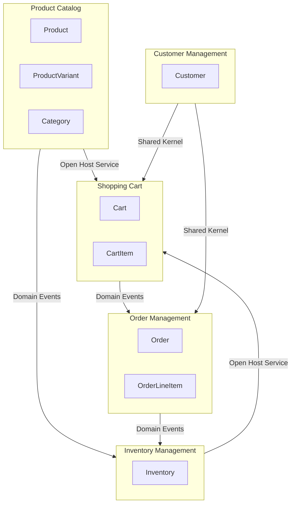

# Bounded Context Map

Generated: 2025-12-29T13:37:22+01:00

---

## Bounded Contexts

### BC-CATALOG – Product Catalog

**Purpose:** Manages product information, categorization, and browsing capabilities for customers and administrators

**Core Entities:** [Product ProductVariant Category]

**Aggregates:** [Product Category]

**Capabilities:**
- Create and manage products
- Organize products into categories
- Manage product variants (size, color)
- Activate and deactivate products
- Browse and search product catalog

**Ubiquitous Language:**
- **Variant**: A specific configuration of a product (e.g., size/color combination)
- **SKU**: Stock Keeping Unit - unique identifier for a product variant
- **Active Product**: A product available for purchase
- **Product**: A purchasable item with name, description, and price
- **Category**: A logical grouping of related products for browsing

---

### BC-INVENTORY – Inventory Management

**Purpose:** Tracks stock levels, manages availability, and handles stock reservations for order fulfillment

**Core Entities:** [Inventory]

**Aggregates:** [Inventory]

**Capabilities:**
- Track stock levels per product
- Reserve inventory for pending orders
- Release reserved inventory on cancellation
- Deduct inventory on order fulfillment
- Restock products
- Notify when products go out of stock

**Ubiquitous Language:**
- **Stock Level**: Total quantity of a product in warehouse
- **Reserved Quantity**: Stock allocated to pending orders but not yet shipped
- **Available Quantity**: Stock available for new orders (stock level minus reserved)
- **Reservation**: Temporary hold on inventory for a pending order
- **Restock**: Adding new inventory to increase stock level

---

### BC-SHOPPING – Shopping Cart

**Purpose:** Manages the shopping experience including cart operations and checkout preparation

**Core Entities:** [Cart CartItem]

**Aggregates:** [Cart]

**Capabilities:**
- Add products to cart
- Update item quantities
- Remove items from cart
- Calculate cart totals
- Validate product availability
- Clear cart after checkout

**Ubiquitous Language:**
- **Cart**: A temporary collection of products a customer intends to purchase
- **Cart Item**: A product with specified quantity in the cart
- **Total Price**: Sum of all cart item subtotals
- **Checkout**: Process of converting cart contents to an order

---

### BC-ORDERS – Order Management

**Purpose:** Handles the complete order lifecycle from placement through delivery or cancellation

**Core Entities:** [Order OrderLineItem]

**Aggregates:** [Order]

**Capabilities:**
- Place orders from cart contents
- Track order status progression
- Process order confirmation
- Handle order shipping
- Record order delivery
- Process order cancellations
- Calculate shipping costs
- Apply free shipping rules

**Ubiquitous Language:**
- **Order**: A confirmed customer purchase with shipping and payment details
- **Line Item**: An immutable snapshot of a product at order time
- **Order Status**: Current state in the order lifecycle (pending, confirmed, shipped, delivered, cancelled)
- **Shipping Cost**: Delivery fee (free for orders over $50)
- **Fulfillment**: Process of preparing and shipping an order

---

### BC-CUSTOMERS – Customer Management

**Purpose:** Manages customer registration, authentication, and customer-related operations

**Core Entities:** [Customer]

**Aggregates:** [Customer]

**Capabilities:**
- Register new customers
- Manage customer profiles
- Authenticate customers
- Associate customers with carts and orders

**Ubiquitous Language:**
- **Customer**: A registered user who can browse and purchase products
- **Registration**: Process of creating a customer account
- **Registered Customer**: A customer who has completed registration and can place orders

---

## Context Relationships

| Upstream | Downstream | Type | Pattern |
|----------|------------|------|----------|
| BC-CATALOG | BC-SHOPPING | customer_supplier | Open Host Service |
| BC-CATALOG | BC-INVENTORY | customer_supplier | Domain Events |
| BC-INVENTORY | BC-SHOPPING | customer_supplier | Open Host Service |
| BC-SHOPPING | BC-ORDERS | customer_supplier | Domain Events |
| BC-CUSTOMERS | BC-SHOPPING | customer_supplier | Shared Kernel |
| BC-CUSTOMERS | BC-ORDERS | customer_supplier | Shared Kernel |
| BC-ORDERS | BC-INVENTORY | customer_supplier | Domain Events |

## Context Map Diagram

## Summary

- Total Contexts: 5
- Total Relationships: 7
- Integration Patterns: [Open Host Service Domain Events Shared Kernel]
