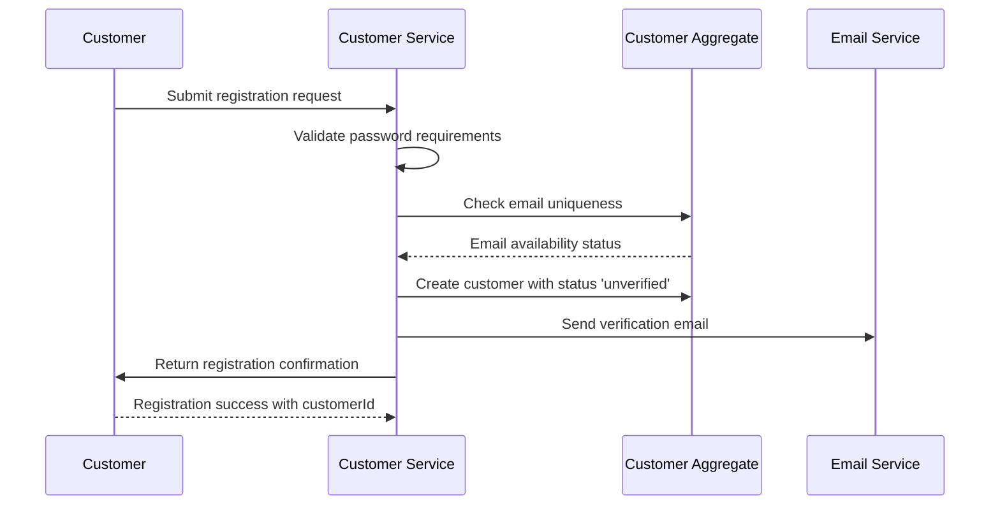
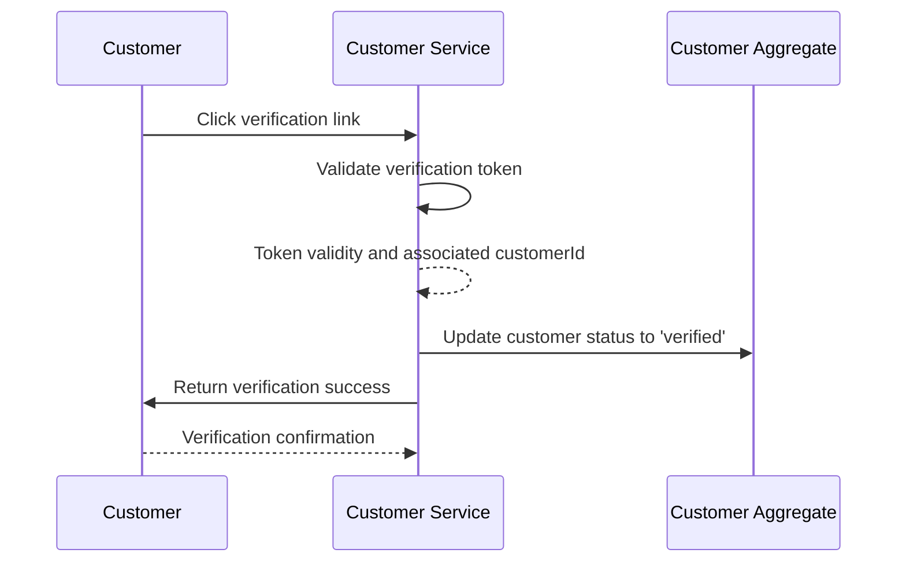
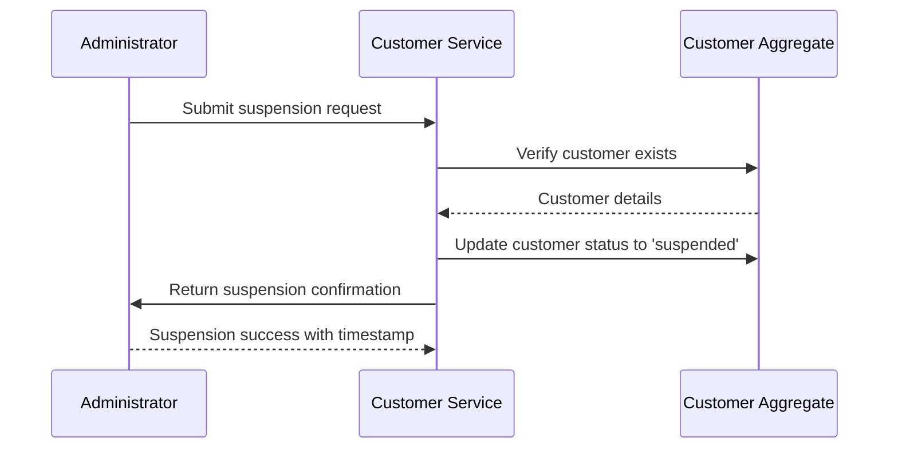
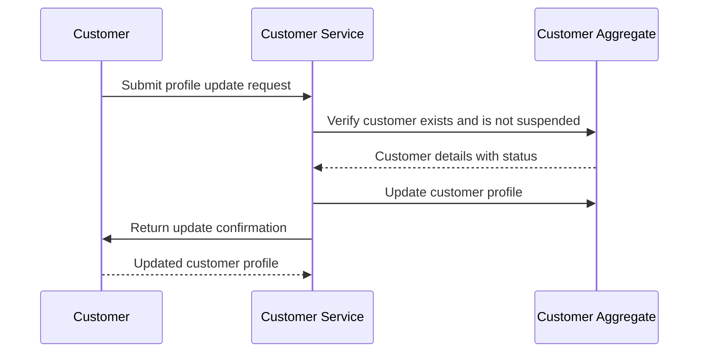
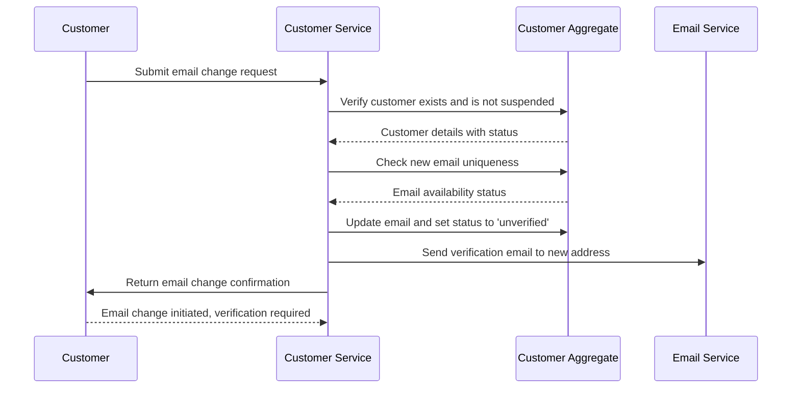

# Sequence Design

Generated: 2025-12-31T13:24:23+01:00

---

## SEQ-CUST-001 – Customer Registration Flow {#seq-cust-001}

Complete flow from registration form submission to account creation

### Trigger

**Type:** user_action

Customer submits registration form

### Participants

- **Customer** (actor)
- **Customer Service** (service)
- **Customer Aggregate** (aggregate)
- **Email Service** (service)

### Sequence

1. **Customer** → Customer Service: Submit registration request
2. **Customer Service** → Customer Service: Validate password requirements
3. **Customer Service** → Customer Aggregate: Check email uniqueness
   - Returns: Email availability status
4. **Customer Service** → Customer Aggregate: Create customer with status 'unverified'
   - Emits: `CustomerCreated`
5. **Customer Service** → Email Service: Send verification email
   - Emits: `VerificationEmailSent`
6. **Customer Service** → Customer: Return registration confirmation
   - Returns: Registration success with customerId

### Sequence Diagram

### Outcome

Customer account created with 'unverified' status, verification email sent

**State Changes:**
- Customer.status = unverified
- Customer.id = generated UUID

### Exceptions

- **Password does not meet requirements** (step 2): Return error INVALID_PASSWORD with requirements, abort flow
- **Email already registered** (step 3): Return error EMAIL_ALREADY_EXISTS, abort flow

---

## SEQ-CUST-002 – Email Verification Flow {#seq-cust-002}

Customer verifies email address via verification link

### Trigger

**Type:** user_action

Customer clicks email verification link

### Participants

- **Customer** (actor)
- **Customer Service** (service)
- **Customer Aggregate** (aggregate)

### Sequence

1. **Customer** → Customer Service: Click verification link
2. **Customer Service** → Customer Service: Validate verification token
   - Returns: Token validity and associated customerId
3. **Customer Service** → Customer Aggregate: Update customer status to 'verified'
   - Emits: `CustomerVerified`
4. **Customer Service** → Customer: Return verification success
   - Returns: Verification confirmation

### Sequence Diagram

### Outcome

Customer account status changed to 'verified'

**State Changes:**
- Customer.status = verified

### Exceptions

- **Invalid or expired token** (step 2): Return error INVALID_TOKEN, abort flow
- **Customer already verified** (step 3): Return success (idempotent), no state change

---

## SEQ-CUST-003 – Customer Suspension Flow {#seq-cust-003}

Administrator suspends a customer account

### Trigger

**Type:** admin_action

Administrator initiates customer suspension

### Participants

- **Administrator** (actor)
- **Customer Service** (service)
- **Customer Aggregate** (aggregate)

### Sequence

1. **Administrator** → Customer Service: Submit suspension request
2. **Customer Service** → Customer Aggregate: Verify customer exists
   - Returns: Customer details
3. **Customer Service** → Customer Aggregate: Update customer status to 'suspended'
   - Emits: `CustomerSuspended`
4. **Customer Service** → Administrator: Return suspension confirmation
   - Returns: Suspension success with timestamp

### Sequence Diagram

### Outcome

Customer account status changed to 'suspended'

**State Changes:**
- Customer.status = suspended

### Exceptions

- **Customer not found** (step 2): Return error CUSTOMER_NOT_FOUND, abort flow
- **Customer already suspended** (step 3): Return success (idempotent), no state change

---

## SEQ-CUST-004 – Customer Profile Update Flow {#seq-cust-004}

Customer updates their profile information

### Trigger

**Type:** user_action

Customer submits profile update form

### Participants

- **Customer** (actor)
- **Customer Service** (service)
- **Customer Aggregate** (aggregate)

### Sequence

1. **Customer** → Customer Service: Submit profile update request
2. **Customer Service** → Customer Aggregate: Verify customer exists and is not suspended
   - Returns: Customer details with status
3. **Customer Service** → Customer Aggregate: Update customer profile
   - Emits: `CustomerProfileUpdated`
4. **Customer Service** → Customer: Return update confirmation
   - Returns: Updated customer profile

### Sequence Diagram

### Outcome

Customer profile information updated

**State Changes:**
- Customer.firstName = new value
- Customer.lastName = new value

### Exceptions

- **Customer not found** (step 2): Return error CUSTOMER_NOT_FOUND, abort flow
- **Customer is suspended** (step 2): Return error ACCOUNT_SUSPENDED, abort flow

---

## SEQ-CUST-005 – Customer Email Change Flow {#seq-cust-005}

Customer changes their email address with re-verification

### Trigger

**Type:** user_action

Customer submits email change request

### Participants

- **Customer** (actor)
- **Customer Service** (service)
- **Customer Aggregate** (aggregate)
- **Email Service** (service)

### Sequence

1. **Customer** → Customer Service: Submit email change request
2. **Customer Service** → Customer Aggregate: Verify customer exists and is not suspended
   - Returns: Customer details with status
3. **Customer Service** → Customer Aggregate: Check new email uniqueness
   - Returns: Email availability status
4. **Customer Service** → Customer Aggregate: Update email and set status to 'unverified'
   - Emits: `CustomerEmailChanged`
5. **Customer Service** → Email Service: Send verification email to new address
   - Emits: `VerificationEmailSent`
6. **Customer Service** → Customer: Return email change confirmation
   - Returns: Email change initiated, verification required

### Sequence Diagram

### Outcome

Customer email updated, status set to 'unverified', verification email sent

**State Changes:**
- Customer.email = new email
- Customer.status = unverified

### Exceptions

- **Customer not found** (step 2): Return error CUSTOMER_NOT_FOUND, abort flow
- **Customer is suspended** (step 2): Return error ACCOUNT_SUSPENDED, abort flow
- **New email already registered** (step 3): Return error EMAIL_ALREADY_EXISTS, abort flow

---

