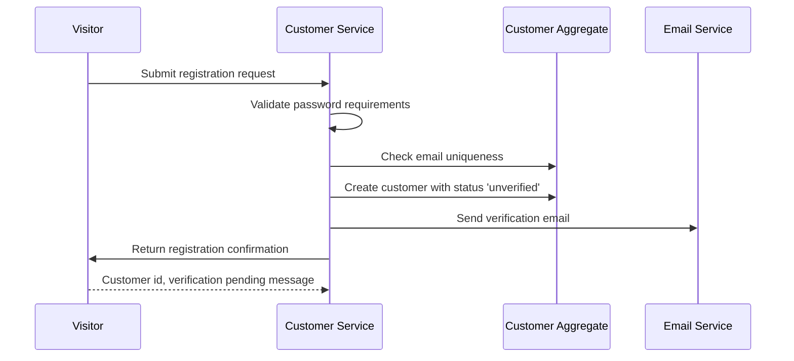
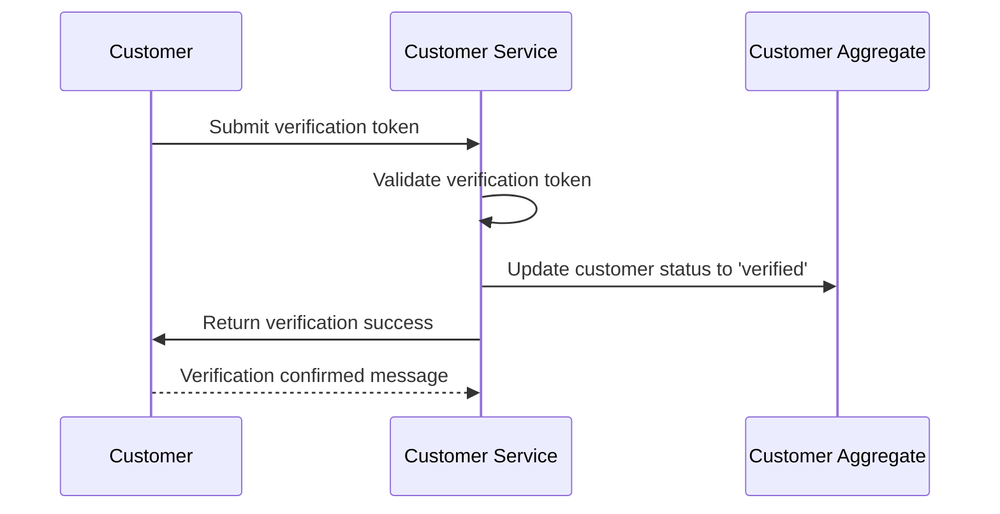
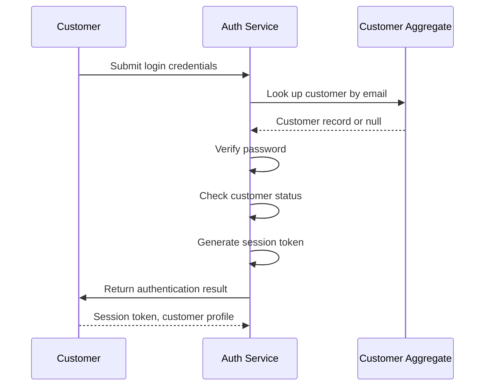
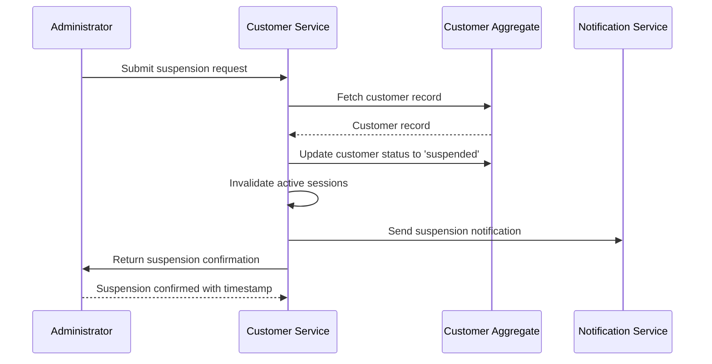
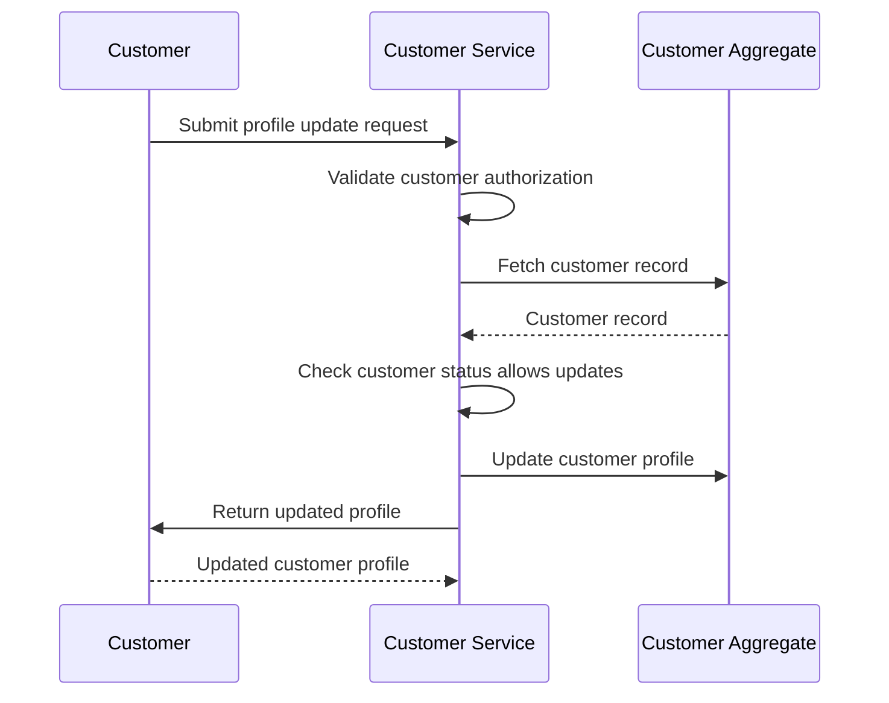

# Sequence Design

Generated: 2026-01-02T11:02:21+01:00

---

## SEQ-CUST-001 – Customer Registration Flow {#seq-cust-001}

Complete flow from registration form submission to account creation

### Trigger

**Type:** user_action

Visitor submits registration form with email and password

### Participants

- **Visitor** (actor)
- **Customer Service** (service)
- **Customer Aggregate** (aggregate)
- **Email Service** (service)

### Sequence

1. **Visitor** → Customer Service: Submit registration request
2. **Customer Service** → Customer Service: Validate password requirements
3. **Customer Service** → Customer Aggregate: Check email uniqueness
4. **Customer Service** → Customer Aggregate: Create customer with status 'unverified'
   - Emits: `CustomerRegistered`
5. **Customer Service** → Email Service: Send verification email
   - Emits: `VerificationEmailSent`
6. **Customer Service** → Visitor: Return registration confirmation
   - Returns: Customer id, verification pending message

### Sequence Diagram

### Outcome

Customer account created with 'unverified' status, verification email sent

**State Changes:**
- Customer.status = unverified
- Customer.email = provided email

### Exceptions

- **Password does not meet requirements** (step 2): Return error PASSWORD_INVALID with requirements, abort flow
- **Email already registered** (step 3): Return error EMAIL_EXISTS, abort flow

---

## SEQ-CUST-002 – Email Verification Flow {#seq-cust-002}

Flow for customer to verify their email address

### Trigger

**Type:** user_action

Customer clicks verification link in email

### Participants

- **Customer** (actor)
- **Customer Service** (service)
- **Customer Aggregate** (aggregate)

### Sequence

1. **Customer** → Customer Service: Submit verification token
2. **Customer Service** → Customer Service: Validate verification token
3. **Customer Service** → Customer Aggregate: Update customer status to 'verified'
   - Emits: `CustomerVerified`
4. **Customer Service** → Customer: Return verification success
   - Returns: Verification confirmed message

### Sequence Diagram

### Outcome

Customer email verified, account status changed to 'verified'

**State Changes:**
- Customer.status = verified

### Exceptions

- **Token invalid or expired** (step 2): Return error INVALID_TOKEN, abort flow
- **Customer already verified** (step 2): Return success (idempotent), no state change

---

## SEQ-CUST-003 – Customer Login Flow {#seq-cust-003}

Authentication flow for existing customers

### Trigger

**Type:** user_action

Customer submits login credentials

### Participants

- **Customer** (actor)
- **Auth Service** (service)
- **Customer Aggregate** (aggregate)

### Sequence

1. **Customer** → Auth Service: Submit login credentials
2. **Auth Service** → Customer Aggregate: Look up customer by email
   - Returns: Customer record or null
3. **Auth Service** → Auth Service: Verify password
4. **Auth Service** → Auth Service: Check customer status
5. **Auth Service** → Auth Service: Generate session token
   - Emits: `CustomerLoggedIn`
6. **Auth Service** → Customer: Return authentication result
   - Returns: Session token, customer profile

### Sequence Diagram

### Outcome

Customer authenticated, session established

**State Changes:**
- Session created for customer

### Exceptions

- **Customer not found** (step 2): Return error INVALID_CREDENTIALS, abort flow
- **Password incorrect** (step 3): Return error INVALID_CREDENTIALS, abort flow
- **Customer suspended** (step 4): Return error ACCOUNT_SUSPENDED, abort flow

---

## SEQ-CUST-004 – Suspend Customer Flow {#seq-cust-004}

Administrative flow to suspend a customer account

### Trigger

**Type:** admin_action

Administrator initiates customer suspension

### Participants

- **Administrator** (actor)
- **Customer Service** (service)
- **Customer Aggregate** (aggregate)
- **Notification Service** (service)

### Sequence

1. **Administrator** → Customer Service: Submit suspension request
2. **Customer Service** → Customer Aggregate: Fetch customer record
   - Returns: Customer record
3. **Customer Service** → Customer Aggregate: Update customer status to 'suspended'
   - Emits: `CustomerSuspended`
4. **Customer Service** → Customer Service: Invalidate active sessions
   - Emits: `SessionsInvalidated`
5. **Customer Service** → Notification Service: Send suspension notification
   - Emits: `SuspensionNotificationSent`
6. **Customer Service** → Administrator: Return suspension confirmation
   - Returns: Suspension confirmed with timestamp

### Sequence Diagram

### Outcome

Customer account suspended, sessions invalidated, notification sent

**State Changes:**
- Customer.status = suspended
- All customer sessions invalidated

### Exceptions

- **Customer not found** (step 2): Return error CUSTOMER_NOT_FOUND, abort flow
- **Customer already suspended** (step 2): Return success (idempotent), no state change

---

## SEQ-CUST-005 – Update Customer Profile Flow {#seq-cust-005}

Flow for customer to update their profile information

### Trigger

**Type:** user_action

Customer submits profile update form

### Participants

- **Customer** (actor)
- **Customer Service** (service)
- **Customer Aggregate** (aggregate)

### Sequence

1. **Customer** → Customer Service: Submit profile update request
2. **Customer Service** → Customer Service: Validate customer authorization
3. **Customer Service** → Customer Aggregate: Fetch customer record
   - Returns: Customer record
4. **Customer Service** → Customer Service: Check customer status allows updates
5. **Customer Service** → Customer Aggregate: Update customer profile
   - Emits: `CustomerProfileUpdated`
6. **Customer Service** → Customer: Return updated profile
   - Returns: Updated customer profile

### Sequence Diagram

### Outcome

Customer profile updated with new information

**State Changes:**
- Customer.firstName = new value
- Customer.lastName = new value

### Exceptions

- **Authorization failed** (step 2): Return error UNAUTHORIZED, abort flow
- **Customer not found** (step 3): Return error CUSTOMER_NOT_FOUND, abort flow
- **Customer suspended** (step 4): Return error ACCOUNT_SUSPENDED, abort flow

---

