# Sequence Design

Generated: 2026-01-02T18:27:24+01:00

---

## SEQ-REG-001 – Customer Registration {#seq-reg-001}

Register a new customer account with email verification

### Trigger

**Type:** user_action

Customer submits registration form with email and password

### Participants

- **Customer** (actor)
- **CustomerService** (service)
- **CustomerAggregate** (aggregate)
- **EmailService** (external)

### Sequence

1. **Customer** → CustomerService: submitRegistration
   - Returns: registrationResult
2. **CustomerService** → CustomerAggregate: validateEmailUniqueness
   - Returns: isUnique
3. **CustomerService** → CustomerService: validatePasswordStrength
   - Returns: isValid
4. **CustomerService** → CustomerAggregate: register
   - Emits: `CustomerRegistered`
   - Returns: customerId
5. **CustomerService** → EmailService: sendVerificationEmail
   - Returns: emailSent
6. **CustomerService** → Customer: returnResult

### Sequence Diagram

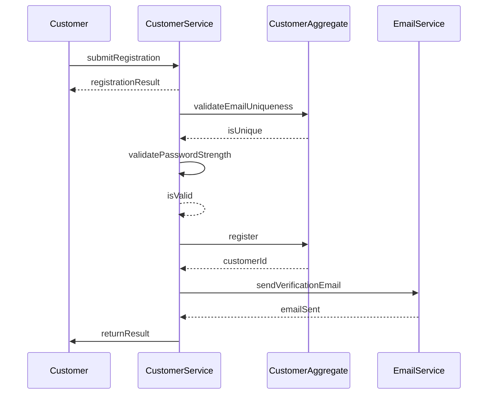

### Outcome

Customer account created with REGISTERED status, verification email sent

**State Changes:**
- Customer.status = REGISTERED
- Customer.emailVerified = false
- Cart created for customer

### Exceptions

- **Email already registered** (step 2): Return EMAIL_ALREADY_REGISTERED error
- **Password too weak** (step 3): Return WEAK_PASSWORD error with requirements
- **Email service unavailable** (step 5): Queue email for retry, continue with registration

---

## SEQ-CART-001 – Add Item to Cart {#seq-cart-001}

Add a product to the customer's shopping cart with stock validation

### Trigger

**Type:** user_action

Customer clicks Add to Cart button on product page

### Participants

- **Customer** (actor)
- **CartService** (service)
- **InventoryService** (service)
- **CartAggregate** (aggregate)
- **InventoryAggregate** (aggregate)

### Sequence

1. **Customer** → CartService: addToCart
   - Returns: cartResult
2. **CartService** → InventoryService: checkAvailability
   - Returns: availableQuantity
3. **CartService** → CartAggregate: addItem
   - Emits: `ItemAddedToCart`
   - Returns: updatedCart
4. **CartService** → CartAggregate: recalculateTotal
   - Returns: newTotal
5. **CartService** → Customer: returnCart

### Sequence Diagram

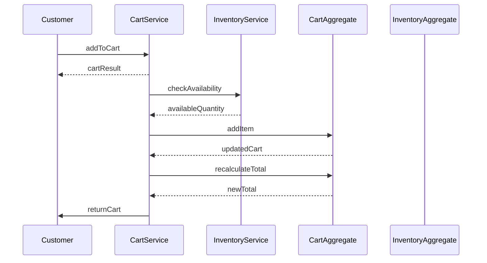

### Outcome

Item added to cart, total recalculated

**State Changes:**
- Cart.items += CartItem
- Cart.totalPrice updated

### Exceptions

- **Product out of stock** (step 2): Return OUT_OF_STOCK error
- **Requested quantity exceeds available stock** (step 2): Return QUANTITY_EXCEEDS_STOCK error with available amount
- **Variant not selected for product with variants** (step 1): Return VARIANT_REQUIRED error
- **Product is inactive** (step 2): Return PRODUCT_NOT_AVAILABLE error

---

## SEQ-CART-002 – Update Cart Quantity {#seq-cart-002}

Update the quantity of an item already in the cart

### Trigger

**Type:** user_action

Customer changes quantity in cart view

### Participants

- **Customer** (actor)
- **CartService** (service)
- **InventoryService** (service)
- **CartAggregate** (aggregate)

### Sequence

1. **Customer** → CartService: updateQuantity
   - Returns: cartResult
2. **CartService** → InventoryService: checkAvailability
   - Returns: availableQuantity
3. **CartService** → CartAggregate: updateQuantity
   - Emits: `CartQuantityUpdated`
   - Returns: updatedCart
4. **CartService** → Customer: returnCart

### Sequence Diagram

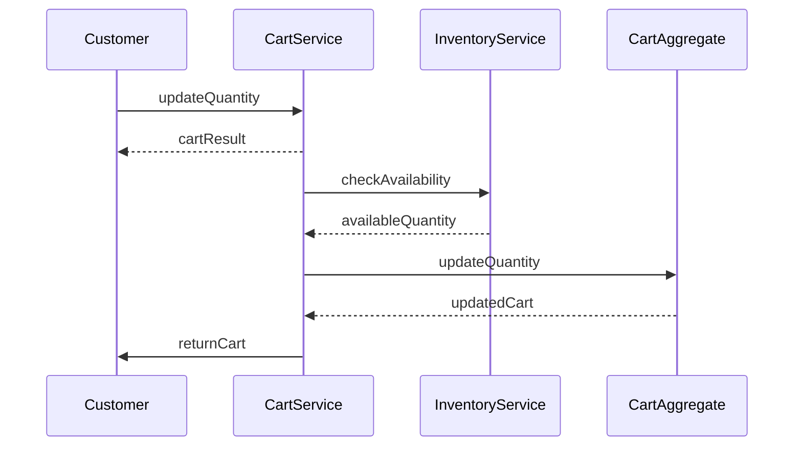

### Outcome

Cart quantity updated, total recalculated

**State Changes:**
- CartItem.quantity = newQuantity
- CartItem.subtotal recalculated
- Cart.totalPrice updated

### Exceptions

- **Requested quantity exceeds stock** (step 2): Return QUANTITY_EXCEEDS_STOCK with available amount
- **Item not in cart** (step 3): Return ITEM_NOT_FOUND error

---

## SEQ-CART-003 – Remove Item from Cart {#seq-cart-003}

Remove a product from the shopping cart

### Trigger

**Type:** user_action

Customer clicks remove button on cart item

### Participants

- **Customer** (actor)
- **CartService** (service)
- **CartAggregate** (aggregate)

### Sequence

1. **Customer** → CartService: removeItem
   - Returns: cartResult
2. **CartService** → CartAggregate: removeItem
   - Emits: `ItemRemovedFromCart`
   - Returns: updatedCart
3. **CartService** → Customer: returnCart

### Sequence Diagram

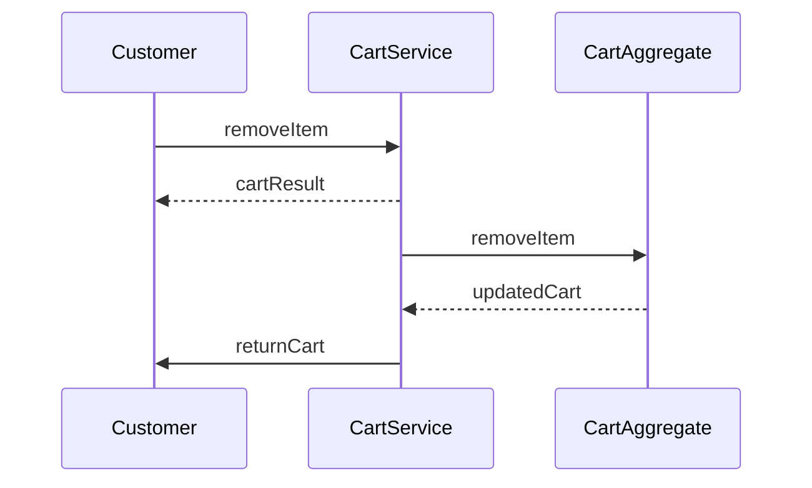

### Outcome

Item removed from cart, total recalculated

**State Changes:**
- Cart.items -= CartItem
- Cart.totalPrice updated

### Exceptions

- **Item not in cart** (step 2): Return ITEM_NOT_FOUND error

---

## SEQ-ORD-001 – Place Order {#seq-ord-001}

Complete checkout process: validate cart, reserve inventory, process payment, create order

### Trigger

**Type:** user_action

Customer clicks Place Order button at checkout

### Participants

- **Customer** (actor)
- **OrderService** (service)
- **CartService** (service)
- **InventoryService** (service)
- **PaymentService** (external)
- **OrderAggregate** (aggregate)
- **InventoryAggregate** (aggregate)
- **CartAggregate** (aggregate)

### Sequence

1. **Customer** → OrderService: placeOrder
   - Returns: orderResult
2. **OrderService** → CustomerService: validateCustomer
   - Returns: isRegistered, isEmailVerified
3. **OrderService** → CartService: getCart
   - Returns: cartItems, cartTotal
4. **OrderService** → OrderService: validateShippingAddress
   - Returns: isValid
5. **OrderService** → InventoryService: reserveInventory
   - Emits: `InventoryReserved`
   - Returns: reservationId
6. **OrderService** → OrderService: calculateShipping
   - Returns: shippingCost
7. **OrderService** → PaymentService: processPayment
   - Returns: paymentAuthorizationId
8. **OrderService** → OrderAggregate: createOrder
   - Emits: `OrderPlaced`
   - Returns: orderId
9. **OrderService** → CartService: clearCart
   - Emits: `CartCleared`
   - Returns: cleared
10. **OrderService** → Customer: returnConfirmation

### Sequence Diagram

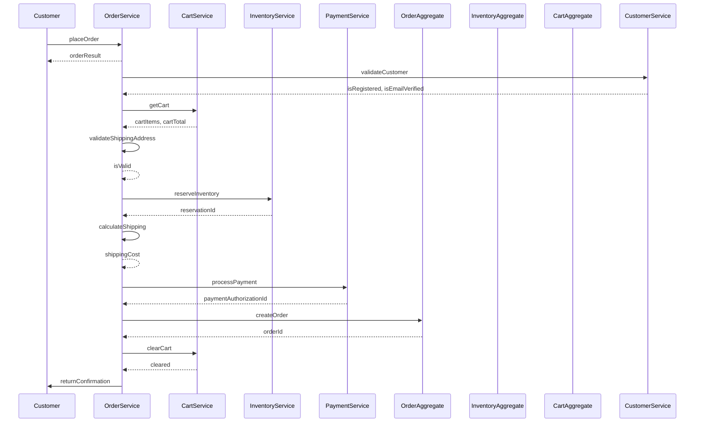

### Outcome

Order created in PENDING status, inventory reserved, payment authorized, cart cleared

**State Changes:**
- Order.status = PENDING
- Order.lineItems = snapshot of cart items with current prices
- Inventory.reservedQuantity += order quantities
- Cart.items = empty
- Cart.totalPrice = 0

### Exceptions

- **Customer not registered** (step 2): Return REGISTRATION_REQUIRED error
- **Email not verified** (step 2): Return EMAIL_NOT_VERIFIED error
- **Cart is empty** (step 3): Return EMPTY_CART error
- **International shipping address** (step 4): Return INTERNATIONAL_SHIPPING_NOT_AVAILABLE error
- **Incomplete shipping address** (step 4): Return INCOMPLETE_ADDRESS error
- **Insufficient stock for one or more items** (step 5): Return INSUFFICIENT_STOCK error with affected items
- **Payment authorization failed** (step 7): Return PAYMENT_FAILED error
- **Order creation failed** (step 8): Return ORDER_CREATION_FAILED error

---

## SEQ-ORD-002 – Confirm Order {#seq-ord-002}

Confirm a pending order after payment capture

### Trigger

**Type:** system_event

Payment captured successfully or admin confirms order

### Participants

- **OrderService** (service)
- **PaymentService** (external)
- **OrderAggregate** (aggregate)
- **NotificationService** (service)

### Sequence

1. **OrderService** → PaymentService: capturePayment
   - Returns: captureResult
2. **OrderService** → OrderAggregate: confirm
   - Emits: `OrderConfirmed`
   - Returns: updatedOrder
3. **OrderService** → AuditLog: logAuditEvent
4. **NotificationService** → EmailService: sendOrderConfirmation

### Sequence Diagram

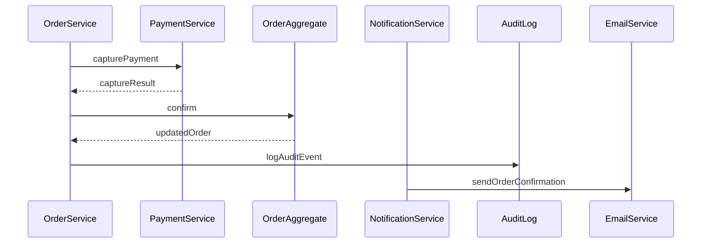

### Outcome

Order status changed to CONFIRMED, customer notified

**State Changes:**
- Order.status = CONFIRMED

### Exceptions

- **Payment capture failed** (step 1): Keep order in PENDING, retry capture, notify admin
- **Order not in PENDING status** (step 2): Return INVALID_STATUS_TRANSITION error

---

## SEQ-ORD-003 – Ship Order {#seq-ord-003}

Mark order as shipped with tracking information

### Trigger

**Type:** user_action

Warehouse staff marks order as shipped with tracking number

### Participants

- **WarehouseStaff** (actor)
- **OrderService** (service)
- **InventoryService** (service)
- **OrderAggregate** (aggregate)
- **NotificationService** (service)

### Sequence

1. **WarehouseStaff** → OrderService: shipOrder
   - Returns: shipResult
2. **OrderService** → InventoryService: deductInventory
   - Emits: `InventoryDeducted`
   - Returns: deducted
3. **OrderService** → OrderAggregate: ship
   - Emits: `OrderShipped`
   - Returns: updatedOrder
4. **OrderService** → AuditLog: logAuditEvent
5. **NotificationService** → EmailService: sendShippingNotification

### Sequence Diagram

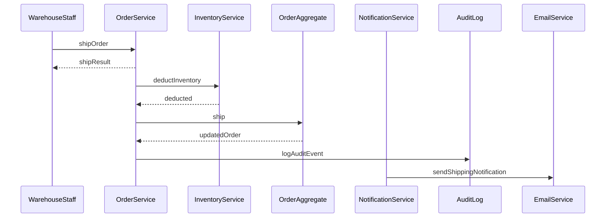

### Outcome

Order status changed to SHIPPED, inventory deducted, customer notified with tracking

**State Changes:**
- Order.status = SHIPPED
- Inventory.quantityOnHand -= order quantities
- Inventory.reservedQuantity -= order quantities

### Exceptions

- **Order not in CONFIRMED status** (step 3): Return INVALID_STATUS_TRANSITION error
- **Inventory deduction failed** (step 2): Return error, do not change order status

---

## SEQ-ORD-004 – Deliver Order {#seq-ord-004}

Mark order as delivered when customer receives package

### Trigger

**Type:** system_event

Carrier confirms delivery or manual delivery confirmation

### Participants

- **CarrierWebhook** (external)
- **OrderService** (service)
- **OrderAggregate** (aggregate)
- **NotificationService** (service)

### Sequence

1. **CarrierWebhook** → OrderService: deliveryConfirmation
   - Returns: acknowledged
2. **OrderService** → OrderAggregate: findOrderByTracking
   - Returns: orderId
3. **OrderService** → OrderAggregate: deliver
   - Emits: `OrderDelivered`
   - Returns: updatedOrder
4. **OrderService** → AuditLog: logAuditEvent
5. **NotificationService** → EmailService: sendDeliveryConfirmation

### Sequence Diagram

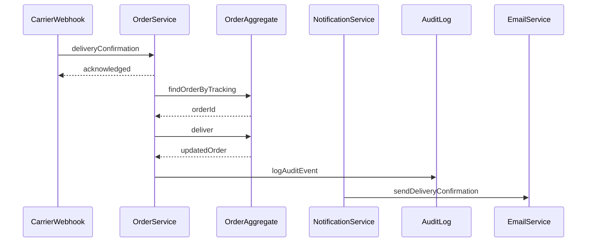

### Outcome

Order status changed to DELIVERED, customer notified

**State Changes:**
- Order.status = DELIVERED

### Exceptions

- **Order not found for tracking number** (step 2): Log error, notify operations team
- **Order not in SHIPPED status** (step 3): Return INVALID_STATUS_TRANSITION error

---

## SEQ-ORD-005 – Cancel Order {#seq-ord-005}

Cancel an order before shipping, restore inventory, process refund

### Trigger

**Type:** user_action

Customer requests order cancellation

### Participants

- **Customer** (actor)
- **OrderService** (service)
- **InventoryService** (service)
- **PaymentService** (external)
- **OrderAggregate** (aggregate)
- **NotificationService** (service)

### Sequence

1. **Customer** → OrderService: cancelOrder
   - Returns: cancellationResult
2. **OrderService** → OrderAggregate: validateCancellable
   - Returns: canCancel
3. **OrderService** → OrderAggregate: cancel
   - Emits: `OrderCancelled`
   - Returns: cancelledOrder
4. **OrderService** → InventoryService: releaseInventory
   - Emits: `InventoryReleased`
   - Returns: released
5. **OrderService** → PaymentService: processRefund
   - Returns: refundId
6. **OrderService** → AuditLog: logAuditEvent
7. **NotificationService** → EmailService: sendCancellationConfirmation

### Sequence Diagram

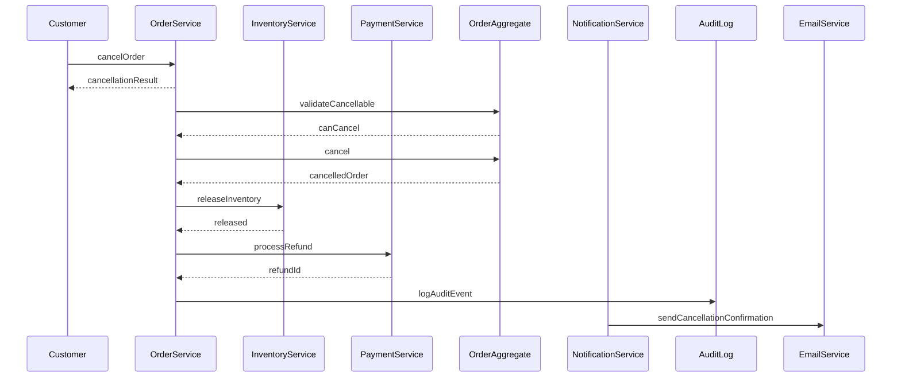

### Outcome

Order cancelled, inventory restored, refund initiated, customer notified

**State Changes:**
- Order.status = CANCELLED
- Inventory.reservedQuantity -= order quantities
- Inventory.availableQuantity += order quantities

### Exceptions

- **Order already shipped or delivered** (step 2): Return CANCELLATION_NOT_ALLOWED error
- **Refund processing failed** (step 5): Log error, queue for manual refund, notify customer of delay

---

## SEQ-PROD-001 – Create Product {#seq-prod-001}

Create a new product in the catalog with initial inventory

### Trigger

**Type:** user_action

Admin creates a new product in catalog

### Participants

- **Admin** (actor)
- **ProductService** (service)
- **InventoryService** (service)
- **ProductAggregate** (aggregate)
- **InventoryAggregate** (aggregate)

### Sequence

1. **Admin** → ProductService: createProduct
   - Returns: productResult
2. **ProductService** → ProductService: validateProduct
   - Returns: isValid
3. **ProductService** → CategoryService: validateCategory
   - Returns: categoryExists
4. **ProductService** → ProductAggregate: create
   - Emits: `ProductCreated`
   - Returns: productId
5. **ProductService** → InventoryService: createInventory
   - Returns: inventoryId
6. **ProductService** → Admin: returnProduct

### Sequence Diagram

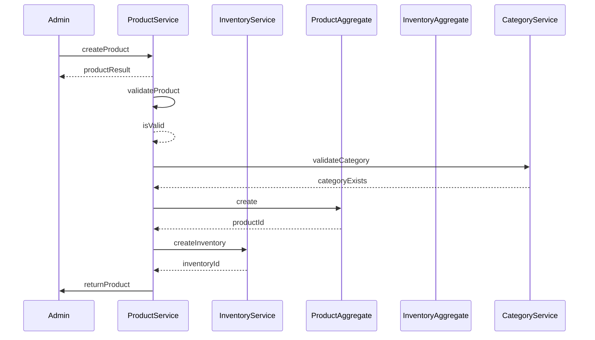

### Outcome

Product created and active, inventory initialized

**State Changes:**
- Product created with isActive = true
- Inventory.quantityOnHand = initialStock
- Inventory.reservedQuantity = 0

### Exceptions

- **Price less than $0.01** (step 2): Return INVALID_PRICE error
- **Name too short or too long** (step 2): Return INVALID_PRODUCT_NAME error
- **Description too long** (step 2): Return DESCRIPTION_TOO_LONG error
- **Category does not exist** (step 3): Return INVALID_CATEGORY error

---

## SEQ-PROD-002 – Deactivate Product {#seq-prod-002}

Soft delete a product while preserving order history

### Trigger

**Type:** user_action

Admin deactivates product from catalog

### Participants

- **Admin** (actor)
- **ProductService** (service)
- **ProductAggregate** (aggregate)

### Sequence

1. **Admin** → ProductService: deactivateProduct
   - Returns: deactivateResult
2. **ProductService** → ProductAggregate: deactivate
   - Emits: `ProductDeactivated`
   - Returns: updatedProduct
3. **ProductService** → Admin: returnResult

### Sequence Diagram

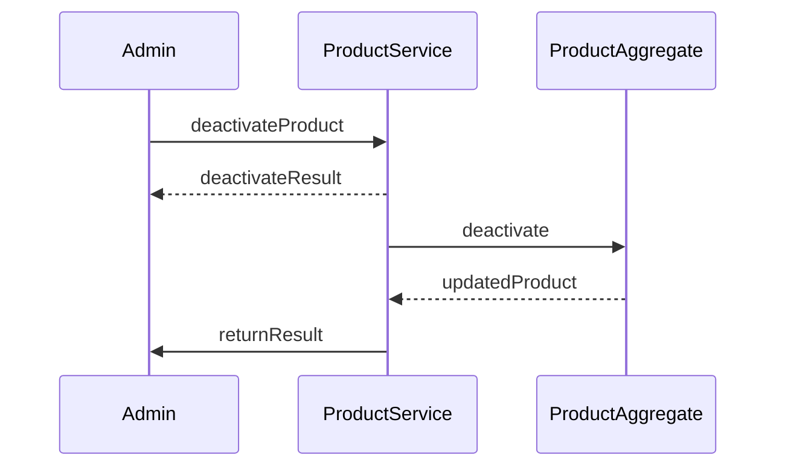

### Outcome

Product deactivated, no longer visible in catalog, order history preserved

**State Changes:**
- Product.isActive = false

### Exceptions

- **Product already inactive** (step 2): Return success (idempotent operation)

---

## SEQ-INV-001 – Restock Inventory {#seq-inv-001}

Add stock to product inventory

### Trigger

**Type:** user_action

Warehouse staff receives shipment and adds stock

### Participants

- **WarehouseStaff** (actor)
- **InventoryService** (service)
- **InventoryAggregate** (aggregate)

### Sequence

1. **WarehouseStaff** → InventoryService: restock
   - Returns: restockResult
2. **InventoryService** → InventoryAggregate: restock
   - Emits: `InventoryRestocked`
   - Returns: newQuantity
3. **InventoryService** → AuditLog: logAuditEvent
4. **InventoryService** → WarehouseStaff: returnResult

### Sequence Diagram

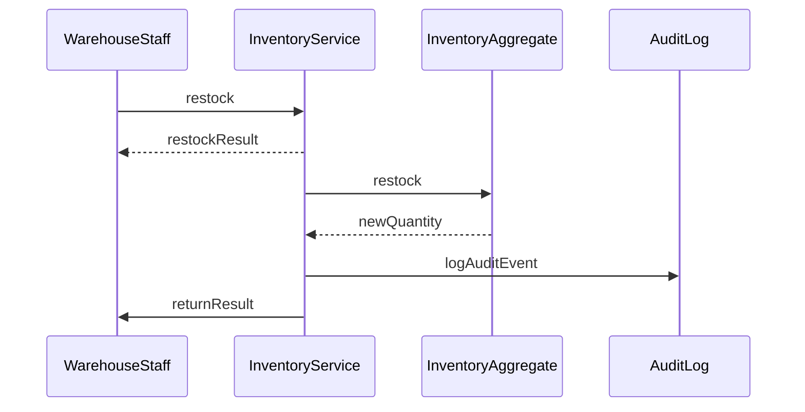

### Outcome

Inventory increased, audit trail recorded

**State Changes:**
- Inventory.quantityOnHand += quantity
- Inventory.availableQuantity += quantity

### Exceptions

- **Invalid quantity (zero or negative)** (step 2): Return INVALID_QUANTITY error
- **Product not found** (step 2): Return PRODUCT_NOT_FOUND error

---

## SEQ-INV-002 – Out of Stock Notification {#seq-inv-002}

Notify operations when product goes out of stock

### Trigger

**Type:** system_event

Inventory available quantity reaches zero

### Participants

- **InventoryService** (service)
- **NotificationService** (service)
- **EmailService** (external)

### Sequence

1. **InventoryService** → EventBus: emit
   - Emits: `OutOfStock`
2. **NotificationService** → NotificationService: handleOutOfStock
3. **NotificationService** → EmailService: notifyOperations

### Sequence Diagram

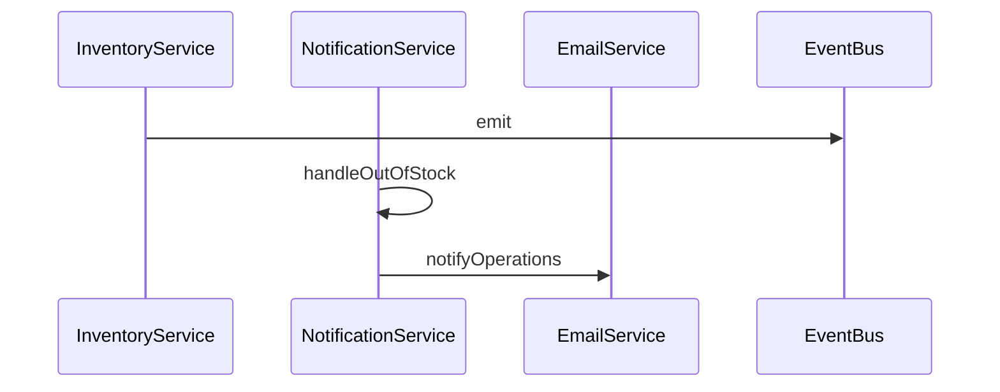

### Outcome

Operations team notified of out-of-stock product

### Exceptions

- **Email delivery failed** (step 3): Retry 3 times, log for manual follow-up

---

## SEQ-CAT-001 – Create Category {#seq-cat-001}

Create a new product category with optional parent

### Trigger

**Type:** user_action

Admin creates a new category

### Participants

- **Admin** (actor)
- **CategoryService** (service)
- **CategoryAggregate** (aggregate)

### Sequence

1. **Admin** → CategoryService: createCategory
   - Returns: categoryResult
2. **CategoryService** → CategoryAggregate: validateUniqueName
   - Returns: isUnique
3. **CategoryService** → CategoryService: validateHierarchyDepth
   - Returns: currentDepth
4. **CategoryService** → CategoryAggregate: create
   - Emits: `CategoryCreated`
   - Returns: categoryId
5. **CategoryService** → Admin: returnCategory

### Sequence Diagram

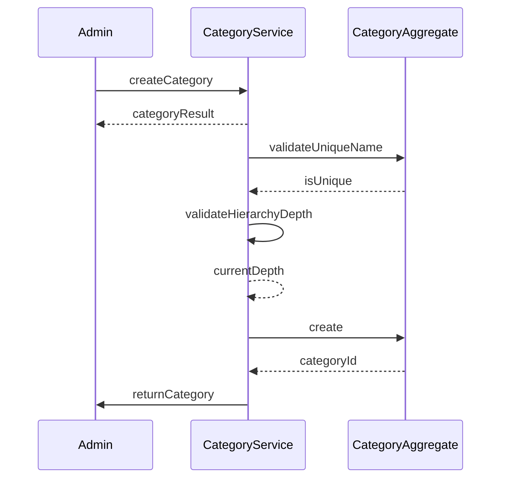

### Outcome

Category created in hierarchy

**State Changes:**
- Category created with optional parent reference

### Exceptions

- **Category name already exists** (step 2): Return DUPLICATE_CATEGORY_NAME error
- **Parent category would exceed depth limit** (step 3): Return CATEGORY_DEPTH_EXCEEDED error
- **Parent category not found** (step 3): Return PARENT_CATEGORY_NOT_FOUND error

---

## SEQ-VAR-001 – Add Product Variant {#seq-var-001}

Add a size/color variant to an existing product

### Trigger

**Type:** user_action

Admin adds variant to product

### Participants

- **Admin** (actor)
- **ProductService** (service)
- **ProductAggregate** (aggregate)
- **InventoryService** (service)

### Sequence

1. **Admin** → ProductService: addVariant
   - Returns: variantResult
2. **ProductService** → ProductAggregate: validateSkuUniqueness
   - Returns: isUnique
3. **ProductService** → ProductAggregate: addVariant
   - Returns: variantId
4. **ProductService** → InventoryService: createVariantInventory
   - Returns: inventoryId
5. **ProductService** → Admin: returnVariant

### Sequence Diagram

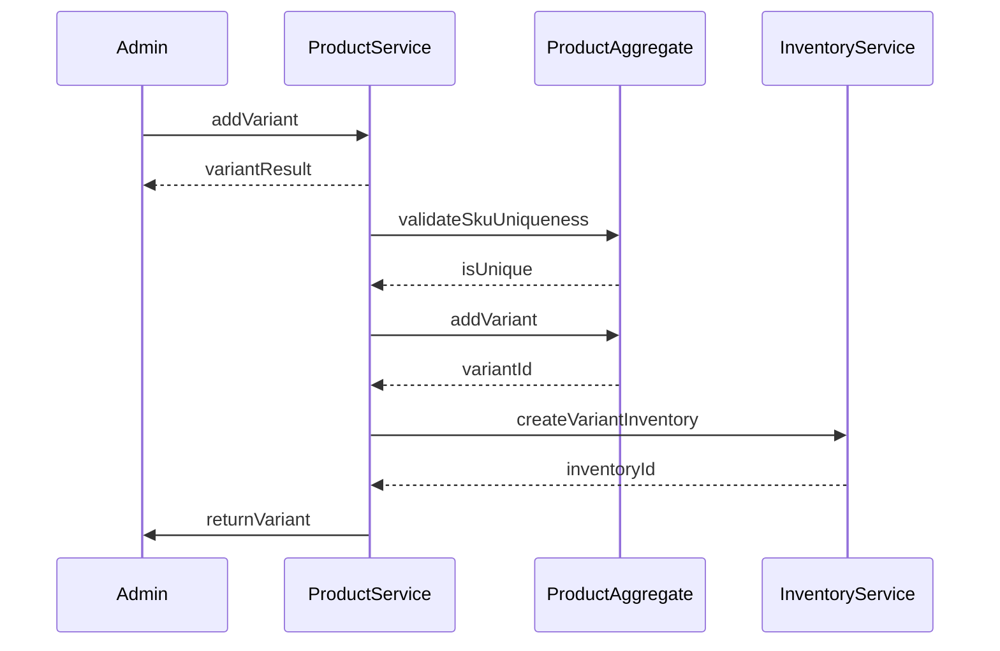

### Outcome

Variant added to product with initial inventory

**State Changes:**
- Product.variants += new variant
- Inventory record created for variant

### Exceptions

- **SKU already exists** (step 2): Return DUPLICATE_SKU error
- **Product not found** (step 3): Return PRODUCT_NOT_FOUND error
- **Neither size nor color specified** (step 1): Return VARIANT_ATTRIBUTE_REQUIRED error

---

## SEQ-CART-004 – Cart Expiration Cleanup {#seq-cart-004}

Scheduled job to clean up expired carts

### Trigger

**Type:** scheduled

Daily scheduled job runs at midnight

### Participants

- **Scheduler** (service)
- **CartService** (service)
- **CartAggregate** (aggregate)

### Sequence

1. **Scheduler** → CartService: triggerCleanup
2. **CartService** → CartAggregate: findExpiredCarts
   - Returns: expiredCartIds
3. **CartService** → CartAggregate: deleteExpiredCarts
   - Returns: deletedCount
4. **CartService** → Logger: logCleanupResult

### Sequence Diagram

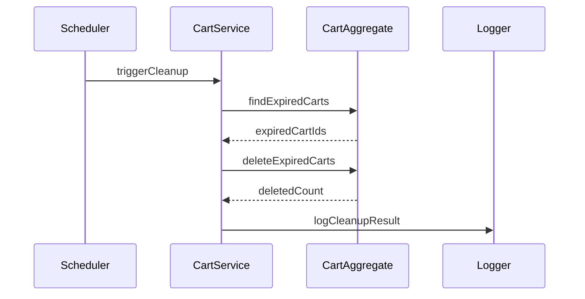

### Outcome

Expired carts deleted, resources freed

**State Changes:**
- Expired Cart records deleted

### Exceptions

- **Database error during deletion** (step 3): Log error, continue with next batch, retry failed deletions

---

## SEQ-PRICE-001 – Update Product Price {#seq-price-001}

Update product price with audit trail

### Trigger

**Type:** user_action

Admin updates product pricing

### Participants

- **Admin** (actor)
- **ProductService** (service)
- **ProductAggregate** (aggregate)

### Sequence

1. **Admin** → ProductService: updatePrice
   - Returns: updateResult
2. **ProductService** → ProductService: validatePrice
   - Returns: isValid
3. **ProductService** → ProductAggregate: getPreviousPrice
   - Returns: previousPrice
4. **ProductService** → ProductAggregate: update
   - Emits: `ProductUpdated`
   - Returns: updatedProduct
5. **ProductService** → AuditLog: logPriceChange
6. **ProductService** → Admin: returnResult

### Sequence Diagram

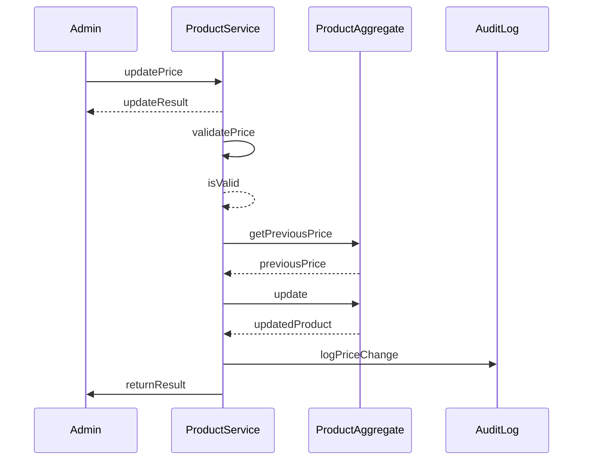

### Outcome

Product price updated, audit trail recorded, cart prices will reflect change on next view

**State Changes:**
- Product.price = newPrice

### Exceptions

- **Price less than $0.01** (step 2): Return INVALID_PRICE error
- **Product not found** (step 3): Return PRODUCT_NOT_FOUND error

---

