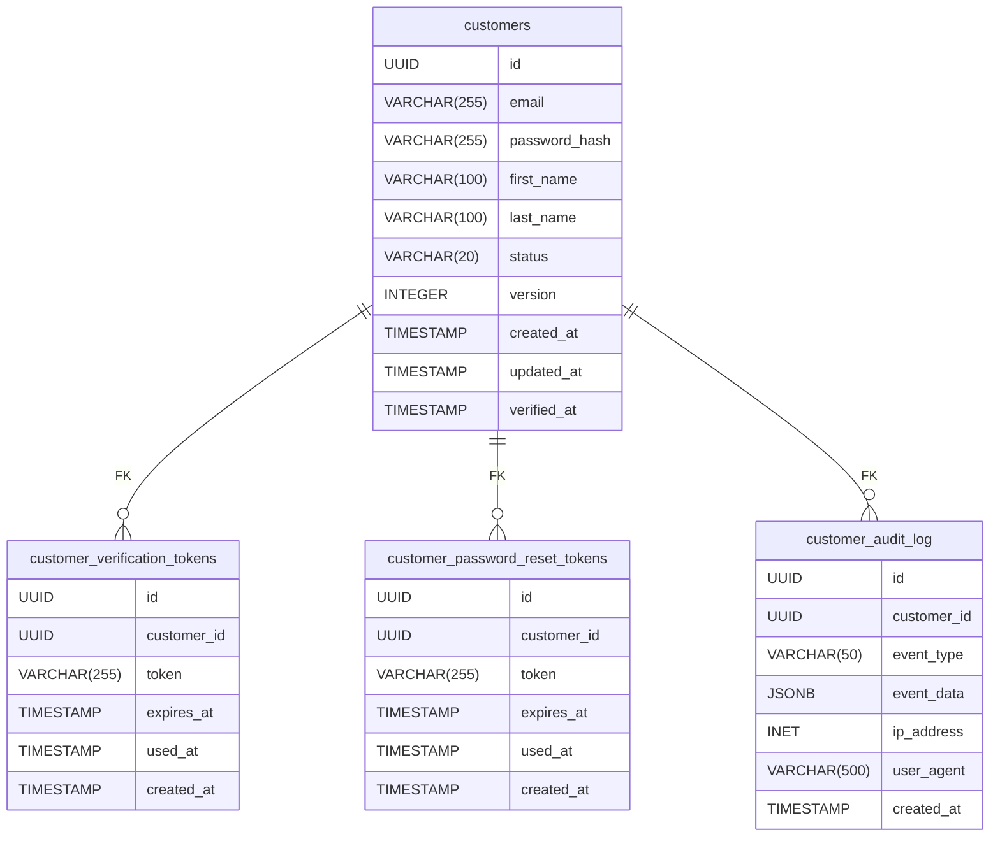

# Initial Data Model

Generated: 2025-12-31T10:31:00+01:00

---

## Enumerations

### customer_status

Values: `[unverified verified suspended]`

### customer_audit_event_type

Values: `[registered email_verified password_changed profile_updated suspended reactivated login_success login_failed]`

---

## Tables

### TBL-CUST-001 – customers

**Aggregate:** Customer

**Purpose:** Stores customer account information and credentials

**Columns:**

| Name | Type | Constraints | Default |
|------|------|-------------|----------|
| id | UUID | NOT NULL | gen_random_uuid() |
| email | VARCHAR(255) | NOT NULL UNIQUE |  |
| password_hash | VARCHAR(255) | NOT NULL |  |
| first_name | VARCHAR(100) | NOT NULL |  |
| last_name | VARCHAR(100) | NOT NULL |  |
| status | VARCHAR(20) | NOT NULL | 'unverified' |
| version | INTEGER | NOT NULL | 1 |
| created_at | TIMESTAMP | NOT NULL | NOW() |
| updated_at | TIMESTAMP | NOT NULL | NOW() |
| verified_at | TIMESTAMP | NULL |  |

**Primary Key:** [id]

**Indexes:**
- `idx_customers_email`: [email]
- `idx_customers_status`: [status]
- `idx_customers_created`: [created_at]

**Constraints:**
- `chk_customer_status`: status IN ('unverified', 'verified', 'suspended')
- `chk_customer_email_format`: email ~* '^[A-Za-z0-9._%+-]+@[A-Za-z0-9.-]+\.[A-Za-z]{2,}$'
- `chk_customer_first_name_length`: LENGTH(first_name) >= 1 AND LENGTH(first_name) <= 100
- `chk_customer_last_name_length`: LENGTH(last_name) >= 1 AND LENGTH(last_name) <= 100

---

### TBL-CUST-002 – customer_verification_tokens

**Aggregate:** Customer

**Purpose:** Stores email verification tokens for customer registration

**Columns:**

| Name | Type | Constraints | Default |
|------|------|-------------|----------|
| id | UUID | NOT NULL | gen_random_uuid() |
| customer_id | UUID | NOT NULL |  |
| token | VARCHAR(255) | NOT NULL |  |
| expires_at | TIMESTAMP | NOT NULL |  |
| used_at | TIMESTAMP | NULL |  |
| created_at | TIMESTAMP | NOT NULL | NOW() |

**Primary Key:** [id]

**Indexes:**
- `idx_verification_tokens_customer`: [customer_id]
- `idx_verification_tokens_token`: [token]
- `idx_verification_tokens_expires`: [expires_at]

**Foreign Keys:**
- [customer_id] → customers(id) (ON DELETE CASCADE)

**Constraints:**
- `chk_token_expiry`: expires_at > created_at

---

### TBL-CUST-003 – customer_password_reset_tokens

**Aggregate:** Customer

**Purpose:** Stores password reset tokens for customer account recovery

**Columns:**

| Name | Type | Constraints | Default |
|------|------|-------------|----------|
| id | UUID | NOT NULL | gen_random_uuid() |
| customer_id | UUID | NOT NULL |  |
| token | VARCHAR(255) | NOT NULL |  |
| expires_at | TIMESTAMP | NOT NULL |  |
| used_at | TIMESTAMP | NULL |  |
| created_at | TIMESTAMP | NOT NULL | NOW() |

**Primary Key:** [id]

**Indexes:**
- `idx_password_reset_tokens_customer`: [customer_id]
- `idx_password_reset_tokens_token`: [token]
- `idx_password_reset_tokens_expires`: [expires_at]

**Foreign Keys:**
- [customer_id] → customers(id) (ON DELETE CASCADE)

**Constraints:**
- `chk_reset_token_expiry`: expires_at > created_at

---

### TBL-CUST-004 – customer_audit_log

**Aggregate:** Customer

**Purpose:** Stores audit trail of customer account changes

**Columns:**

| Name | Type | Constraints | Default |
|------|------|-------------|----------|
| id | UUID | NOT NULL | gen_random_uuid() |
| customer_id | UUID | NOT NULL |  |
| event_type | VARCHAR(50) | NOT NULL |  |
| event_data | JSONB | NULL |  |
| ip_address | INET | NULL |  |
| user_agent | VARCHAR(500) | NULL |  |
| created_at | TIMESTAMP | NOT NULL | NOW() |

**Primary Key:** [id]

**Indexes:**
- `idx_audit_log_customer`: [customer_id]
- `idx_audit_log_event_type`: [event_type]
- `idx_audit_log_created`: [created_at]

**Foreign Keys:**
- [customer_id] → customers(id) (ON DELETE CASCADE)

**Constraints:**
- `chk_audit_event_type`: event_type IN ('registered', 'email_verified', 'password_changed', 'profile_updated', 'suspended', 'reactivated', 'login_success', 'login_failed')

---

## Entity-Relationship Diagram

