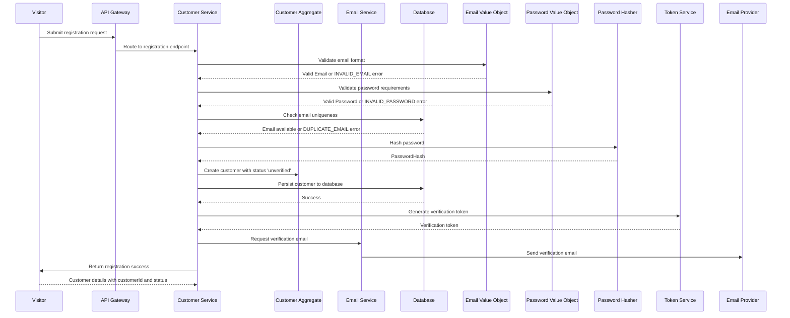
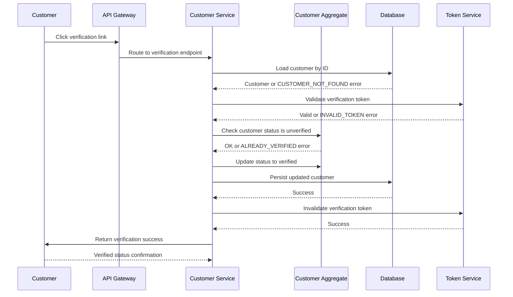
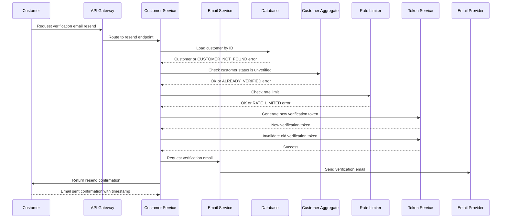
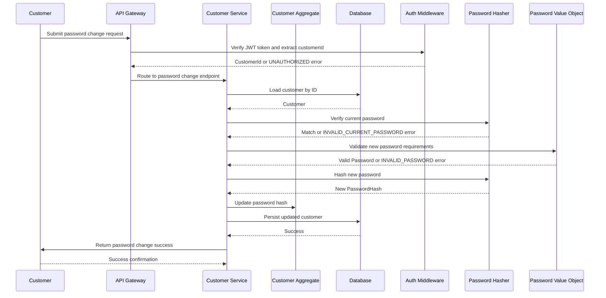

# Sequence Design

Generated: 2025-12-31T10:31:00+01:00

---

## SEQ-CUST-001 – Customer Registration Flow

Complete flow from visitor registration to verification email sent

### Trigger

**Type:** user_action

Visitor submits registration form

### Participants

- **Visitor** (actor)
- **API Gateway** (infrastructure)
- **Customer Service** (service)
- **Customer Aggregate** (aggregate)
- **Email Service** (service)
- **Database** (infrastructure)

### Sequence

1. **Visitor** → API Gateway: Submit registration request
2. **API Gateway** → Customer Service: Route to registration endpoint
3. **Customer Service** → Email Value Object: Validate email format
   - Returns: Valid Email or INVALID_EMAIL error
4. **Customer Service** → Password Value Object: Validate password requirements
   - Returns: Valid Password or INVALID_PASSWORD error
5. **Customer Service** → Database: Check email uniqueness
   - Returns: Email available or DUPLICATE_EMAIL error
6. **Customer Service** → Password Hasher: Hash password
   - Returns: PasswordHash
7. **Customer Service** → Customer Aggregate: Create customer with status 'unverified'
   - Emits: `CustomerRegistered`
8. **Customer Service** → Database: Persist customer to database
   - Returns: Success
9. **Customer Service** → Token Service: Generate verification token
   - Returns: Verification token
10. **Customer Service** → Email Service: Request verification email
   - Emits: `VerificationEmailRequested`
11. **Email Service** → Email Provider: Send verification email
   - Emits: `VerificationEmailSent`
12. **Customer Service** → Visitor: Return registration success
   - Returns: Customer details with customerId and status

### Sequence Diagram

### Outcome

Customer account created with 'unverified' status, verification email sent

**State Changes:**
- Customer created in database
- Customer.status = unverified
- Verification token stored

### Exceptions

- **Invalid email format** (step 3): Return INVALID_EMAIL error, abort flow
- **Password less than 8 characters** (step 4): Return INVALID_PASSWORD error with requirements, abort flow
- **Password without number** (step 4): Return INVALID_PASSWORD error with requirements, abort flow
- **Email already registered** (step 5): Return DUPLICATE_EMAIL error, suggest login or password reset, abort flow

---

## SEQ-CUST-002 – Email Verification Flow

Complete flow from verification link click to account activation

### Trigger

**Type:** user_action

Customer clicks verification link in email

### Participants

- **Customer** (actor)
- **API Gateway** (infrastructure)
- **Customer Service** (service)
- **Customer Aggregate** (aggregate)
- **Database** (infrastructure)

### Sequence

1. **Customer** → API Gateway: Click verification link
2. **API Gateway** → Customer Service: Route to verification endpoint
3. **Customer Service** → Database: Load customer by ID
   - Returns: Customer or CUSTOMER_NOT_FOUND error
4. **Customer Service** → Token Service: Validate verification token
   - Returns: Valid or INVALID_TOKEN error
5. **Customer Service** → Customer Aggregate: Check customer status is unverified
   - Returns: OK or ALREADY_VERIFIED error
6. **Customer Service** → Customer Aggregate: Update status to verified
   - Emits: `CustomerEmailVerified`
7. **Customer Service** → Database: Persist updated customer
   - Returns: Success
8. **Customer Service** → Token Service: Invalidate verification token
   - Returns: Success
9. **Customer Service** → Customer: Return verification success
   - Returns: Verified status confirmation

### Sequence Diagram

### Outcome

Customer email verified, account fully activated

**State Changes:**
- Customer.status = verified
- Customer.verifiedAt = now
- Verification token invalidated

### Exceptions

- **Customer not found** (step 3): Return CUSTOMER_NOT_FOUND error, abort flow
- **Invalid or expired token** (step 4): Return INVALID_TOKEN error, suggest resend verification, abort flow
- **Already verified** (step 5): Return ALREADY_VERIFIED error, redirect to login

---

## SEQ-CUST-003 – Resend Verification Email Flow

Flow for resending verification email to unverified customer

### Trigger

**Type:** user_action

Customer requests new verification email

### Participants

- **Customer** (actor)
- **API Gateway** (infrastructure)
- **Customer Service** (service)
- **Email Service** (service)
- **Database** (infrastructure)

### Sequence

1. **Customer** → API Gateway: Request verification email resend
2. **API Gateway** → Customer Service: Route to resend endpoint
3. **Customer Service** → Database: Load customer by ID
   - Returns: Customer or CUSTOMER_NOT_FOUND error
4. **Customer Service** → Customer Aggregate: Check customer status is unverified
   - Returns: OK or ALREADY_VERIFIED error
5. **Customer Service** → Rate Limiter: Check rate limit
   - Returns: OK or RATE_LIMITED error
6. **Customer Service** → Token Service: Generate new verification token
   - Returns: New verification token
7. **Customer Service** → Token Service: Invalidate old verification token
   - Returns: Success
8. **Customer Service** → Email Service: Request verification email
   - Emits: `VerificationEmailRequested`
9. **Email Service** → Email Provider: Send verification email
   - Emits: `VerificationEmailSent`
10. **Customer Service** → Customer: Return resend confirmation
   - Returns: Email sent confirmation with timestamp

### Sequence Diagram

### Outcome

New verification email sent, old token invalidated

**State Changes:**
- Old verification token invalidated
- New verification token created
- Rate limit counter incremented

### Exceptions

- **Customer not found** (step 3): Return CUSTOMER_NOT_FOUND error, abort flow
- **Already verified** (step 4): Return ALREADY_VERIFIED error, redirect to login
- **Rate limit exceeded** (step 5): Return RATE_LIMITED error with retry-after time, abort flow

---

## SEQ-CUST-004 – Password Change Flow

Flow for authenticated customer changing their password

### Trigger

**Type:** user_action

Customer submits password change request

### Participants

- **Customer** (actor)
- **API Gateway** (infrastructure)
- **Customer Service** (service)
- **Customer Aggregate** (aggregate)
- **Database** (infrastructure)

### Sequence

1. **Customer** → API Gateway: Submit password change request
2. **API Gateway** → Auth Middleware: Verify JWT token and extract customerId
   - Returns: CustomerId or UNAUTHORIZED error
3. **API Gateway** → Customer Service: Route to password change endpoint
4. **Customer Service** → Database: Load customer by ID
   - Returns: Customer
5. **Customer Service** → Password Hasher: Verify current password
   - Returns: Match or INVALID_CURRENT_PASSWORD error
6. **Customer Service** → Password Value Object: Validate new password requirements
   - Returns: Valid Password or INVALID_PASSWORD error
7. **Customer Service** → Password Hasher: Hash new password
   - Returns: New PasswordHash
8. **Customer Service** → Customer Aggregate: Update password hash
   - Emits: `CustomerPasswordChanged`
9. **Customer Service** → Database: Persist updated customer
   - Returns: Success
10. **Customer Service** → Customer: Return password change success
   - Returns: Success confirmation

### Sequence Diagram

### Outcome

Customer password updated successfully

**State Changes:**
- Customer.passwordHash = new hash

### Exceptions

- **Not authenticated** (step 2): Return UNAUTHORIZED error, abort flow
- **Current password incorrect** (step 5): Return INVALID_CURRENT_PASSWORD error, abort flow
- **New password less than 8 characters** (step 6): Return INVALID_PASSWORD error with requirements, abort flow
- **New password without number** (step 6): Return INVALID_PASSWORD error with requirements, abort flow

---

