# Sequence Design

Generated: 2025-12-31T12:00:34+01:00

---

## SEQ-REG-001 – Customer Registration Flow

Complete flow for new customer registration with email verification

### Trigger

**Type:** user_action

Customer submits registration form with email and password

### Participants

- **Customer** (actor)
- **Customer Service** (service)
- **Customer Aggregate** (aggregate)
- **Email Service** (service)

### Sequence

1. **Customer** → Customer Service: Submit registration request
2. **Customer Service** → Customer Aggregate: Validate email uniqueness
   - Returns: Email availability status
3. **Customer Service** → Customer Service: Validate password requirements
   - Returns: Password validation result
4. **Customer Service** → Customer Aggregate: Create customer with 'registered' status
   - Emits: `CustomerRegistered`
5. **Customer Service** → Cart Aggregate: Create empty cart for customer
   - Returns: Cart created
6. **Customer Service** → Email Service: Send verification email (async)
   - Returns: Email queued
7. **Customer Service** → Customer: Return registration confirmation
   - Returns: Customer ID and confirmation message

### Sequence Diagram

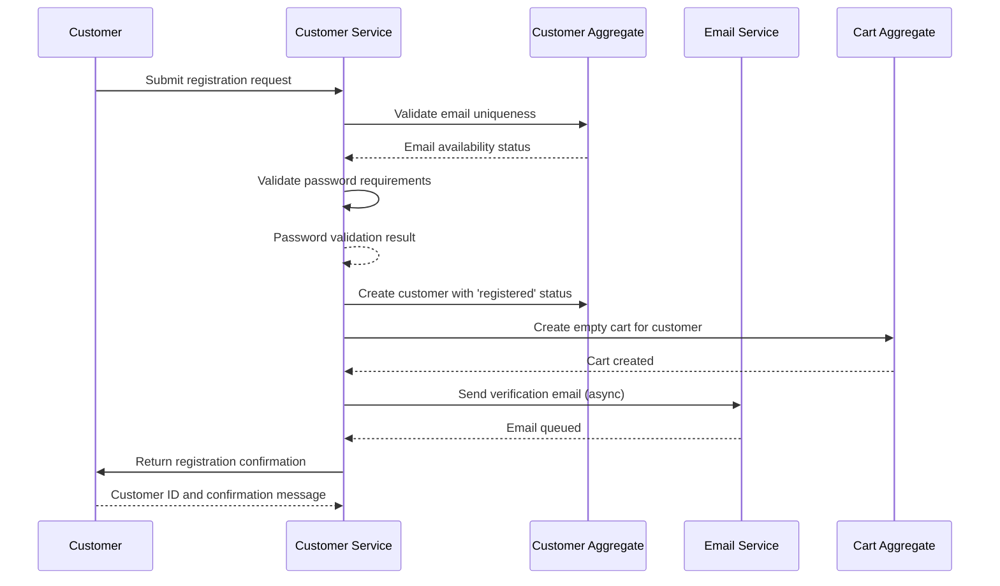

### Outcome

Customer registered with 'registered' status, empty cart created, verification email sent

**State Changes:**
- Customer.status = registered
- Cart created with empty items

### Exceptions

- **Email already registered** (step 2): Return error DUPLICATE_EMAIL, abort flow
- **Invalid password format** (step 3): Return error INVALID_PASSWORD with requirements, abort flow
- **Email delivery fails** (step 6): Log error, continue flow (BR-EMAIL-001: non-blocking)

---

## SEQ-CART-001 – Add Item to Cart Flow

Complete flow for adding a product to shopping cart with stock validation

### Trigger

**Type:** user_action

Customer clicks 'Add to Cart' button on product page

### Participants

- **Customer** (actor)
- **Cart Service** (service)
- **Product Service** (service)
- **Inventory Service** (service)
- **Cart Aggregate** (aggregate)

### Sequence

1. **Customer** → Cart Service: Submit add to cart request
2. **Cart Service** → Product Service: Fetch product details
   - Returns: Product with name, price, variants, isActive
3. **Cart Service** → Cart Service: Validate product is active
   - Returns: Validation result
4. **Cart Service** → Cart Service: Validate variant selection if product has variants
   - Returns: Variant validation result
5. **Cart Service** → Inventory Service: Check available inventory
   - Returns: Available quantity
6. **Cart Service** → Cart Aggregate: Add item to cart or update quantity if exists
   - Emits: `ItemAddedToCart`
7. **Cart Service** → Cart Aggregate: Recalculate cart total
   - Returns: Updated total price
8. **Cart Service** → Customer: Return updated cart
   - Returns: Cart with items and total

### Sequence Diagram

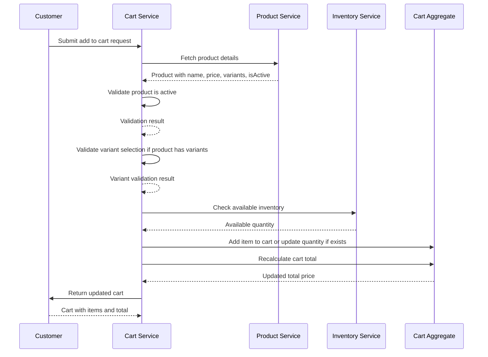

### Outcome

Product added to cart with validated quantity, cart total updated

**State Changes:**
- Cart.items += new item or quantity updated
- Cart.totalPrice recalculated

### Exceptions

- **Product inactive** (step 3): Return error PRODUCT_UNAVAILABLE, abort flow
- **Variant required but not selected** (step 4): Return error VARIANT_REQUIRED, abort flow
- **Product out of stock** (step 5): Return error OUT_OF_STOCK, abort flow
- **Requested quantity exceeds stock** (step 5): Cap quantity to available stock, return QUANTITY_LIMITED warning

---

## SEQ-CART-002 – Update Cart Item Quantity Flow

Complete flow for updating quantity of an item in the cart

### Trigger

**Type:** user_action

Customer changes quantity in cart view

### Participants

- **Customer** (actor)
- **Cart Service** (service)
- **Inventory Service** (service)
- **Cart Aggregate** (aggregate)

### Sequence

1. **Customer** → Cart Service: Submit quantity update request
2. **Cart Service** → Cart Aggregate: Validate item exists in cart
   - Returns: Cart item details
3. **Cart Service** → Cart Service: Check if quantity is zero
   - Returns: Boolean: should remove item
4. **Cart Service** → Inventory Service: Check available inventory for new quantity
   - Returns: Available quantity
5. **Cart Service** → Cart Aggregate: Update item quantity or remove if zero
   - Emits: `CartItemQuantityUpdated or ItemRemovedFromCart`
6. **Cart Service** → Cart Aggregate: Recalculate cart total
   - Returns: Updated total price
7. **Cart Service** → Customer: Return updated cart
   - Returns: Cart with updated items and total

### Sequence Diagram

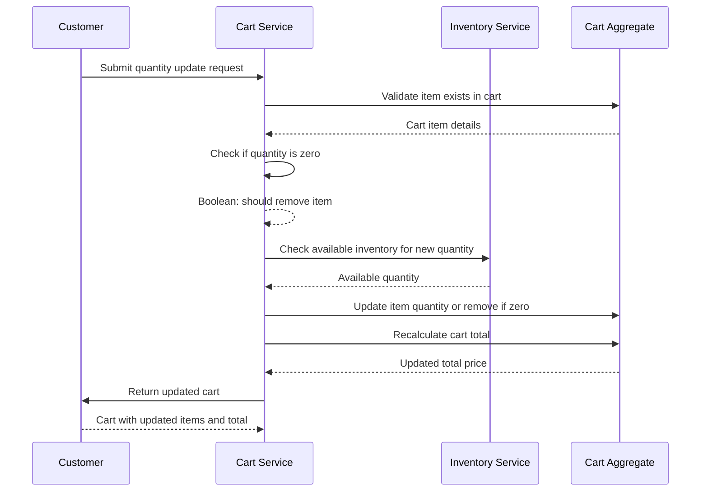

### Outcome

Cart item quantity updated or item removed, cart total recalculated

**State Changes:**
- CartItem.quantity = newQuantity or item removed
- Cart.totalPrice recalculated

### Exceptions

- **Item not in cart** (step 2): Return error ITEM_NOT_FOUND, abort flow
- **Requested quantity exceeds stock** (step 4): Cap quantity to available stock, return QUANTITY_LIMITED warning

---

## SEQ-CART-003 – Remove Item from Cart Flow

Complete flow for removing a product from shopping cart

### Trigger

**Type:** user_action

Customer clicks 'Remove' button on cart item

### Participants

- **Customer** (actor)
- **Cart Service** (service)
- **Cart Aggregate** (aggregate)

### Sequence

1. **Customer** → Cart Service: Submit remove item request
2. **Cart Service** → Cart Aggregate: Validate item exists in cart
   - Returns: Cart item details
3. **Cart Service** → Cart Aggregate: Remove item from cart
   - Emits: `ItemRemovedFromCart`
4. **Cart Service** → Cart Aggregate: Recalculate cart total
   - Returns: Updated total price
5. **Cart Service** → Customer: Return updated cart
   - Returns: Cart with remaining items and total

### Sequence Diagram

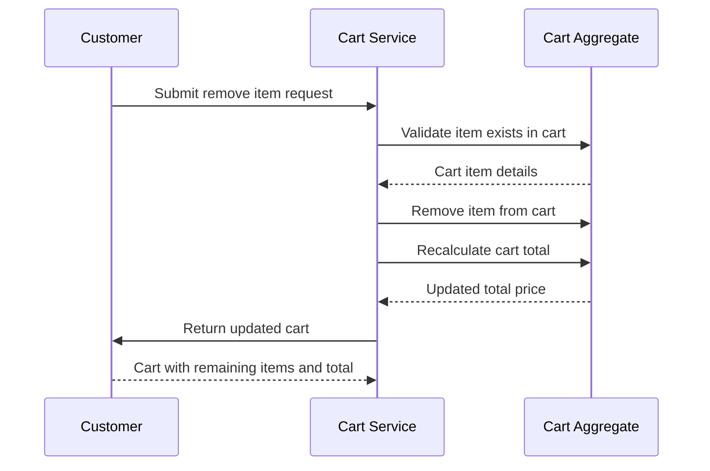

### Outcome

Item removed from cart, cart total recalculated

**State Changes:**
- Cart.items -= removed item
- Cart.totalPrice recalculated

### Exceptions

- **Item not in cart** (step 2): Return error ITEM_NOT_FOUND, abort flow

---

## SEQ-ORDER-001 – Place Order Flow

Complete flow from cart checkout to order confirmation with payment and inventory reservation

### Trigger

**Type:** user_action

Customer clicks 'Place Order' button at checkout

### Participants

- **Customer** (actor)
- **Order Service** (service)
- **Cart Service** (service)
- **Inventory Service** (service)
- **Payment Service** (service)
- **Email Service** (service)
- **Order Aggregate** (aggregate)
- **Cart Aggregate** (aggregate)
- **Inventory Aggregate** (aggregate)

### Sequence

1. **Customer** → Order Service: Submit order request
2. **Order Service** → Order Service: Validate customer registration status
   - Returns: Customer is registered
3. **Order Service** → Cart Service: Fetch cart contents
   - Returns: Cart with items and total
4. **Order Service** → Order Service: Validate cart is not empty
   - Returns: Validation result
5. **Order Service** → Order Service: Validate shipping address
   - Returns: Address validation result
6. **Order Service** → Inventory Service: Reserve inventory for each item
   - Emits: `InventoryReserved`
7. **Order Service** → Payment Service: Authorize payment
   - Returns: Payment authorization token
8. **Order Service** → Order Service: Calculate shipping cost (free if subtotal > $50)
   - Returns: Shipping cost
9. **Order Service** → Order Aggregate: Create order with 'pending' status, snapshot prices
   - Emits: `OrderPlaced`
10. **Order Service** → Cart Service: Clear customer cart
   - Emits: `CartCleared`
11. **Order Service** → Email Service: Send order confirmation email (async)
   - Returns: Email queued
12. **Order Service** → Customer: Return order confirmation
   - Returns: Order details with orderId

### Sequence Diagram

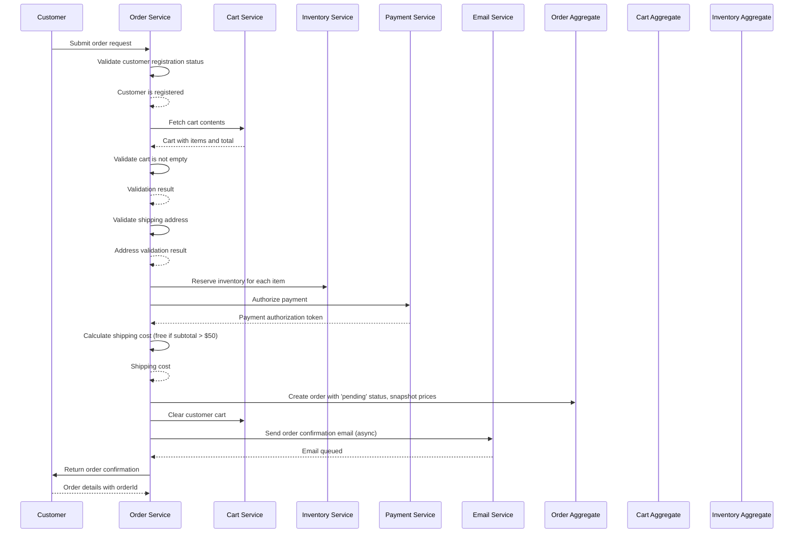

### Outcome

Order created with 'pending' status, inventory reserved, payment authorized, cart cleared, confirmation email sent

**State Changes:**
- Order.status = pending
- Inventory.reservedQuantity += quantities
- Cart.items = empty
- Payment authorized

### Exceptions

- **Customer not registered** (step 2): Return error UNAUTHORIZED_ORDER, abort flow
- **Cart is empty** (step 4): Return error EMPTY_ORDER, abort flow
- **Invalid shipping address** (step 5): Return error INVALID_ADDRESS, abort flow
- **Shipping outside domestic country** (step 5): Return error UNSUPPORTED_SHIPPING_REGION, abort flow
- **Insufficient stock for item** (step 6): Return error STOCK_UNAVAILABLE with affected items, abort flow
- **Payment authorization fails** (step 7): Release reserved inventory, return error PAYMENT_FAILED, abort flow
- **Unsupported card type** (step 7): Return error UNSUPPORTED_CARD_TYPE, abort flow
- **Email delivery fails** (step 11): Log error, continue flow (BR-EMAIL-001: non-blocking)

---

## SEQ-ORDER-002 – Confirm Order Flow

Flow for confirming a pending order after payment capture

### Trigger

**Type:** system_event

Payment capture completed or manual confirmation by admin

### Participants

- **Payment Service** (service)
- **Order Service** (service)
- **Inventory Service** (service)
- **Order Aggregate** (aggregate)
- **Inventory Aggregate** (aggregate)

### Sequence

1. **Payment Service** → Order Service: Notify payment captured
2. **Order Service** → Order Aggregate: Validate order status is 'pending'
   - Returns: Order details and status
3. **Order Service** → Inventory Service: Deduct reserved inventory
   - Emits: `InventoryDeducted`
4. **Order Service** → Order Aggregate: Update order status to 'confirmed'
   - Emits: `OrderConfirmed`
5. **Order Service** → Payment Service: Return confirmation result
   - Returns: Order confirmed status

### Sequence Diagram

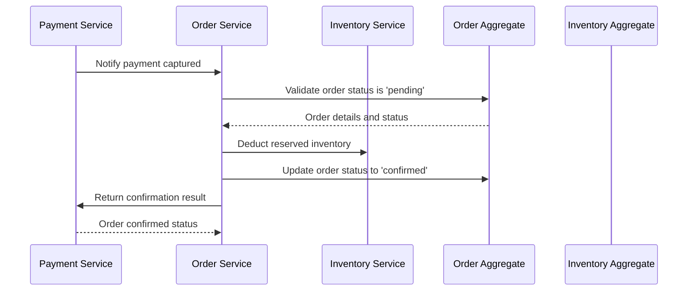

### Outcome

Order confirmed, reserved inventory deducted from stock

**State Changes:**
- Order.status = confirmed
- Inventory.stockLevel -= quantities
- Inventory.reservedQuantity -= quantities

### Exceptions

- **Order not in 'pending' status** (step 2): Return error INVALID_STATUS_TRANSITION, abort flow

---

## SEQ-ORDER-003 – Ship Order Flow

Flow for marking an order as shipped

### Trigger

**Type:** system_event

Warehouse confirms shipment dispatch

### Participants

- **Warehouse System** (actor)
- **Order Service** (service)
- **Email Service** (service)
- **Order Aggregate** (aggregate)

### Sequence

1. **Warehouse System** → Order Service: Submit shipment notification
2. **Order Service** → Order Aggregate: Validate order status is 'confirmed'
   - Returns: Order details and status
3. **Order Service** → Order Aggregate: Update order status to 'shipped'
   - Emits: `OrderShipped`
4. **Order Service** → Email Service: Send shipment notification email (async)
   - Returns: Email queued
5. **Order Service** → Warehouse System: Return shipment confirmation
   - Returns: Order shipped status

### Sequence Diagram

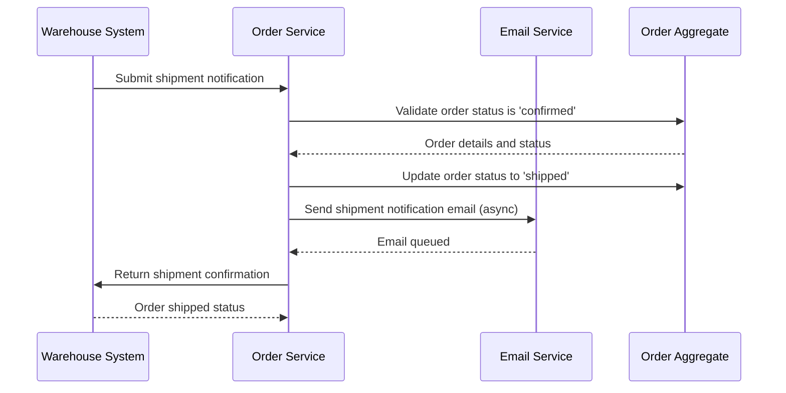

### Outcome

Order marked as shipped, customer notified

**State Changes:**
- Order.status = shipped
- Order.trackingNumber set

### Exceptions

- **Order not in 'confirmed' status** (step 2): Return error INVALID_STATUS_TRANSITION, abort flow
- **Email delivery fails** (step 4): Log error, continue flow (BR-EMAIL-001: non-blocking)

---

## SEQ-ORDER-004 – Deliver Order Flow

Flow for marking an order as delivered

### Trigger

**Type:** system_event

Carrier confirms delivery or customer confirms receipt

### Participants

- **Carrier System** (actor)
- **Order Service** (service)
- **Order Aggregate** (aggregate)

### Sequence

1. **Carrier System** → Order Service: Submit delivery confirmation
2. **Order Service** → Order Aggregate: Validate order status is 'shipped'
   - Returns: Order details and status
3. **Order Service** → Order Aggregate: Update order status to 'delivered'
   - Emits: `OrderDelivered`
4. **Order Service** → Carrier System: Return delivery confirmation
   - Returns: Order delivered status

### Sequence Diagram

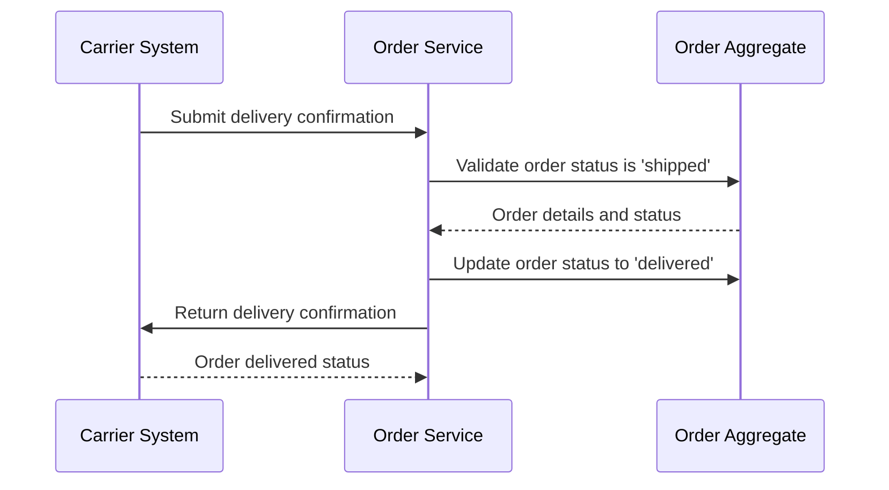

### Outcome

Order marked as delivered, order lifecycle complete

**State Changes:**
- Order.status = delivered

### Exceptions

- **Order not in 'shipped' status** (step 2): Return error INVALID_STATUS_TRANSITION, abort flow

---

## SEQ-ORDER-005 – Cancel Order Flow

Complete flow for cancelling an order with inventory restoration and refund

### Trigger

**Type:** user_action

Customer clicks 'Cancel Order' button or admin initiates cancellation

### Participants

- **Customer** (actor)
- **Order Service** (service)
- **Inventory Service** (service)
- **Payment Service** (service)
- **Email Service** (service)
- **Order Aggregate** (aggregate)
- **Inventory Aggregate** (aggregate)

### Sequence

1. **Customer** → Order Service: Submit cancellation request
2. **Order Service** → Order Aggregate: Validate order status allows cancellation
   - Returns: Order details and status
3. **Order Service** → Inventory Service: Release or restore inventory for each line item
   - Emits: `InventoryReleased`
4. **Order Service** → Payment Service: Initiate refund to original payment method
   - Returns: Refund confirmation
5. **Order Service** → Order Aggregate: Update order status to 'cancelled'
   - Emits: `OrderCancelled`
6. **Order Service** → Email Service: Send cancellation confirmation email (async)
   - Returns: Email queued
7. **Order Service** → Customer: Return cancellation confirmation
   - Returns: Cancellation details with refund info

### Sequence Diagram

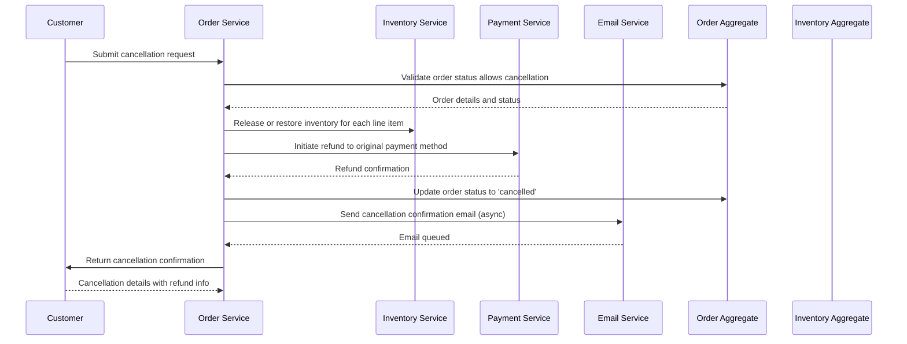

### Outcome

Order cancelled, inventory restored, refund initiated, customer notified

**State Changes:**
- Order.status = cancelled
- Inventory.stockLevel += quantities (if deducted)
- Inventory.reservedQuantity -= quantities (if reserved)
- Payment refunded

### Exceptions

- **Order already shipped or delivered** (step 2): Return error ORDER_ALREADY_SHIPPED, abort flow
- **Order already cancelled** (step 2): Return error INVALID_STATUS_TRANSITION, abort flow
- **Refund fails** (step 4): Log error REFUND_FAILED, mark for manual review, continue with cancellation
- **Email delivery fails** (step 6): Log error, continue flow (BR-EMAIL-001: non-blocking)

---

## SEQ-INV-001 – Restock Inventory Flow

Flow for restocking product inventory with audit trail

### Trigger

**Type:** system_event

Warehouse receives new stock or admin manually adjusts inventory

### Participants

- **Warehouse Admin** (actor)
- **Inventory Service** (service)
- **Inventory Aggregate** (aggregate)
- **Audit Service** (service)

### Sequence

1. **Warehouse Admin** → Inventory Service: Submit restock request
2. **Inventory Service** → Inventory Service: Validate quantity is positive
   - Returns: Validation result
3. **Inventory Service** → Inventory Aggregate: Get current inventory state
   - Returns: Current stockLevel and reservedQuantity
4. **Inventory Service** → Inventory Aggregate: Increase stock level
   - Emits: `InventoryRestocked`
5. **Inventory Service** → Audit Service: Create audit log entry
6. **Inventory Service** → Warehouse Admin: Return updated inventory
   - Returns: Updated inventory with new stockLevel

### Sequence Diagram

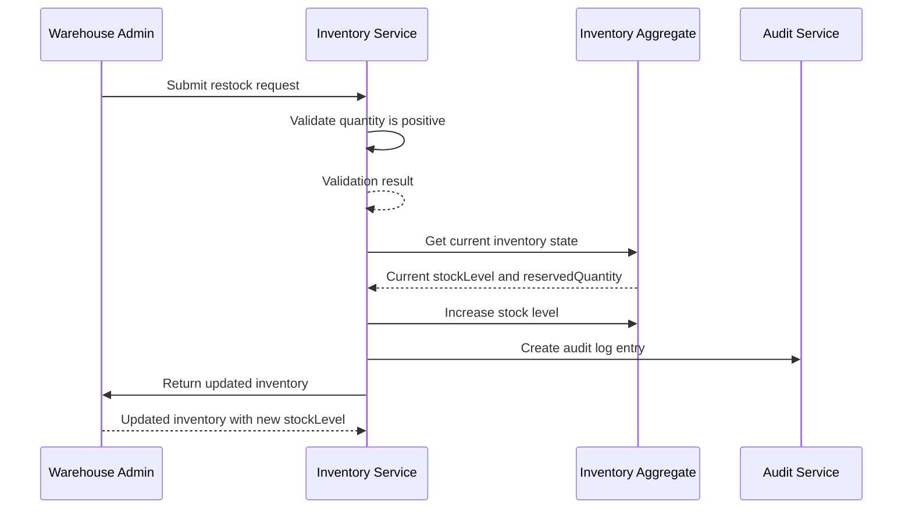

### Outcome

Inventory restocked, audit trail created

**State Changes:**
- Inventory.stockLevel += quantity
- Audit log entry created

### Exceptions

- **Invalid quantity (zero or negative)** (step 2): Return error INVALID_QUANTITY, abort flow
- **Product not found** (step 3): Return error PRODUCT_NOT_FOUND, abort flow

---

## SEQ-PROD-001 – Create Product Flow

Flow for creating a new product in the catalog with inventory initialization

### Trigger

**Type:** user_action

Admin submits new product creation form

### Participants

- **Admin** (actor)
- **Product Service** (service)
- **Category Service** (service)
- **Inventory Service** (service)
- **Product Aggregate** (aggregate)
- **Inventory Aggregate** (aggregate)

### Sequence

1. **Admin** → Product Service: Submit product creation request
2. **Product Service** → Product Service: Validate product name length
   - Returns: Validation result
3. **Product Service** → Product Service: Validate price is positive
   - Returns: Validation result
4. **Product Service** → Category Service: Verify category exists
   - Returns: Category details
5. **Product Service** → Product Aggregate: Create product with active status
   - Emits: `ProductCreated`
6. **Product Service** → Inventory Service: Initialize inventory record
   - Returns: Inventory created with initial stock
7. **Product Service** → Admin: Return created product
   - Returns: Product details with productId

### Sequence Diagram

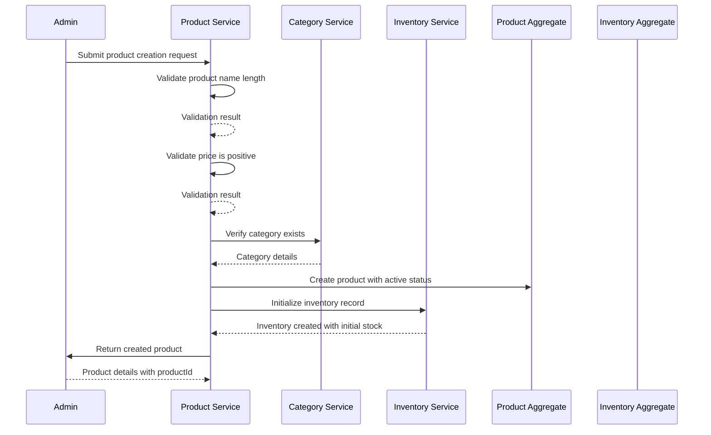

### Outcome

Product created with active status, inventory initialized

**State Changes:**
- Product created with isActive=true
- Inventory.stockLevel = initialStock

### Exceptions

- **Invalid product name** (step 2): Return error INVALID_NAME, abort flow
- **Invalid price** (step 3): Return error INVALID_PRICE, abort flow
- **Category not found** (step 4): Return error CATEGORY_NOT_FOUND, abort flow

---

## SEQ-PROD-002 – Deactivate Product Flow

Flow for soft-deleting a product while preserving order history

### Trigger

**Type:** user_action

Admin clicks 'Deactivate Product' button

### Participants

- **Admin** (actor)
- **Product Service** (service)
- **Order Service** (service)
- **Product Aggregate** (aggregate)

### Sequence

1. **Admin** → Product Service: Submit deactivation request
2. **Product Service** → Product Aggregate: Validate product exists and is active
   - Returns: Product details and status
3. **Product Service** → Order Service: Check for order history references
   - Returns: Boolean: has order references
4. **Product Service** → Product Aggregate: Set product to inactive (soft delete)
   - Emits: `ProductDeactivated`
5. **Product Service** → Admin: Return deactivation confirmation
   - Returns: Product deactivated status

### Sequence Diagram

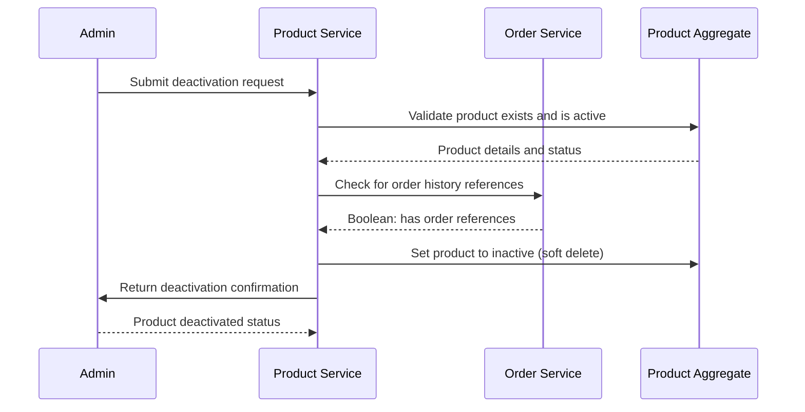

### Outcome

Product deactivated, order history preserved, product no longer appears in catalog

**State Changes:**
- Product.isActive = false

### Exceptions

- **Product not found** (step 2): Return error PRODUCT_NOT_FOUND, abort flow
- **Product already inactive** (step 2): Return success (idempotent operation)

---

