# Sequence Design

Generated: 2025-12-29T15:49:16+01:00

---

## SEQ-CUST-001 – Customer Registration Flow

Complete flow from visitor registration to email verification

### Trigger

**Type:** user_action

Visitor submits registration form with email, password, and name

### Participants

- **Visitor** (actor)
- **Customer Service** (service)
- **Customer Aggregate** (aggregate)
- **Email Service** (service)

### Sequence

1. **Visitor** → Customer Service: Submit registration request
2. **Customer Service** → Customer Repository: Validate email uniqueness
   - Returns: boolean (exists)
3. **Customer Service** → Password Validator: Validate password requirements
4. **Customer Service** → Customer Aggregate: Create customer with status 'unverified'
   - Emits: `CustomerRegistered`
5. **Customer Service** → Token Service: Generate verification token
   - Returns: verification token
6. **Customer Service** → Email Service: Queue verification email (async)
7. **Customer Service** → Visitor: Return registration success
   - Returns: customerId, status='unverified'

### Sequence Diagram

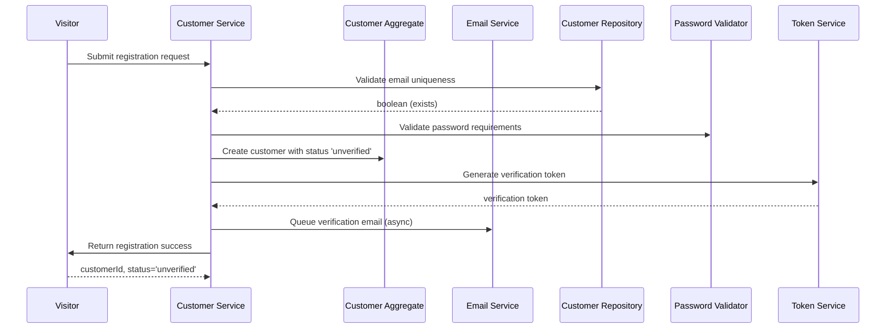

### Outcome

Customer created with 'unverified' status, verification email queued

**State Changes:**
- Customer.status = unverified
- Customer.emailVerified = false

### Exceptions

- **Email already registered** (step 2): Return DUPLICATE_EMAIL error, suggest login or password reset
- **Password too short or missing number** (step 3): Return INVALID_PASSWORD error with requirements
- **Invalid email format** (step 1): Return INVALID_EMAIL error

---

## SEQ-CUST-002 – Email Verification Flow

Customer verifies their email address via token link

### Trigger

**Type:** user_action

Customer clicks verification link in email

### Participants

- **Customer** (actor)
- **Customer Service** (service)
- **Customer Aggregate** (aggregate)
- **Token Service** (service)

### Sequence

1. **Customer** → Customer Service: Submit verification token
2. **Customer Service** → Token Service: Validate token
   - Returns: customerId, isValid, isExpired
3. **Customer Service** → Customer Aggregate: Mark email as verified
   - Emits: `CustomerEmailVerified`
4. **Customer Service** → Token Service: Invalidate verification token
5. **Customer Service** → Customer: Return verification success
   - Returns: emailVerified = true

### Sequence Diagram

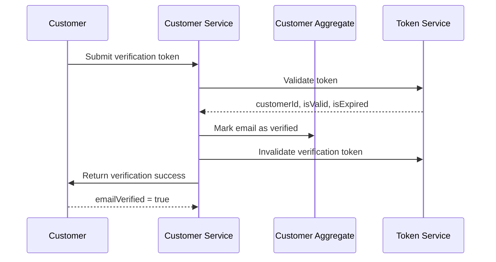

### Outcome

Customer email verified, can now place orders

**State Changes:**
- Customer.emailVerified = true
- Customer.registrationStatus = registered

### Exceptions

- **Invalid token** (step 2): Return INVALID_TOKEN error
- **Token expired** (step 2): Return VERIFICATION_EXPIRED error with resend option

---

## SEQ-CART-001 – Add Item to Cart Flow

Customer adds a product to their shopping cart

### Trigger

**Type:** user_action

Customer clicks 'Add to Cart' button on product page

### Participants

- **Customer** (actor)
- **Cart Service** (service)
- **Cart Aggregate** (aggregate)
- **Product Service** (service)
- **Inventory Service** (service)

### Sequence

1. **Customer** → Cart Service: Submit add to cart request
2. **Cart Service** → Product Service: Fetch product details
   - Returns: product with name, price, hasVariants
3. **Cart Service** → Cart Service (internal): Check if variant required
4. **Cart Service** → Inventory Service: Check available inventory
   - Returns: availableQuantity
5. **Cart Service** → Cart Service (internal): Cap quantity to available stock if needed
   - Returns: finalQuantity, quantityLimited flag
6. **Cart Service** → Cart Repository: Get or create cart for customer
   - Returns: Cart
7. **Cart Service** → Cart Aggregate: Add item or merge quantity if exists
   - Emits: `ItemAddedToCart`
8. **Cart Service** → Customer: Return updated cart summary
   - Returns: cartItem, subtotal, quantityLimited notification

### Sequence Diagram

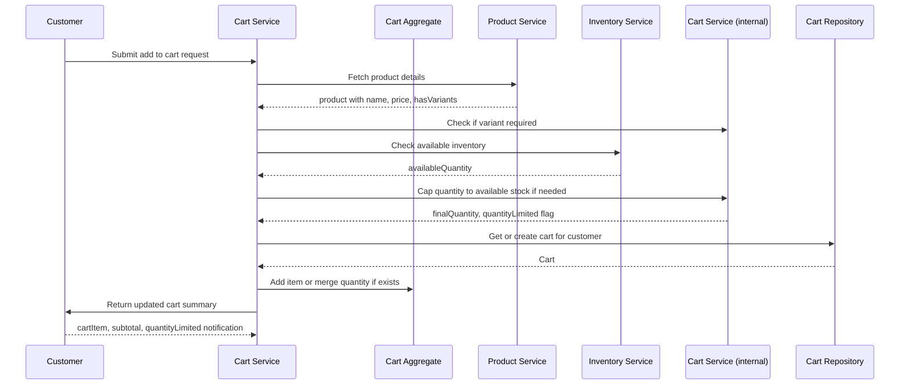

### Outcome

Item added to cart, totals recalculated

**State Changes:**
- Cart.items += item
- Cart.totalPrice recalculated
- Cart.lastActivityDate = now

### Exceptions

- **Product not found** (step 2): Return PRODUCT_NOT_FOUND error
- **Product out of stock** (step 4): Return OUT_OF_STOCK error
- **Product has variants but none selected** (step 3): Return VARIANT_REQUIRED error
- **Requested quantity exceeds stock** (step 5): Cap to available, return QUANTITY_LIMITED warning

---

## SEQ-CART-002 – Update Cart Item Quantity Flow

Customer changes quantity of item in cart

### Trigger

**Type:** user_action

Customer modifies quantity input in cart

### Participants

- **Customer** (actor)
- **Cart Service** (service)
- **Cart Aggregate** (aggregate)
- **Inventory Service** (service)

### Sequence

1. **Customer** → Cart Service: Submit quantity update
2. **Cart Service** → Cart Repository: Fetch cart with item
   - Returns: Cart with items
3. **Cart Service** → Cart Service (internal): Validate item exists in cart
4. **Cart Service** → Cart Service (internal): Check if quantity is 0
5. **Cart Service** → Inventory Service: Check available inventory
   - Returns: availableQuantity
6. **Cart Service** → Cart Service (internal): Cap quantity if exceeds stock
   - Returns: finalQuantity, quantityLimited flag
7. **Cart Service** → Cart Aggregate: Update item quantity
   - Emits: `CartItemQuantityUpdated`
8. **Cart Service** → Customer: Return updated cart
   - Returns: updated item, cart totals, warnings

### Sequence Diagram

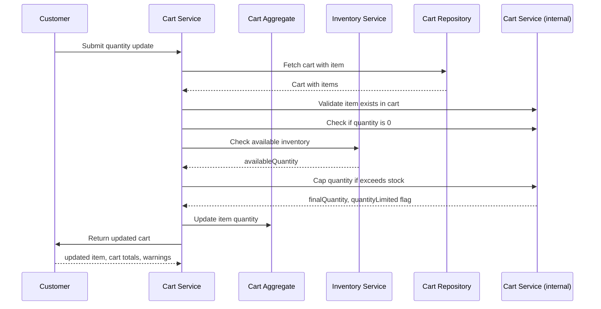

### Outcome

Cart item quantity updated, totals recalculated

**State Changes:**
- CartItem.quantity = newQuantity
- Cart.totalPrice recalculated

### Exceptions

- **Item not in cart** (step 3): Return ITEM_NOT_FOUND error
- **Quantity exceeds stock** (step 6): Cap to available, return notification

---

## SEQ-CART-003 – Remove Item from Cart Flow

Customer removes an item from their cart

### Trigger

**Type:** user_action

Customer clicks 'Remove' on cart item

### Participants

- **Customer** (actor)
- **Cart Service** (service)
- **Cart Aggregate** (aggregate)

### Sequence

1. **Customer** → Cart Service: Submit remove item request
2. **Cart Service** → Cart Repository: Fetch cart
   - Returns: Cart with items
3. **Cart Service** → Cart Aggregate: Remove item from cart
   - Emits: `ItemRemovedFromCart`
4. **Cart Service** → Cart Service (internal): Generate undo token (5 second TTL)
   - Returns: undoToken
5. **Cart Service** → Customer: Return updated cart with undo option
   - Returns: cart totals, isEmpty flag, undoToken

### Sequence Diagram

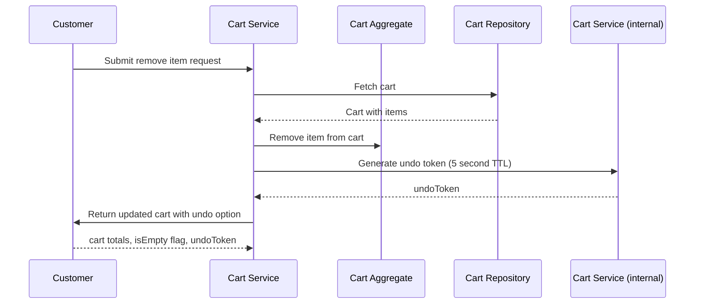

### Outcome

Item removed from cart, undo available for 5 seconds

**State Changes:**
- Cart.items -= item
- Cart.totalPrice recalculated

### Exceptions

- **Item not in cart** (step 3): Return ITEM_NOT_FOUND error

---

## SEQ-CART-004 – Merge Guest Cart on Login Flow

Guest cart items merged with customer cart after login

### Trigger

**Type:** system_event

Guest user successfully logs in with existing cart

### Participants

- **Customer** (actor)
- **Auth Service** (service)
- **Cart Service** (service)
- **Cart Aggregate** (aggregate)
- **Inventory Service** (service)

### Sequence

1. **Auth Service** → Cart Service: Notify cart service of login with guest cart
2. **Cart Service** → Cart Repository: Fetch guest cart
   - Returns: Guest cart with items
3. **Cart Service** → Cart Repository: Fetch customer cart (or create)
   - Returns: Customer cart
4. **Cart Service** → Inventory Service: For each guest item, check stock
   - Returns: available quantities
5. **Cart Service** → Cart Aggregate: Merge items, cap quantities to stock
   - Emits: `CartMerged`
6. **Cart Service** → Cart Repository: Delete guest cart
7. **Cart Service** → Customer: Return merged cart with notifications
   - Returns: merged cart, merge notifications

### Sequence Diagram

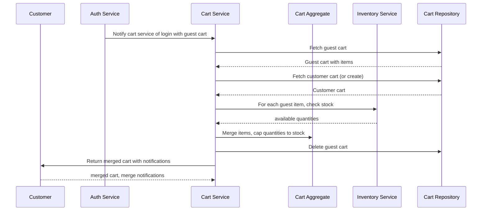

### Outcome

Guest cart merged into customer cart, quantities limited to stock

**State Changes:**
- Customer Cart.items += guest items (merged)
- Guest Cart deleted

### Exceptions

- **Merged quantity exceeds stock** (step 5): Cap to available stock, add notification
- **Guest cart not found** (step 2): No merge needed, continue with customer cart

---

## SEQ-ORDER-001 – Place Order Flow

Complete flow from checkout to order confirmation with payment

### Trigger

**Type:** user_action

Customer clicks 'Place Order' button at checkout

### Participants

- **Customer** (actor)
- **Order Service** (service)
- **Customer Service** (service)
- **Cart Service** (service)
- **Inventory Service** (service)
- **Payment Service** (service)
- **Order Aggregate** (aggregate)
- **Email Service** (service)

### Sequence

1. **Customer** → Order Service: Submit order request
2. **Order Service** → Customer Service: Validate customer is registered and verified
   - Returns: customer status, emailVerified
3. **Order Service** → Cart Service: Fetch cart contents
   - Returns: Cart with items
4. **Order Service** → Order Service (internal): Validate cart is not empty
5. **Order Service** → Customer Service: Validate shipping address
   - Returns: Address object
6. **Order Service** → Inventory Service: Verify stock for all items
   - Returns: stock availability per item
7. **Order Service** → Order Service (internal): Calculate order totals (subtotal, shipping, tax)
8. **Order Service** → Payment Service: Authorize payment
   - Returns: authorizationId, success/failure
9. **Order Service** → Inventory Service: Reserve inventory for all items
   - Emits: `InventoryReserved (per item)`
10. **Order Service** → Order Repository: Generate order number
   - Returns: ORD-{YEAR}-{SEQUENCE}
11. **Order Service** → Order Aggregate: Create order with line items (price snapshot)
   - Emits: `OrderPlaced`
12. **Order Service** → Cart Service: Clear customer cart
   - Emits: `CartCleared`
13. **Order Service** → Email Service: Queue confirmation email (async)
14. **Order Service** → Customer: Return order confirmation
   - Returns: orderId, orderNumber, status, totals

### Sequence Diagram

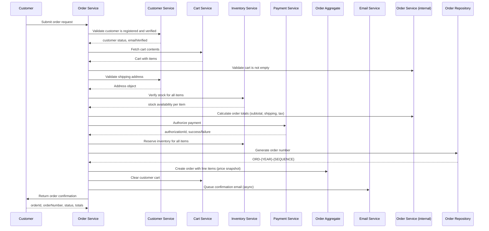

### Outcome

Order created with 'pending' status, payment authorized, inventory reserved, cart cleared, email queued

**State Changes:**
- Order.status = pending
- Order.lineItems = snapshots from cart
- Inventory.reservedQuantity += order quantities
- Cart.items = empty
- Payment.authorization = captured

### Exceptions

- **Customer not verified** (step 2): Return EMAIL_NOT_VERIFIED error
- **Cart is empty** (step 4): Return CART_EMPTY error
- **Invalid shipping address** (step 5): Return INVALID_ADDRESS error
- **Insufficient stock for item** (step 6): Return STOCK_UNAVAILABLE error with affected items
- **Payment authorization fails** (step 8): Return PAYMENT_FAILED error, cart preserved
- **Unsupported card type** (step 8): Return UNSUPPORTED_CARD_TYPE error

---

## SEQ-ORDER-002 – Cancel Order Flow

Customer or admin cancels a pending/confirmed order with refund

### Trigger

**Type:** user_action

Customer or admin requests order cancellation

### Participants

- **Customer/Admin** (actor)
- **Order Service** (service)
- **Order Aggregate** (aggregate)
- **Inventory Service** (service)
- **Payment Service** (service)
- **Email Service** (service)

### Sequence

1. **Customer/Admin** → Order Service: Submit cancellation request
2. **Order Service** → Order Repository: Fetch order
   - Returns: Order with line items
3. **Order Service** → Order Aggregate: Validate cancellation allowed
4. **Order Service** → Order Aggregate: Update order status to cancelled
   - Emits: `OrderCancelled`
5. **Order Service** → Inventory Service: Release reserved inventory
   - Emits: `InventoryReleased (per item)`
6. **Order Service** → Payment Service: Initiate refund to original payment
   - Emits: `RefundInitiated`
7. **Order Service** → Email Service: Queue cancellation email
8. **Order Service** → Customer/Admin: Return cancellation confirmation
   - Returns: orderId, status=cancelled, refundStatus

### Sequence Diagram

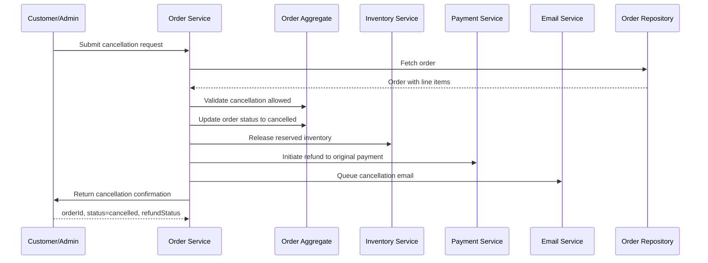

### Outcome

Order cancelled, inventory released, refund initiated, email sent

**State Changes:**
- Order.status = cancelled
- Order.cancellationReason = reason
- Inventory.reservedQuantity -= order quantities
- Payment.refund = initiated

### Exceptions

- **Order not found** (step 2): Return ORDER_NOT_FOUND error
- **Order already shipped** (step 3): Return ORDER_ALREADY_SHIPPED error
- **Refund fails** (step 6): Log error, mark for manual processing, return REFUND_FAILED warning

---

## SEQ-ORDER-003 – Update Order Status to Shipped Flow

Admin updates order status to shipped with tracking number

### Trigger

**Type:** admin_action

Admin marks order as shipped with tracking info

### Participants

- **Admin** (actor)
- **Order Service** (service)
- **Order Aggregate** (aggregate)
- **Inventory Service** (service)
- **Email Service** (service)

### Sequence

1. **Admin** → Order Service: Submit ship order request
2. **Order Service** → Order Repository: Fetch order
   - Returns: Order
3. **Order Service** → Order Aggregate: Validate status transition (confirmed → shipped)
4. **Order Service** → Inventory Service: Deduct reserved inventory
   - Emits: `InventoryDeducted (per item)`
5. **Order Service** → Order Aggregate: Update status and tracking number
   - Emits: `OrderShipped`
6. **Order Service** → Order Service (internal): Log status change with admin user
7. **Order Service** → Email Service: Queue shipment notification email
8. **Order Service** → Admin: Return updated order
   - Returns: orderId, status=shipped, trackingNumber

### Sequence Diagram

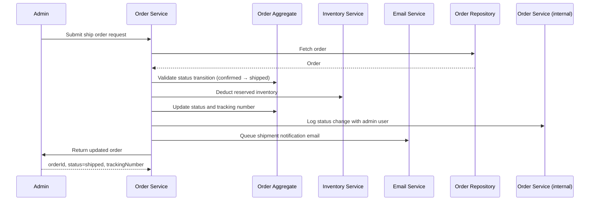

### Outcome

Order marked as shipped, inventory deducted, customer notified

**State Changes:**
- Order.status = shipped
- Order.trackingNumber = trackingNumber
- Inventory.stockLevel -= quantities
- Inventory.reservedQuantity -= quantities

### Exceptions

- **Order not found** (step 2): Return ORDER_NOT_FOUND error
- **Invalid status transition** (step 3): Return INVALID_STATUS_TRANSITION error

---

## SEQ-ORDER-004 – Order Status Confirmation Flow

Admin confirms a pending order

### Trigger

**Type:** admin_action

Admin confirms order after payment verification

### Participants

- **Admin** (actor)
- **Order Service** (service)
- **Order Aggregate** (aggregate)

### Sequence

1. **Admin** → Order Service: Submit confirm order request
2. **Order Service** → Order Repository: Fetch order
   - Returns: Order
3. **Order Service** → Order Aggregate: Validate status transition (pending → confirmed)
4. **Order Service** → Order Aggregate: Update status to confirmed
   - Emits: `OrderConfirmed`
5. **Order Service** → Admin: Return updated order
   - Returns: orderId, status=confirmed

### Sequence Diagram

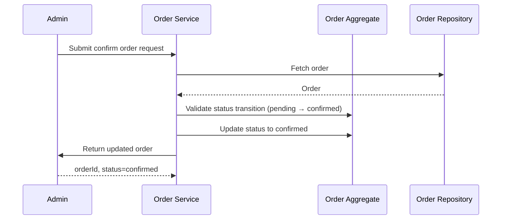

### Outcome

Order confirmed, ready for fulfillment

**State Changes:**
- Order.status = confirmed

### Exceptions

- **Order not found** (step 2): Return ORDER_NOT_FOUND error
- **Invalid status transition** (step 3): Return INVALID_STATUS_TRANSITION error

---

## SEQ-INV-001 – Set Inventory Quantity Flow

Admin sets absolute inventory quantity with audit

### Trigger

**Type:** admin_action

Admin updates inventory level via admin panel

### Participants

- **Admin** (actor)
- **Inventory Service** (service)
- **Inventory Aggregate** (aggregate)

### Sequence

1. **Admin** → Inventory Service: Submit set inventory request
2. **Inventory Service** → Inventory Repository: Fetch current inventory
   - Returns: Inventory with current stock
3. **Inventory Service** → Inventory Service (internal): Validate quantity >= 0
4. **Inventory Service** → Inventory Service (internal): Record previous value
   - Returns: previousValue
5. **Inventory Service** → Inventory Aggregate: Update stock level
   - Emits: `InventoryQuantitySet`
6. **Inventory Service** → Inventory Aggregate: Create audit log entry
7. **Inventory Service** → Inventory Aggregate: Check low stock threshold
   - Emits: `LowStockAlert (if below threshold)`
8. **Inventory Service** → Admin: Return update confirmation
   - Returns: productId, previousValue, newValue, auditLogId

### Sequence Diagram

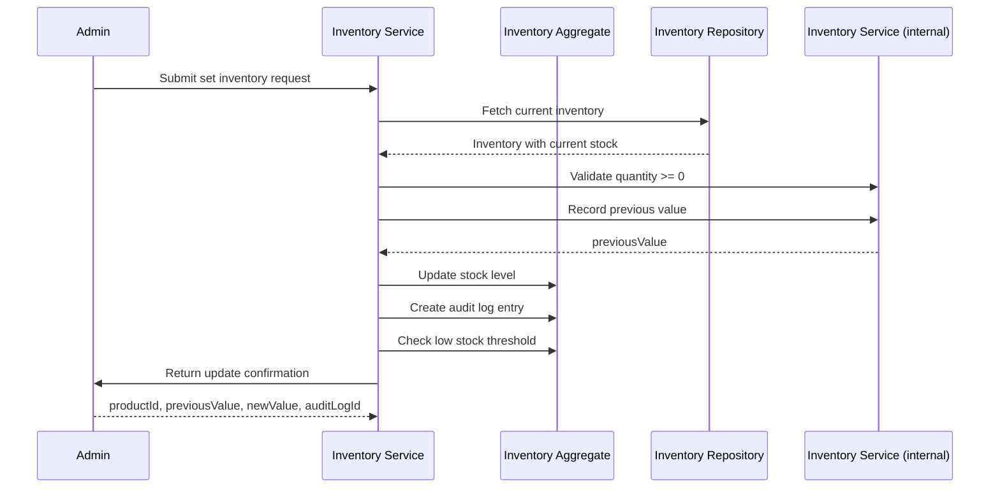

### Outcome

Inventory updated with full audit trail

**State Changes:**
- Inventory.stockLevel = newQuantity
- InventoryAuditLog += entry

### Exceptions

- **Product not found** (step 2): Return PRODUCT_NOT_FOUND error
- **Negative quantity** (step 3): Return INVALID_QUANTITY error

---

## SEQ-INV-002 – Adjust Inventory Delta Flow

Admin adjusts inventory by positive or negative delta

### Trigger

**Type:** admin_action

Admin adjusts inventory level via admin panel

### Participants

- **Admin** (actor)
- **Inventory Service** (service)
- **Inventory Aggregate** (aggregate)

### Sequence

1. **Admin** → Inventory Service: Submit adjust inventory request
2. **Inventory Service** → Inventory Repository: Fetch current inventory
   - Returns: Inventory
3. **Inventory Service** → Inventory Service (internal): Calculate new value
   - Returns: newValue = stockLevel + adjustment
4. **Inventory Service** → Inventory Service (internal): Validate result >= 0
5. **Inventory Service** → Inventory Aggregate: Apply adjustment
   - Emits: `InventoryAdjusted`
6. **Inventory Service** → Inventory Aggregate: Create audit log entry
7. **Inventory Service** → Inventory Aggregate: Check low stock / out of stock
   - Emits: `LowStockAlert or OutOfStock (if applicable)`
8. **Inventory Service** → Admin: Return adjustment confirmation
   - Returns: productId, adjustment, newValue, auditLogId

### Sequence Diagram

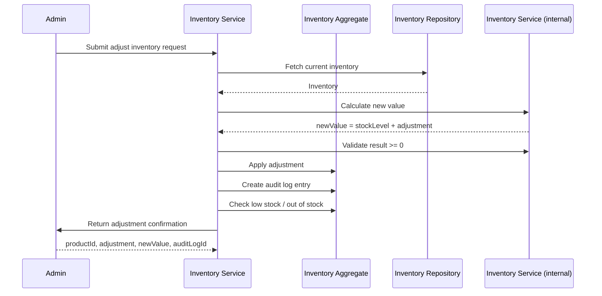

### Outcome

Inventory adjusted with audit trail

**State Changes:**
- Inventory.stockLevel += adjustment
- InventoryAuditLog += entry

### Exceptions

- **Product not found** (step 2): Return PRODUCT_NOT_FOUND error
- **Adjustment would result in negative stock** (step 4): Return INSUFFICIENT_STOCK error

---

## SEQ-PROD-001 – Create Product Flow

Admin creates a new product in the catalog

### Trigger

**Type:** admin_action

Admin submits new product form

### Participants

- **Admin** (actor)
- **Product Service** (service)
- **Product Aggregate** (aggregate)
- **Category Service** (service)
- **Inventory Service** (service)

### Sequence

1. **Admin** → Product Service: Submit create product request
2. **Product Service** → Product Service (internal): Validate product name length (2-200 chars)
3. **Product Service** → Product Service (internal): Validate price >= $0.01
4. **Product Service** → Category Service: Verify category exists
   - Returns: Category
5. **Product Service** → Product Aggregate: Create product with status 'draft'
   - Emits: `ProductCreated`
6. **Product Service** → Inventory Service: Initialize inventory with stock = 0
   - Returns: Inventory record created
7. **Product Service** → Admin: Return created product
   - Returns: productId, name, status='draft'

### Sequence Diagram

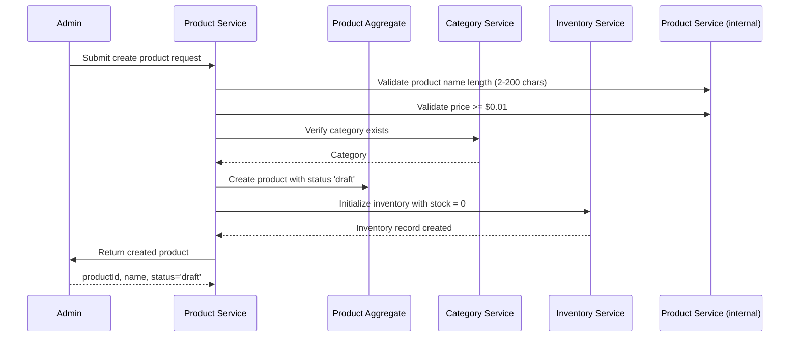

### Outcome

Product created in draft status with initial inventory

**State Changes:**
- Product created with status=draft
- Inventory created with stockLevel=0

### Exceptions

- **Name empty or too long** (step 2): Return NAME_REQUIRED or NAME_TOO_LONG error
- **Price <= 0** (step 3): Return INVALID_PRICE error
- **Category not found** (step 4): Return CATEGORY_NOT_FOUND error

---

## SEQ-PROD-002 – Delete Product Flow

Admin removes a product from the catalog (soft delete)

### Trigger

**Type:** admin_action

Admin clicks delete on product

### Participants

- **Admin** (actor)
- **Product Service** (service)
- **Product Aggregate** (aggregate)
- **Cart Service** (service)
- **Order Service** (service)

### Sequence

1. **Admin** → Product Service: Submit delete product request
2. **Product Service** → Product Repository: Fetch product
   - Returns: Product
3. **Product Service** → Order Service: Check for order history
   - Returns: hasOrderHistory
4. **Product Service** → Product Aggregate: Apply soft delete (set isDeleted=true)
   - Emits: `ProductDeleted`
5. **Product Service** → Cart Service: Remove product from all carts
   - Emits: `ItemRemovedFromCart (async, per affected cart)`
6. **Product Service** → Admin: Return deletion confirmation
   - Returns: productId, status='deleted'

### Sequence Diagram

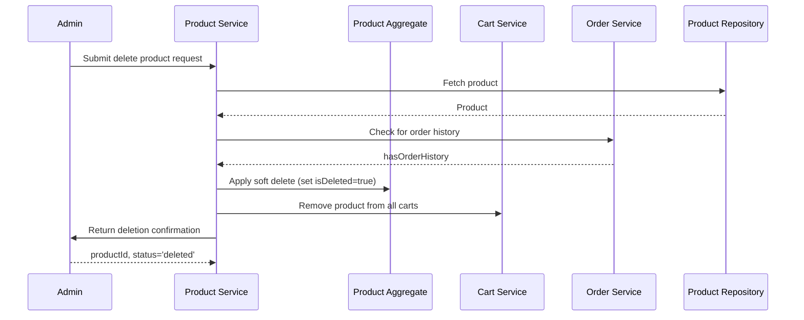

### Outcome

Product soft-deleted, removed from active carts, order history preserved

**State Changes:**
- Product.isDeleted = true
- Product.isActive = false
- Affected carts updated

### Exceptions

- **Product not found** (step 2): Return PRODUCT_NOT_FOUND error

---

## SEQ-PAY-001 – PayPal Payment Authorization Flow

Customer authorizes payment via PayPal redirect flow

### Trigger

**Type:** user_action

Customer selects PayPal at checkout

### Participants

- **Customer** (actor)
- **Payment Service** (service)
- **PayPal Gateway** (external)

### Sequence

1. **Customer** → Payment Service: Initiate PayPal payment
2. **Payment Service** → PayPal Gateway: Create PayPal order
   - Returns: paypalOrderId, approvalUrl
3. **Payment Service** → Customer: Return redirect URL
   - Returns: authorizationUrl
4. **Customer** → PayPal Gateway: Complete PayPal authorization
5. **PayPal Gateway** → Payment Service: Redirect back with approval
6. **Payment Service** → PayPal Gateway: Capture PayPal payment
   - Returns: captureId, status
7. **Payment Service** → Customer: Return payment token
   - Returns: paymentToken for order creation

### Sequence Diagram

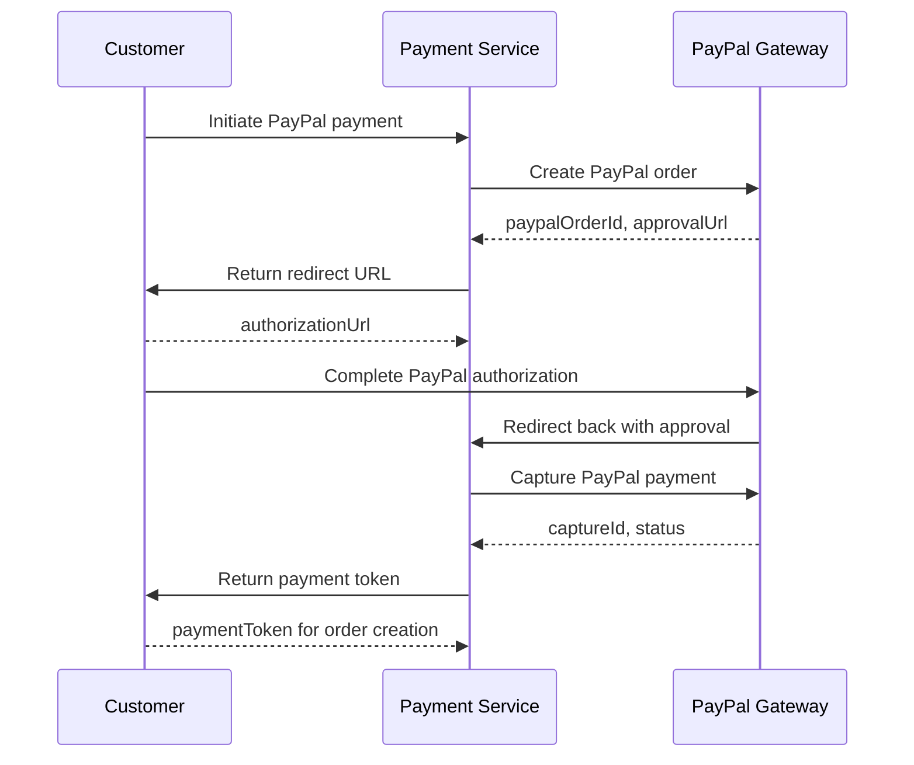

### Outcome

PayPal payment authorized and captured, ready for order

**State Changes:**
- PayPal authorization captured

### Exceptions

- **User cancels at PayPal** (step 4): Return PAYMENT_CANCELLED, redirect to checkout
- **PayPal service error** (step 2): Return PAYPAL_ERROR

---

## SEQ-CAT-001 – Create Category Flow

Admin creates a new product category

### Trigger

**Type:** admin_action

Admin creates category via admin panel

### Participants

- **Admin** (actor)
- **Category Service** (service)
- **Category Aggregate** (aggregate)

### Sequence

1. **Admin** → Category Service: Submit create category request
2. **Category Service** → Category Repository: Validate name uniqueness
   - Returns: boolean (exists)
3. **Category Service** → Category Repository: If parent specified, validate parent exists
   - Returns: parent Category
4. **Category Service** → Category Service (internal): Calculate depth (parent.depth + 1)
5. **Category Service** → Category Service (internal): Validate depth <= 3
6. **Category Service** → Category Aggregate: Create category
   - Emits: `CategoryCreated`
7. **Category Service** → Admin: Return created category
   - Returns: categoryId, name, depth

### Sequence Diagram

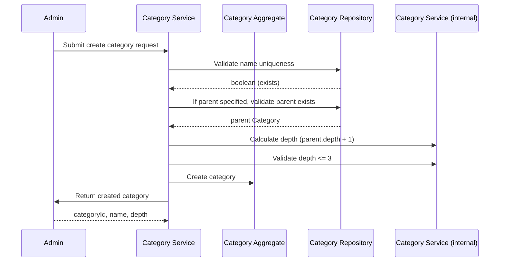

### Outcome

Category created in hierarchy

**State Changes:**
- Category created with calculated depth

### Exceptions

- **Name already exists** (step 2): Return DUPLICATE_CATEGORY_NAME error
- **Parent not found** (step 3): Return PARENT_NOT_FOUND error
- **Depth exceeds 3 levels** (step 5): Return MAX_NESTING_EXCEEDED error

---

