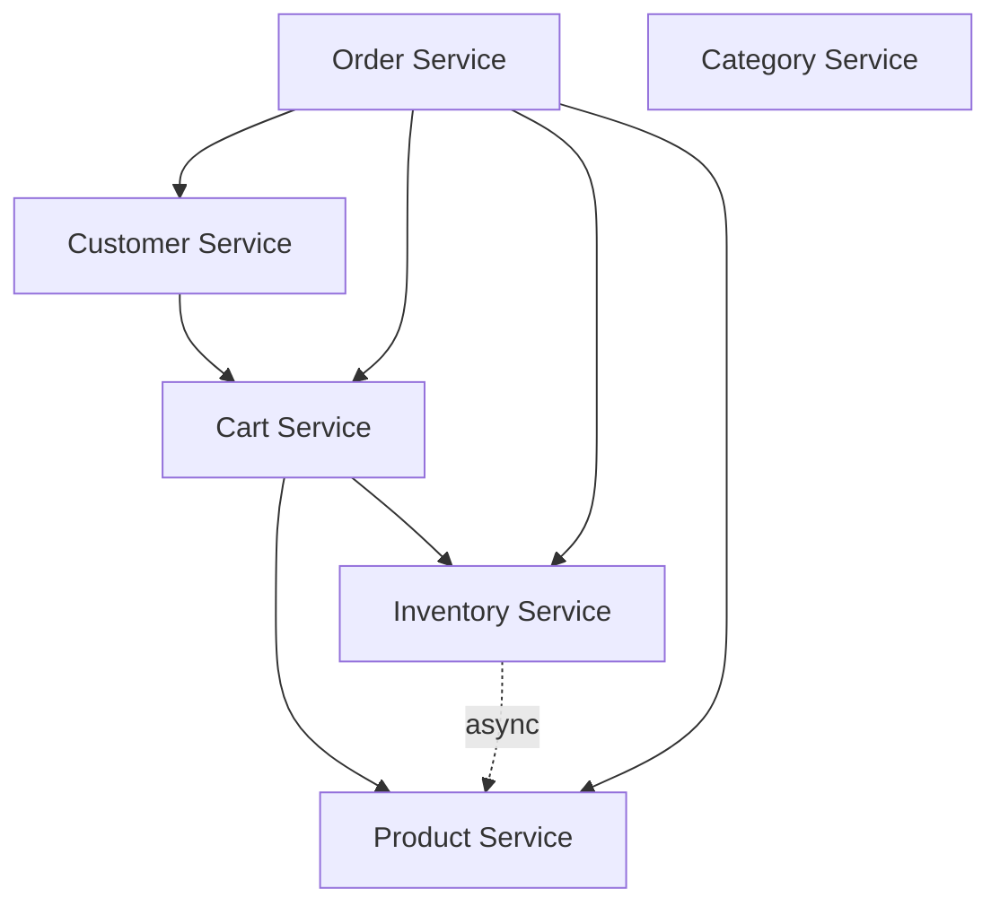

# Dependency Graph

Generated: 2026-01-02T19:24:29+01:00

---

## Visual Overview

## Components

| ID | Type | Description |
|---|---|---|
| Customer Service | domain_service | Manages customer registration, auth, and profiles |
| Cart Service | domain_service | Manages shopping cart with pricing and stock |
| Order Service | domain_service | Manages order lifecycle from placement to fulfillment |
| Product Service | domain_service | Manages product catalog with variants and pricing |
| Category Service | domain_service | Organizes products into hierarchical categories |
| Inventory Service | domain_service | Tracks stock levels and manages reservations |

## Dependencies

| From | To | Type | Description |
|---|---|---|---|
| Customer Service | Cart Service | sync | Retrieve customer cart data |
| Cart Service | Product Service | sync | Validate product info and pricing |
| Cart Service | Inventory Service | sync | Check stock availability |
| Order Service | Customer Service | sync | Validate customer for order placement |
| Order Service | Cart Service | sync | Retrieve cart items for order |
| Order Service | Inventory Service | sync | Reserve stock on order placement |
| Order Service | Product Service | sync | Get product details for order |
| Inventory Service | Product Service | async | Sync product data for stock tracking |

