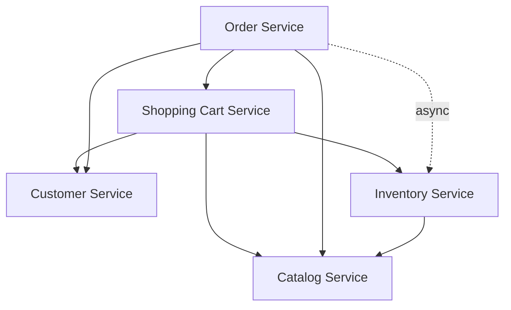

# Dependency Graph

Generated: 2026-01-02T21:37:12+01:00

---

## Visual Overview

## Components

### DEP-CUST-001: Customer Service

- **Type:** domain_service
- **Description:** Manages customer identity, registration, and profiles

### DEP-CATA-002: Catalog Service

- **Type:** domain_service
- **Description:** Manages product information and categorization

### DEP-SHOP-003: Shopping Cart Service

- **Type:** domain_service
- **Description:** Manages cart lifecycle before checkout

### DEP-ORDE-004: Order Service

- **Type:** domain_service
- **Description:** Manages order lifecycle from placement to delivery

### DEP-INVE-005: Inventory Service

- **Type:** domain_service
- **Description:** Tracks stock levels and product availability

## Dependencies

| From | To | Type | Description |
|---|---|---|---|
| DEP-SHOP-003 | DEP-CATA-002 | sync | Fetch product details and pricing for cart items |
| DEP-SHOP-003 | DEP-INVE-005 | sync | Check stock availability for cart items |
| DEP-SHOP-003 | DEP-CUST-001 | sync | Validate customer identity for cart ownership |
| DEP-ORDE-004 | DEP-CUST-001 | sync | Retrieve customer data for order processing |
| DEP-ORDE-004 | DEP-SHOP-003 | sync | Convert cart to order at checkout |
| DEP-ORDE-004 | DEP-CATA-002 | sync | Validate product details during order creation |
| DEP-ORDE-004 | DEP-INVE-005 | async | Reserve and decrement stock on order placement |
| DEP-INVE-005 | DEP-CATA-002 | sync | Link stock records to product catalog entries |

