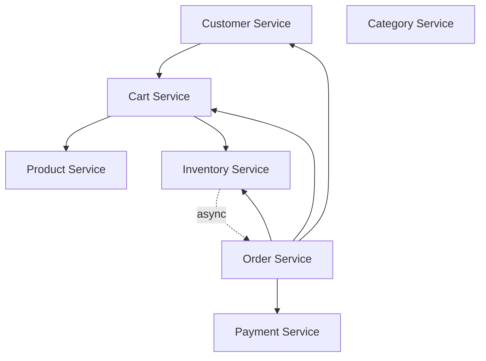

# Dependency Graph

Generated: 2026-01-02T20:15:12+01:00

---

## Visual Overview

## Components

### DEP-CUST-001: Customer Service

- **Type:** domain_service
- **Description:** Manages customer registration, auth, and profile data

### DEP-CART-002: Cart Service

- **Type:** domain_service
- **Description:** Manages shopping cart with pricing and stock validation

### DEP-ORDE-003: Order Service

- **Type:** domain_service
- **Description:** Manages order lifecycle from placement to delivery

### DEP-PROD-004: Product Service

- **Type:** domain_service
- **Description:** Manages product catalog with variants and pricing

### DEP-CATE-005: Category Service

- **Type:** domain_service
- **Description:** Organizes products into hierarchical groupings

### DEP-INVE-006: Inventory Service

- **Type:** domain_service
- **Description:** Tracks stock levels and manages reservations

### DEP-PAYM-007: Payment Service

- **Type:** domain_service
- **Description:** Processes payment transactions for orders

## Dependencies

| From | To | Type | Description |
|---|---|---|---|
| DEP-CUST-001 | DEP-CART-002 | sync | Associates cart with customer session |
| DEP-CART-002 | DEP-PROD-004 | sync | Fetches product details and pricing for cart items |
| DEP-CART-002 | DEP-INVE-006 | sync | Validates stock availability for cart items |
| DEP-ORDE-003 | DEP-CUST-001 | sync | Retrieves customer info for order processing |
| DEP-ORDE-003 | DEP-CART-002 | sync | Converts cart to order at checkout |
| DEP-ORDE-003 | DEP-INVE-006 | sync | Reserves and deducts stock on order placement |
| DEP-ORDE-003 | DEP-PAYM-007 | sync | Processes payment for order completion |
| DEP-INVE-006 | DEP-ORDE-003 | async | Notifies order service of stock level changes |

