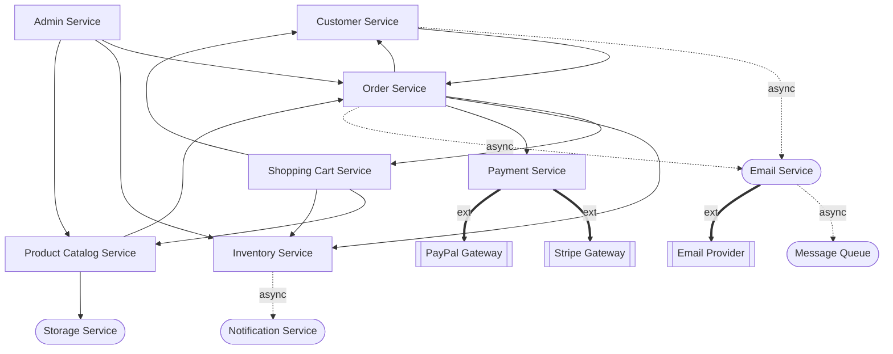

# Dependency Graph

Generated: 2025-12-29T16:22:00+01:00

---

## Visual Overview

## Components

| ID | Type | Description |
|---|---|---|
| Customer Service | domain_service | Manages registration, auth, addresses |
| Product Catalog Service | domain_service | Manages products, variants, categories |
| Inventory Service | domain_service | Tracks stock and reservations |
| Shopping Cart Service | domain_service | Manages cart and checkout prep |
| Order Service | domain_service | Manages order lifecycle |
| Payment Service | domain_service | Handles payments and refunds |
| Email Service | infrastructure_service | Async email delivery |
| Admin Service | domain_service | Admin operations and reporting |
| Notification Service | infrastructure_service | Sends alerts and notifications |
| Storage Service | infrastructure_service | Cloud file storage |
| Message Queue | infrastructure | Async message broker |
| Stripe Gateway | external | Credit card payment processor |
| PayPal Gateway | external | PayPal payment processor |
| Email Provider | external | SMTP/API email delivery |

## Dependencies

| From | To | Type | Description |
|---|---|---|---|
| Customer Service | Email Service | async | Send verification emails |
| Customer Service | Order Service | sync | Check pending orders for GDPR |
| Product Catalog Service | Storage Service | sync | Upload product images |
| Product Catalog Service | Order Service | sync | Check order history for soft delete |
| Inventory Service | Notification Service | async | Send low stock alerts |
| Shopping Cart Service | Product Catalog Service | sync | Get product details and prices |
| Shopping Cart Service | Inventory Service | sync | Check stock availability |
| Shopping Cart Service | Customer Service | sync | Associate cart with customer |
| Order Service | Customer Service | sync | Verify customer eligibility |
| Order Service | Shopping Cart Service | sync | Get cart items for order |
| Order Service | Inventory Service | sync | Reserve and deduct stock |
| Order Service | Payment Service | sync | Authorize and capture payment |
| Order Service | Email Service | async | Send order notifications |
| Payment Service | Stripe Gateway | external | Process credit card payments |
| Payment Service | PayPal Gateway | external | Process PayPal payments |
| Email Service | Message Queue | async | Queue emails for processing |
| Email Service | Email Provider | external | Deliver emails via SMTP/API |
| Admin Service | Order Service | sync | Query and update orders |
| Admin Service | Inventory Service | sync | View and update inventory |
| Admin Service | Product Catalog Service | sync | Manage products |

